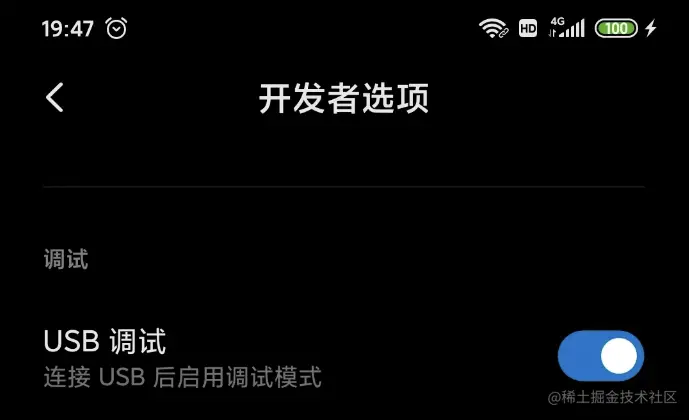
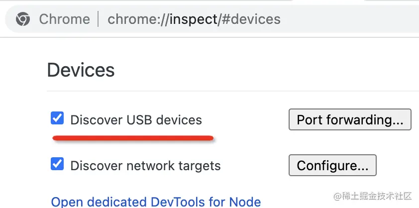
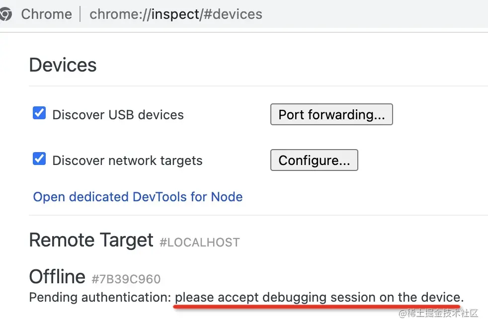
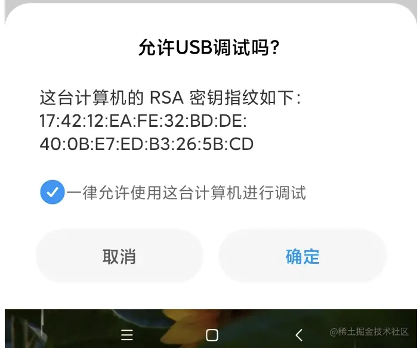
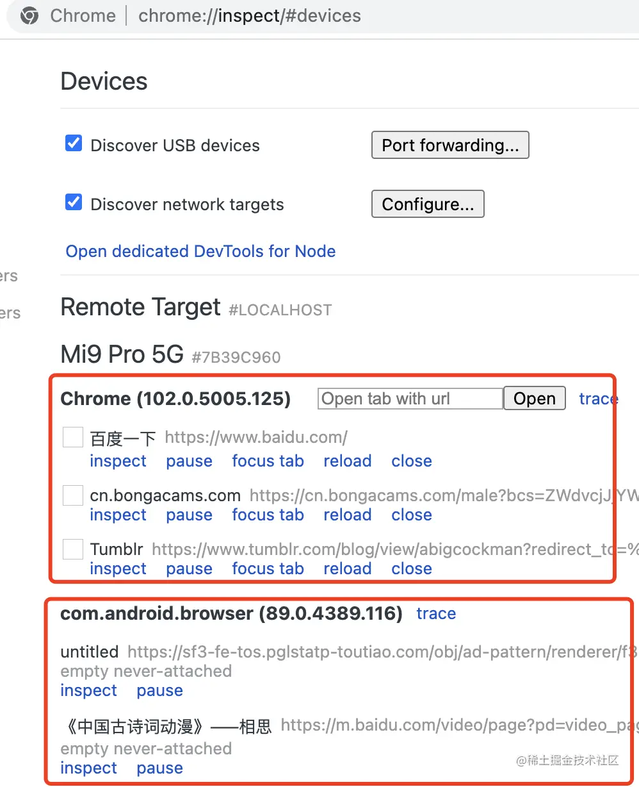
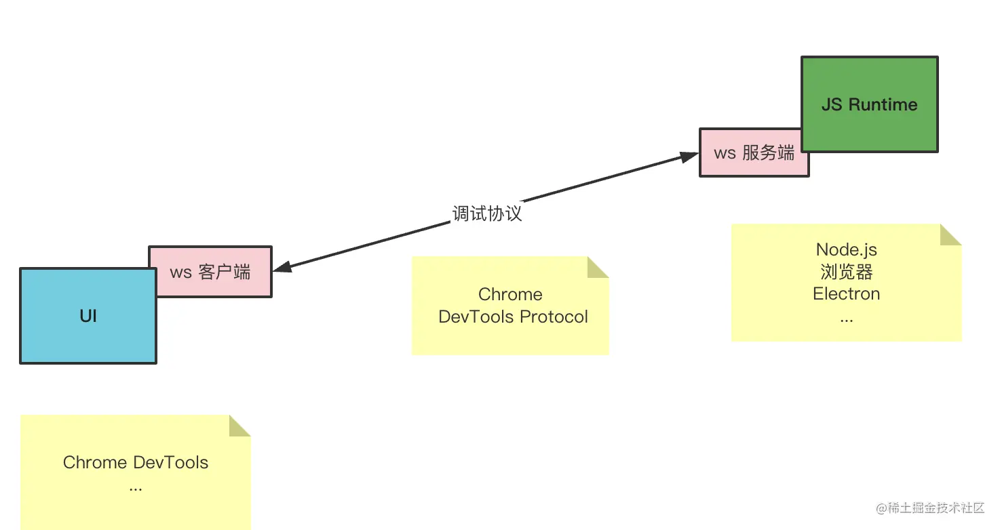
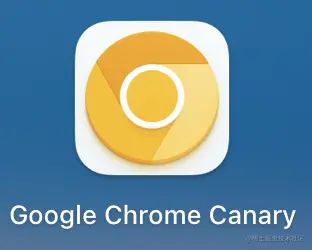
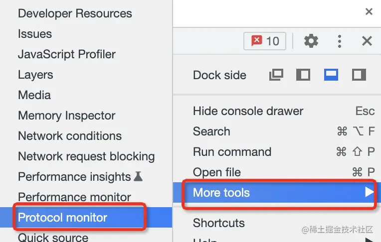
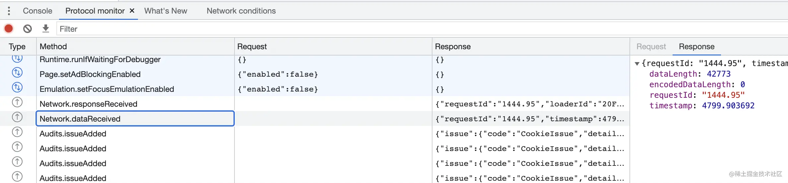

# Chrome DevTools 远程调试安卓网页

Chrome DevTools 其实还能远程调试安卓手机网页

1. 用数据线将安卓手机与电脑连接，在手机设置里打开 USB 调试：

2. 打开 chrome://inspect 页面，勾选 Discover USB devices（默认即勾选）

3. 此时下面就会出现一个提示：请在设备上接受 debugging 会话

4. 在手机上点击确定，就会建立调试会话：

5. 下面就会列出所有可调试的网页：

浏览器内的，或 APP 调试包的 webview 的网页都会列出来，点击 inspect 就可以调试：可审查元素、可打断点、也可用 Performance 分析性能，各种调试 PC 网页的功能基本都支持

但过程中也可能遇到类似问题：打开的窗口是空白或 404：这是因为调试目标可能为任意 chrome 版本，则 Chrome Devtools 也要相应版本才行，所以就需动态下载

动态下载的 devtools 网页在 google 域名下，需科学上网，但也不是每次都要，一个调试目标只需下载一次 Chrome Devtools 的代码，之后就可一直用了

## Chrome DevTools 的原理

Chrome DevTools 架构上与 Chrome 是分离的，二者通过 WebSocket 通信，并设计了专门的通信协议：CDP（Chrome DevTools Protocol）

凡是实现了 CDP 协议的 ws 服务端，都可用 Chrome DevTools 来调试，所以后者可用于调试浏览器网页、Node.js、Electron，自然也就可远程调试安卓手机网页了

只需开启 USB 调试，手机与电脑就可做网络通信，从而实现基于 CDP 的调试。该 CDP 调试协议是 json 格式的，若想看其传输的内容可下载金丝雀版本的 chrome：

在 Chrome DevTools 的 more tools 里打开 Protocol Monitor 面板：

就可在其中看到所有 CDP 协议的数据交互了：

以上即调试的实现原理
