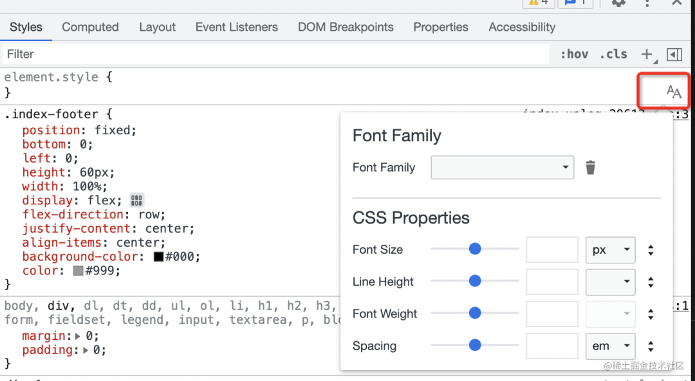

# 可能不知道的 Chrome Devtools 功能

Chrome Devtools 作为高频使用的调试工具，还是有必要好好掌握的。这里分享几个可能不被人注意，但还挺有用的功能

## flex 调试面板

Elements 面板点击某个元素，右边选择 layout，会看到页面上所有使用了 flex 布局的元素。勾选后就会通过 overlay 展示出如何做的布局，其中网格部分就是弹性的部分，比较直观

点击箭头可跳到对应元素；再点击 display: flex 右侧按钮，就会出现 flex 调试面板，可直观的修改 flex 相关样式

## font 调试面板

font 也支持单独的调试面板，点击字体符号就会出现：

该功能是实验中特性，需要手动开启：点击设置 -> 选择 Experiments -> 选中 “Enable new Font Editor tool within the Styles Panes”

## node 截图

Elements 中右击某节点，选择 “Capture node screenshot”，就会下载该 node 的截图

## 请求定位到源码

若想知道某请求是在哪里发的，可打开 Network 面板，在每个网络请求的 initiator 部分可看到相应代码的调用栈，点击可快速定位到对应代码

## 元素定位到创建的源码

若想知道某元素的创建流程，可通过 Elements 面板选中相应元素，点击 Stack Trace，就会展示出其创建流程的调用栈。这对理清前端框架的运行流程很有帮助

该功能是实验性的，需手动开启：在 settings 的 experiments 功能里，勾选 “Capture node creation stacks”

## console 的动态表达式

若想观察某个变化的值，其实无需每次都 console.log，添加一个 live expression 即可实时拿到最新的值

## ruler

在 Preferences 里开启 ruler 后，在 Elements 面板选中某个元素，就可以看到尺子。方便定位元素位置或者测量尺寸

## 请求导出，用 charles 查看

若觉得 network 面板展示的请求信息看起来不方便，则可将其导出到 charles 里看。
点击 network 的 export har 按钮，下载 har 文件，点击文件即可直接用 charles 打开

charles 可结构化展示请求的 url，且请求、响应的各种信息展示也更直观，也能持久化

