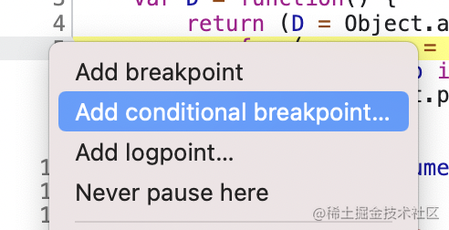
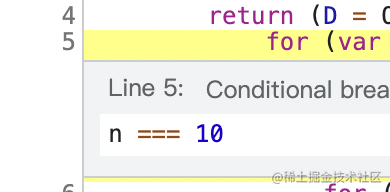
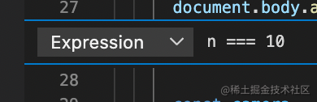
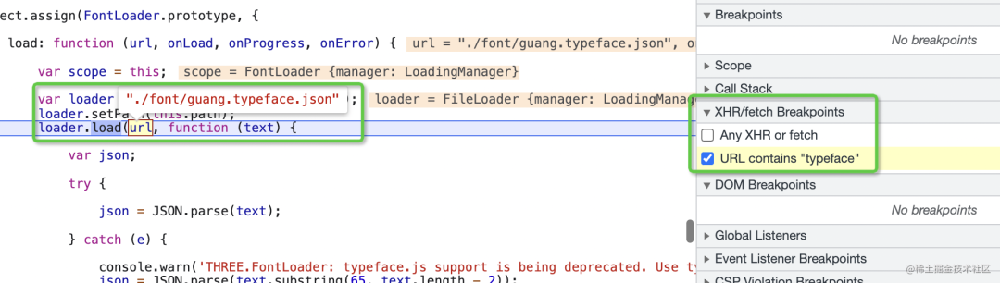
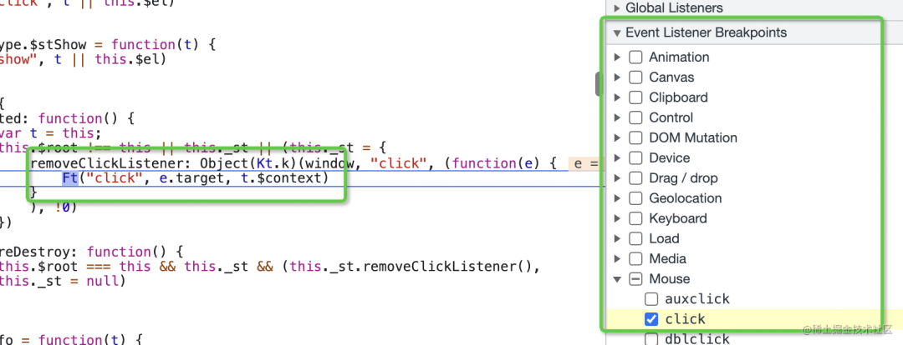
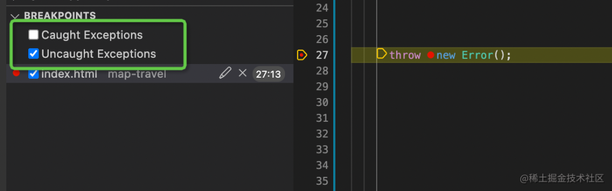

# JS 的 6 种打断点的方式

Chrome Devtools 和 VSCode 都提供了 Debugger，它们支持的打断点的方式有 6 种

## 普通断点（VSCode、Chrome Devtools）

最基础的断点方式，在想断住的对应行左侧单击即可以添加一个断点，运行到该处就会断住

## 条件断点（VSCode、Chrome Devtools）

右键单击代码所在的行左侧，会出现一个下拉框，可添加一个条件断点

输入条件表达式，当运行到该行代码且表达式值为真时就会断住，比普通断点灵活些

VSCode 同样支持：

## DOM 断点（Chrome Devtools）

在 Chrome Devtools Elements 面板中右键对应元素，选择 break on，可以添加一个 DOM 断点，即当子树、属性变动，节点移除这三种情况时会断。可用来调试导致 DOM 变化的代码

## URL 断点（Chrome Devtools）

Chrome Devtools Sources 面板可添加 XHR 的 URL 断点，当 ajax 请求对应 url 时就会断住，可用来调试请求相关代码

## Event Listener 断点（Chrome Devtools）

在 Chrome Devtools Sources 面板还可添加 Event Listener 断点，指定当发生相应事件时断住，可用来调试事件相关代码

## 异常断点（VSCode）

VSCode Debugger 面板勾选 Uncaught Exceptions 和 Caught Exceptions 可添加异常断点，在抛出异常未被捕获或被捕获时断住。在调试一些发生异常的代码时很有用

