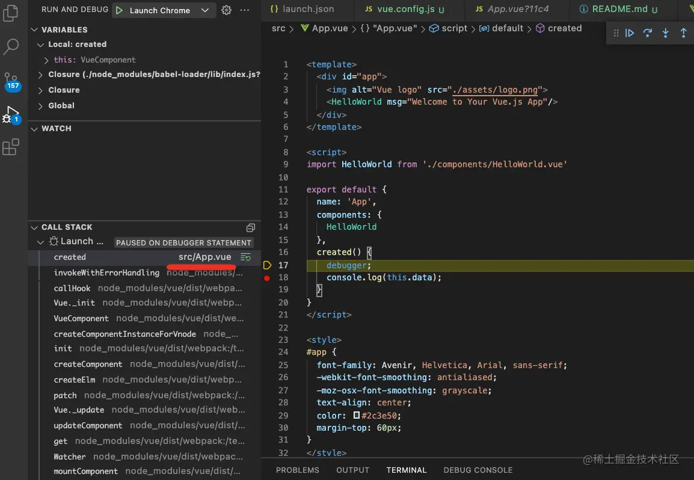

# VSCode 调试浏览器代码

除 chrome devtools，VSCode 也可调试浏览器端代码，相比前者的优势：

- 可在编辑器中打断点，可边调试边改代码

- 可复用调试 Node 的经验

当然 rendering、memory 等信息尚未支持

---

需在项目根目录下`.vscode/launch.json`配置：

1. 点击 Add Configuration 按钮添加一个调试 chrome 的配置：

2. 具体配置行如：

```json
{
	"configurations": [
		{
			"name": "Launch Chrome",
			"request": "launch",
			"type": "pwa-chrome",
			"url": "http://localhost:8080",
			"webRoot": "${workspaceFolder}"
		}
	]
}
```

3. 开始 debug，VSCode 会自动打开 Chrome 加载该网页，且在断点处断住

   - 通常最底层为 Webpack 入口，可单步调试其 runtime（若为 Webpack 项目）

   - 也可查看 render 流程，如 `ReactDOM.render` 到渲染到某个子组件的中间过程

   - 或看下某个组件的 hooks 值如何变化（hooks 值都位于组件的 fiberNode 的 memerizedState 属性上）

---

VSCode debugger 支持 profile。点击左侧按钮可录制一段时间内的耗时信息，可选择手动停止（Manual）、固定间隔（Duration）、或截至某个断点（Pick BreakPoint）的方式记录代码执行 profile

生成项目根目录中的 `xxx.cpuprofile` 文件，记录了执行过程每个函数的耗时


---

在安装 vscode-js-profile-flame 插件后，还可换成火焰图展示。其保存了所有函数的执行路线，如以下火焰图：


意味着其执行过程：


JS 引擎以 event loop 方式不断执行代码。火焰图中可看到每个 event loop 的代码执行和具体耗时，即每个长条宽度代表了每个 loop 的耗时，越细越好

:::tip 提示
vscode 开始调试 chrome 端时，会让后者里面的登录信息等丢失，可设置 userdatadir 为 false
:::

## 调试 React 实例

1. 以 create-react-app 创建 demo 项目，有如下组件：

   

2. 启动开发服务器并添加如下配置（注：type 应为 chrome）：

   

3. 在代码中打两个断点并点击左侧运行：

   

4. 之后便如期断住，调用栈、当前环境的变量等都可看到

   

5. 释放断点往下，触发点击时也能拿到对应事件对象：

   

6. 若想看 react 源码，点击调用栈里的某一帧即可。如渲染时会调用 renderWithHooks 方法，其中的 workInProgress 对象即当前 fiber 节点，且后者 memorizedState 属性即 hooks 存放值处：

   

## 调试 Vue 实例

相比 React 的 jsx（或 tsx）能与编译后的 js 文件一一对应，Vue 因其 SFC 形式代码需 vue-loader 将其分为不同文件，因而路径要单独映射下才能对应到源码位置。即调试配置里多了 sourceMapPathOverrides 项

可在源码中加 debugger，并在浏览器中查看当前的映射路径：


此处的`webpack://test-vue-debug/src/App.vue?11c4`明显是映射到本地的路径。workspaceRoot 为 VSCode 提供的环境变量，即项目根路径


映射过后，地址就变成本地的文件了，在本地文件中打的断点也能生效了：



看这里的路径明显是映射到了项目下的文件。另一个问题：映射时后面还带了 hash，则该如何处理后者的变动


其实该路径是可配置的，其实就是 webpack 生成 sourcemap 时的文件路径，可通过 `output.devtoolModuleFilenameTemplate` 来配置：


可用的变量参见如下文档：


例如可把路径配成这样：


则调试时的文件路径就是这样：


无需管前缀，只看后面部分：发现 ?hash 已被去掉。再把它映射到本地文件：


这样就又映射上了，在 vscode 打的断点就生效了：


## 总结

React 的调试相对简单，只要添加一个 chrome 类型的 debug 配置即可；

Vue 的调试要麻烦一些，要做一次路径映射，如果路径里有 hash，还要改下生成路径的配置，然后再映射（但也只需要配一次）

---

-- launch.json 里面有个 prelaunchTask 字段可以控制这个任务启动前执行一个任务，这样不就可以只需要直接点 f5 就可以适应 npm sever 加自动打开调试的浏览器窗口了么。
