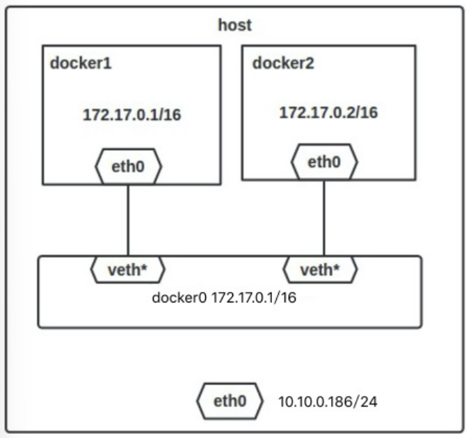

# Docker 网络管理

Docker 容器网络默认与宿主机、与其他容器相互隔离。其自身有四种网络模式：

- host：容器不会虚拟出自己的网卡，配置自己的 IP，而是使用宿主机的 IP 和端口
- Container：容器不会虚拟出自己的网卡，配置自己的 IP，而是与一个指定容器共享 IP、端口范围
- None：关闭容器的网络功能
- Bridge：会为每一个容器分配、设置 IP 等，并将其连接到一个 docker0 虚拟网桥，通过后者以及 Iptables nat 表配置与宿主机通信

安装 Docker 时，会创建三个内置网络：bridge（创建容器默认连接）、 none 、host。可通过 `docker network ls` 列出

在使用 `docker run` 创建容器时，可用 –net/--network 选项指定容器的网络模式，默认为 bridge；container 模式还需指定对应容器的 name 或 id，即 `-net=container:NAME_or_ID`

下面详细介绍：

## Host

相当于 Vmware 中的桥接模式，与宿主机在同一个网络中，但无独立 IP

众所周知，Docker 使用 Linux 的 Namespaces 技术进行资源隔离，如 PID Namespace 隔离进程、Mount Namespace 隔离文件系统、Network Namespace 隔离网络等

Network Namespace 提供一份独立的网络环境：网卡、路由、Iptable 规则等都与其他 Network Namespace 隔离。一个 Docker 容器一般会分配一个独立的 Network Namespace

但若启动容器时使用 host 模式，则该容器将不会获得一个独立的 Network Namespace，而是和宿主机共用一个 Network Namespace。容器将不会虚拟出自己的网卡，配置自己的 IP 等，而是使用宿主机的 IP 和端口

例如在 10.10.0.186/24 的机器上用 host 模式启动一个含 nginx 应用的容器，监听 tcp80 端口:

```sh
# 运行容器
$ docker run --name=nginx_host --net=host -p 80:80 -d nginx
74c911272942841875f4faf2aca02e3814035c900840d11e3f141fbaa884ae5c

# 查看容器
$ docker ps
CONTAINER ID        IMAGE               COMMAND                  CREATED             STATUS              PORTS               NAMES
74c911272942        nginx               "nginx -g 'daemon ..."   25 seconds ago      Up 25 seconds                           nginx_host
```

当我们在容器中执行任何类似 ifconfig 命令查看网络环境时，看到的都是宿主机上的信息；而外界访问容器中的应用，则直接使用 10.10.0.186:80 即可，不用任何 NAT 转换，就如直接跑在宿主机中一样。

但是，容器的其他方面，如文件系统、进程列表等还是和宿主机隔离的

```sh
$ netstat -nplt | grep nginx
tcp        0      0 0.0.0.0:80              0.0.0.0:*               LISTEN      27340/nginx: master
```

## container

该模式指定新创建容器与一个已存在的容器共享 Network Namespace，而非与宿主机。新创建容器不会虚拟出自己的网卡，配置自己的 IP，而是与指定容器共享 IP、端口范围等

除了网络方面，其他的如文件系统、进程列表等还是隔离的。两个容器的进程可以通过 lo 网卡设备通信

## None

该模式将容器放置在它自己的网络栈中，但是不进行任何配置，实际上关闭了容器的网络功能，主要用于容器并不需要网络时（如只需要写磁盘卷的批处理任务）

## Bridge（RAW）

### Bridge 模式拓扑

当 Docker server 启动时，会在主机上创建一个名为 docker0 的虚拟网桥，此主机上启动的 Docker 容器会连接到该虚拟网桥上

虚拟网桥的工作方式和物理交换机类似，这样主机上的所有容器就通过交换机连在了一个二层网络中

接下来就要为容器分配 IP 了，Docker 会从 RFC1918 所定义的私有 IP 网段中，选择一个和宿主机不同的 IP 地址和子网分配给 docker0，连接到 docker0 的容器就从这个子网中选择一个未占用的 IP 使用

如一般 Docker 会使用 172.17.0.0/16 这个网段，并将 172.17.0.1/16 分配给 docker0 网桥（在主机上使用 ifconfig 命令是可以看到 docker0 的，可以认为它是网桥的管理接口，在宿主机上作为一块虚拟网卡使用）

单机环境下的网络拓扑如下，主机地址为 10.10.0.186/24



Docker 完成以上网络配置的过程大致如下：

1. 在主机上创建一对虚拟网卡 veth pair 设备，后者总是成对出现，它们组成一个通道，数据从一个设备进入，就会从另一个设备出来。因此，veth 设备常用来连接两个网络设备

2. Docker 将 veth pair 设备的一端放在新创建的容器中，并命名为 eth0；另一端放在主机中，以类似 veth65f9 的名字命名，并将该网络设备加入到 docker0 网桥中，可以通过 `brctl show` 命令查看

```sh
$ brctl show
bridge name     bridge id               STP enabled     interfaces
docker0         8000.02425f21c208       no
```

1. 从 docker0 子网中分配一个 IP 给容器使用，并设置 docker0 的 IP 地址为容器的默认网关

```sh
# 运行容器;
$ docker run --name=nginx_bridge --net=bridge -p 80:80 -d nginx
9582dbec7981085ab1f159edcc4bf35e2ee8d5a03984d214bce32a30eab4921a

# 查看容器;
$ docker ps
CONTAINER ID        IMAGE          COMMAND                  CREATED             STATUS              PORTS                NAMES
9582dbec7981        nginx          "nginx -g 'daemon ..."   3 seconds ago       Up 2 seconds        0.0.0.0:80->80/tcp   nginx_bridge

# 查看容器网络;
$ docker inspect 9582dbec7981
"Networks": {
    "bridge": {
        "IPAMConfig": null,
        "Links": null,
        "Aliases": null,
        "NetworkID": "9e017f5d4724039f24acc8aec634c8d2af3a9024f67585fce0a0d2b3cb470059",
        "EndpointID": "81b94c1b57de26f9c6690942cd78689041d6c27a564e079d7b1f603ecc104b3b",
        "Gateway": "172.17.0.1",
        "IPAddress": "172.17.0.2",
        "IPPrefixLen": 16,
        "IPv6Gateway": "",
        "GlobalIPv6Address": "",
        "GlobalIPv6PrefixLen": 0,
        "MacAddress": "02:42:ac:11:00:02"
    }
}

$ docker network inspect bridge
[
    {
        "Name": "bridge",
        "Id": "9e017f5d4724039f24acc8aec634c8d2af3a9024f67585fce0a0d2b3cb470059",
        "Created": "2017-08-09T23:20:28.061678042-04:00",
        "Scope": "local",
        "Driver": "bridge",
        "EnableIPv6": false,
        "IPAM": {
            "Driver": "default",
            "Options": null,
            "Config": [
                {
                    "Subnet": "172.17.0.0/16"
                }
            ]
        },
        "Internal": false,
        "Attachable": false,
        "Ingress": false,
        "Containers": {
            "9582dbec7981085ab1f159edcc4bf35e2ee8d5a03984d214bce32a30eab4921a": {
                "Name": "nginx_bridge",
                "EndpointID": "81b94c1b57de26f9c6690942cd78689041d6c27a564e079d7b1f603ecc104b3b",
                "MacAddress": "02:42:ac:11:00:02",
                "IPv4Address": "172.17.0.2/16",
                "IPv6Address": ""
            }
        },
        "Options": {
            "com.docker.network.bridge.default_bridge": "true",
            "com.docker.network.bridge.enable_icc": "true",
            "com.docker.network.bridge.enable_ip_masquerade": "true",
            "com.docker.network.bridge.host_binding_ipv4": "0.0.0.0",
            "com.docker.network.bridge.name": "docker0",
            "com.docker.network.driver.mtu": "1500"
        },
        "Labels": {}
    }
]
```

### bridge 模式下容器的通信

网络拓扑介绍完后，接着介绍 bridge 模式下容器是如何通信的:

bridge 模式下，连在同一网桥上的容器可相互通信（出于安全考虑，也可禁止彼此间的通信，方法是在 DOCKER_OPTS 变量中设置 –icc=false，这样只有使用 –link 才能使两个容器通信）

Docker 可开启容器间通信（意味着默认配置 –icc=true ），即宿主机上的所有容器可不受任何限制地相互通信，这可能导致拒绝服务攻击。进一步 Docker 可以通过 –ip_forward 和 –iptables 选项分别控制容器间、容器与外部的通信

容器也可以与外部通信，若看下主机上的 Iptable 规则，可以看到这么一条：

```
-A POSTROUTING -s 172.17.0.0/16 ! -o docker0 -j MASQUERADE
```

此规则会将源地址 172.17.0.0/16（即从 Docker 容器产生），且非从 docker0 网卡发出的包，进行源地址转换，换成主机网卡的地址。举例说明：

1. 假设主机有一网卡 eth0，IP 地址为 10.10.101.105/24，网关为 10.10.101.254
2. 从主机上一个 IP 为 172.17.0.1/16 的容器中 ping 百度（180.76.3.151）。
3. IP 包首先从容器发往自己的默认网关 docker0，到达后，也就到达了主机上
4. 然后会查询主机的路由表，发现包应该从主机的 eth0 发往主机的网关 10.10.105.254/24
5. 接着包会转发给 eth0，并从 eth0 发出去（主机的 ip_forward 转发应该已经打开）

此时上面的 Iptable 规则就会起作用，对包做 SNAT 转换，将源地址换为 eth0 的地址。这样在外界看来，该包就是从 10.10.101.105 上发出来的，Docker 容器对外不可见

而外界若要访问 Docker 容器服务，首先用下面命令创建一个含 web 应用的容器，将容器的 80 端口映射到主机的 80 端口。

```sh
$docker run --name=nginx_bridge --net=bright -p 80:80 -d nginx
```

然后查看 Iptable 规则的变化，发现多了这样一条：

```
-A DOCKER ! -i docker0 -p tcp -m tcp --dport 80 -j DNAT --to-destination 172.1
```

此条规则就是对主机 eth0 收到的目的端口为 80 的 tcp 流量进行 DNAT 转换，将流量发往 172.17.0.2:80，即上面创建的 Docker 容器。所以，外界只需访问 10.10.101.105:80 就可访问到容器中的服务

此外，还可自定义 Docker 使用的 IP 地址、DNS 等信息，甚至使用自己定义的网桥，但是其工作方式还是一样的

## 自定义网络

建议使用自定义网桥来控制哪些容器可相互通信，还可自动 DNS 解析容器名到 IP 地址

Docker 提供了默认驱动以创建一个新的 Bridge、Overlay 或 Macvlan 网络；还可创建一个网络插件或远程网络进行完整的自定义和控制

可根据需要创建任意数量的网络，并在任意给定时间将容器连接到其中的零个或多个

此外还可连接并断开网络中的运行容器，而无需重启容器。当容器连接到多个网络时，其外部连接通过第一个非内部网络以词法顺序提供

接下来介绍 Docker 的内置网络驱动程序

### bridge

bridge 是 Docker 中最常用的网络类型，类似于默认 bridge 网络，但添加一些新功能并删除一些旧的能力。以下示例创建一些桥接网络，并对这些网络上的容器执行一些实验

$ docker network create --driver bridge new_bridge

创建网络后，可以看到新增加了一个网桥（172.18.0.1）

```sh
$ ifconfig
br-f677ada3003c: flags=4099<UP,BROADCAST,MULTICAST>  mtu 1500
        inet 172.18.0.1  netmask 255.255.0.0  broadcast 0.0.0.0
        ether 02:42:2f:c1:db:5a  txqueuelen 0  (Ethernet)
        RX packets 4001976  bytes 526995216 (502.5 MiB)
        RX errors 0  dropped 35  overruns 0  frame 0
        TX packets 1424063  bytes 186928741 (178.2 MiB)
        TX errors 0  dropped 0 overruns 0  carrier 0  collisions 0

docker0: flags=4163<UP,BROADCAST,RUNNING,MULTICAST>  mtu 1500
        inet 172.17.0.1  netmask 255.255.0.0  broadcast 0.0.0.0
        inet6 fe80::42:5fff:fe21:c208  prefixlen 64  scopeid 0x20<link>
        ether 02:42:5f:21:c2:08  txqueuelen 0  (Ethernet)
        RX packets 12  bytes 2132 (2.0 KiB)
        RX errors 0  dropped 0  overruns 0  frame 0
        TX packets 24  bytes 2633 (2.5 KiB)
        TX errors 0  dropped 0 overruns 0  carrier 0  collisions 0
```

### Macvlan

待续，原文[参见](https://outmanzzq.github.io/2019/10/22/docker-network/#42-macvlan)
