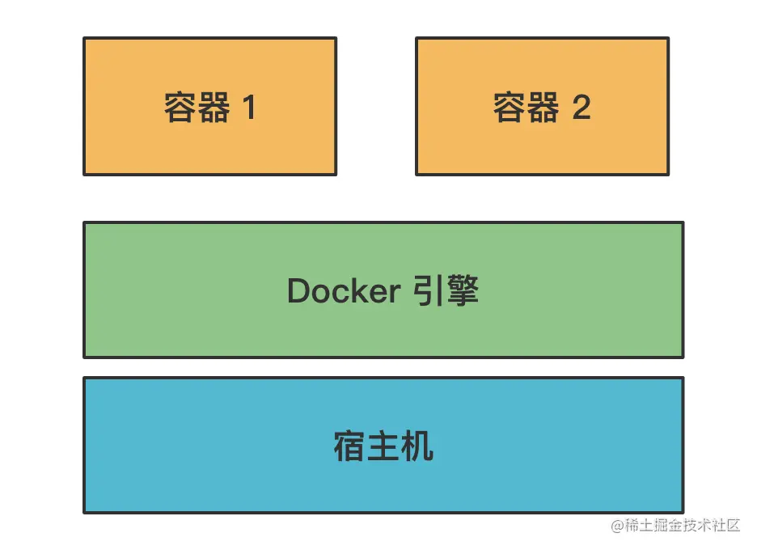
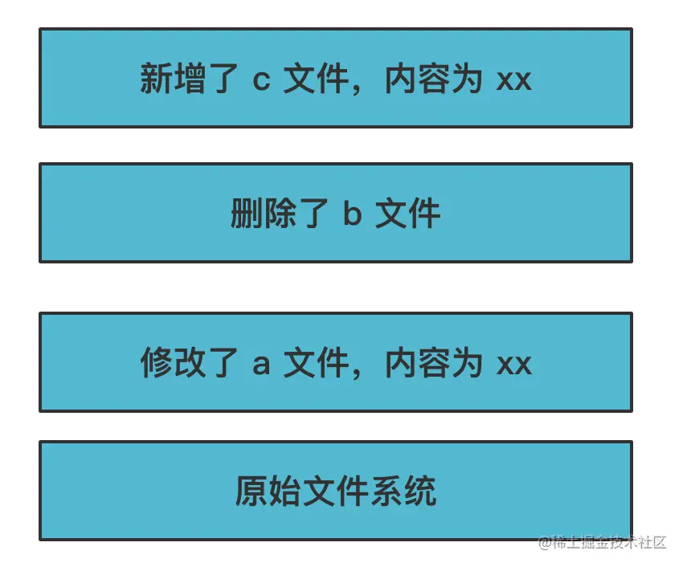
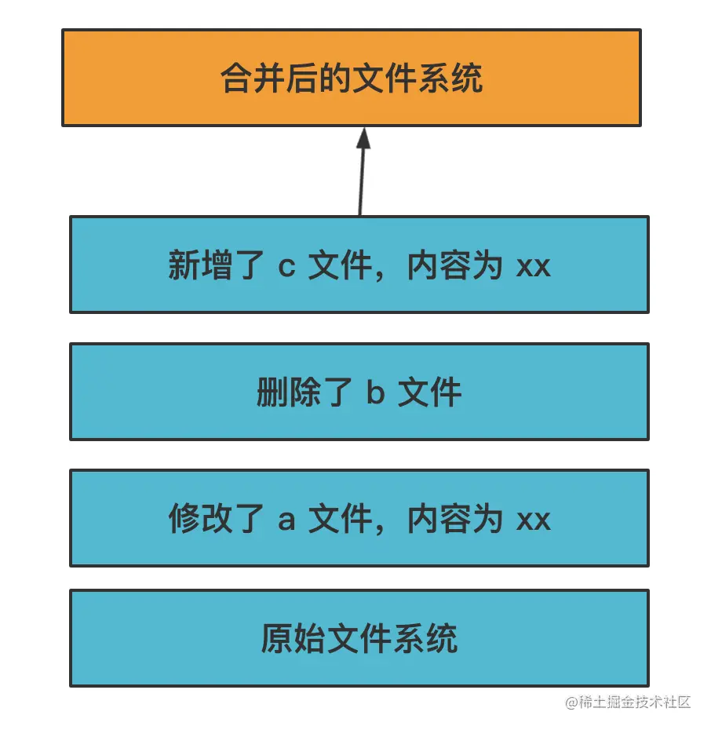
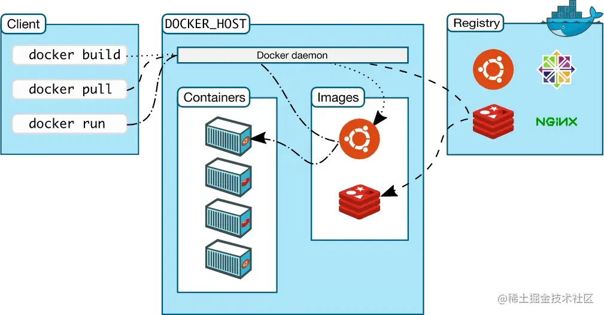
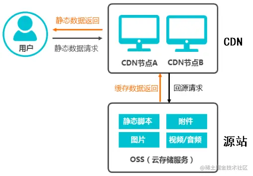

# docker 概述

代码开发完后，需经构建并将产物部署到服务器上运行。不同代码需要不同的环境，如 JS 构建需要 node 环境，Java 需要 JVM 环境，一般会将它们隔离开来单独部署

一台物理主机的性能通常很高，完全可同时跑多个服务，而同时又有环境隔离的需求，所以会用虚拟化技术将一台物理主机变为多台虚拟主机使用

现在主流的虚拟化技术就是 docker，它是基于容器的虚拟化技术，可在一台机器上跑多个容器，每个容器都有独立的系统环境，如文件系统、网络端口等



docker 依赖操作系统机制来实现隔离的容器：

linux 提供了一种称为 namespace 的机制，可给进程、用户、网络等分配一个命名空间，此命名空间下的资源都是独立命名的

例如：

- PID namespace（进程命名空间）可使其中的某个进程 id 变为 1，即 linux 的初始进程 id。所以该命名空间内它就是所有进程的父进程了
- IPC namespace 可限制其中的进程只能相互通信，而不能与外界进程通信
- Mount namespace 会创建一个新的文件系统，其内的文件访问都会在此之上

类似这样的 namespace 一共有 6 种：

- PID namespace： 进程 id 的命名空间
- IPC namespace： 进程通信的命名空间
- Mount namespace：文件系统挂载的命名空间
- Network namespace：网络的命名空间
- User namespace：用户和用户组的命名空间
- UTS namespace：主机名和域名的命名空间

通过这 6 种命名空间，Docker 就实现了资源的隔离

但是只有命名空间的隔离还不够，例如若一个容器占用了太多资源，就会导致别的容器受到影响，如何能限制容器的资源访问呢？

这依赖 linux 提供的另一种机制 Control Group：创建一个 Control Group 并给它指定参数，如 cpu、内存和磁盘占用，而加到该组内的进程就会受到相应限制

这样，创建容器时先创建一个 Control Group，指定资源限制，再把容器进程加入到其中，就不会有容器占用过多资源的问题了

当然这样也并不完美，还有一个问题：每个容器都是相互独立的文件系统，尽管相互之间可能很大部分都一样，同样的内容占据了独立的磁盘空间，会导致浪费

为解决该问题，Docker 设计了一种分层机制：每一层都是不可修改的，也称镜像。若要修改，则会创建一个新层，并在该层做修改



然后通过一种称为 UnionFS 的机制将这些层合并起来，变成一个文件系统：



这样若有多个容器内做了文件修改，只需创建不同的层即可，底层的基础镜像是一样的。Docker 通过这种分层镜像存储，写时复制机制，极大减少了文件系统的磁盘占用。并且这种镜像是可复用的，上传到镜像仓库，别人拉下来可以直接用。例如下面这张 Docker 架构图：



docker 文件系统的内容是通过镜像方式存储的，可上传到 registry 仓库。`docker pull` 拉下来之后经过 `docker run` 就可跑起来

回顾 Docker 实现原理的三大基础技术，都是都缺一不可：

- Namespace：实现各种资源的隔离
- Control Group：实现容器进程的资源访问限制
- UnionFS：实现容器文件系统的分层存储，写时复制，镜像合并

至于上图中的 `docker build`，一般生成镜像都通过 dockerfile 来描述，例如：

```dockerfile
FROM node:10
WORKDIR /app
COPY . /app
EXPOSE 8080
RUN npm install http-server -g
RUN npm install && npm run build
CMD http-server ./dist
```

Dokcer 是分层存储的，修改时会创建一个新层，所以这里每一行都会创建一个新层

以上之类含义如下：

- FROM：基于一个基础镜像来修改
- WORKDIR：指定当前工作目录
- COPY：把容器外的内容复制到容器内
- EXPOSE：声明当前容器要访问的网络端口，比如这里起服务会用到 8080
- RUN：在容器内执行命令
- CMD：容器启动时执行的命令

以上 dockerfile 的作用不难看出，就是在 node 环境下将项目复制过去，执行依赖安装和构建。通过 `docker build` 即可根据该 dockerfile 来生成镜像，然后执行 `docker run` 跑起该镜像，这时候就会执行 http-server ./dist 来启动服务

以上是一个 docker 部署 node 静态服务的例子，但其也并不完善，从上面流程的描述可以看出，构建过程只是为了拿到产物，在容器运行时就不再需要了

那能不能把构建分到一个镜像里，再把产物赋值到另一个镜像，并单独跑产物呢？确实可以，也是推荐的用法，且并不需要分别为 build 和 run 各自写一个 dockerfile，docker 自身即支持多阶段构建。例如：

```dockerfile
# build stage
FROM node:10 AS build_image
WORKDIR /app
COPY . /app
EXPOSE 8080
RUN npm install && npm run build

# production stage
FROM node:10
WORKDIR /app
COPY --from=build_image /app/dist ./dist
RUN npm i -g http-server
CMD http-server ./dist
```

以上将两个镜像的生成过程写到了一个 dockerfile 内，即 docker 支持的多阶段构建

第一个 FROM 里写了 `as build_image`，即把第一个镜像命名为 build_image，后面第二个镜像 COPY 时就可指定 `--from=build_image` 来从前者复制内容了

这样，最终只会留下第二个镜像，该镜像内只有生产环境需要的依赖，体积更小，传输、运行速度也会更快。构建镜像和运行镜像分离，算是一种最佳实践了

一般我们都是在 jenkins 里跑，push 代码时通过 web hooks 触发 jenkins 构建，最终产生运行时镜像，上传到 registry。部署时将该镜像 `docker pull` 下来，再 `docker run` 就完成了部署

以上是 node 项目的 dockerfile。至于前端项目，则大致如下：

```dockerfile
# build stage
FROM node:14.15.0 as build-stage
WORKDIR /app
COPY package.json ./
RUN npm install
COPY . .
RUN npm run build

# production stage
FROM nginx:stable-perl as production-stage
COPY --from=build-stage /app/dist /usr/share/nginx/html
COPY --from=build-stage /app/default.conf /etc/nginx/conf.d/default.conf
EXPOSE 80
CMD ["nginx", "-g", "daemon off;"]
```

也是 build 阶段通过一个镜像做构建，再制作一个镜像把产物复制过去，然后用 nginx 跑一个静态服务
一般公司内部网站，或私有部署之类都是如此

当然也不绝对，若公司部署前端代码的服务是作为 CDN 的源站服务器的，CDN 会从这里取文件，然后在各地区的缓存服务器缓存下来。诸如阿里云等厂商都提供了对象存储服务，可直接把静态文件上传到 oss，无须自己部署



## 总结（RAW）

<!-- Docker 是一种虚拟化技术，通过容器的方式，它的实现原理依赖 linux 的 Namespace、Control Group、UnionFS 这三种机制。
Namespace 做资源隔离，Control Group 做容器的资源限制，UnionFS 做文件系统的镜像存储、写时复制、镜像合并。
一般我们是通过 dockerfile 描述镜像构建的过程，然后通过 docker build 构建出镜像，上传到 registry。
镜像通过 docker run 就可以跑起来，对外提供服务。
用 dockerfile 做部署的最佳实践是分阶段构建，build 阶段单独生成一个镜像，然后把产物复制到另一个镜像，把这个镜像上传 registry。
这样镜像是最小的，传输速度、运行速度都比较快。
前端、node 的代码都可以用 docker 部署，前端代码的静态服务还要作为 CDN 的源站服务器，不过我们也不一定要自己部署，很可能直接用阿里云的 OSS 对象存储服务了。
理解了 Docker 的实现原理，知道了怎么写 dockerfile 还有 dockerfile 的分阶段构建，就可以应付大多数前端部署需求了 -->
