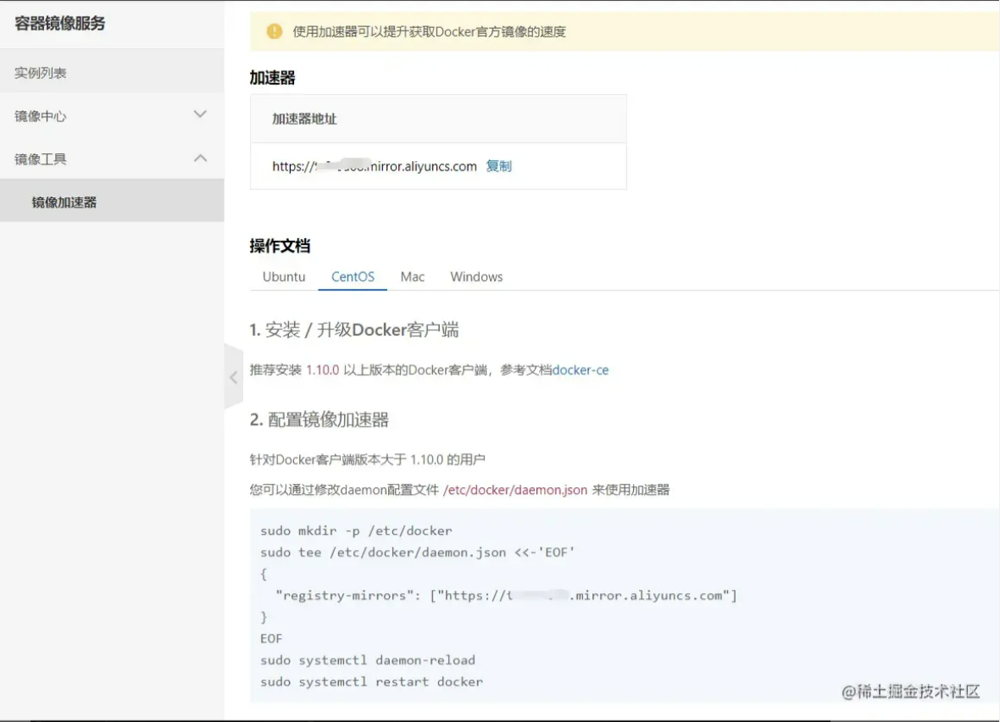
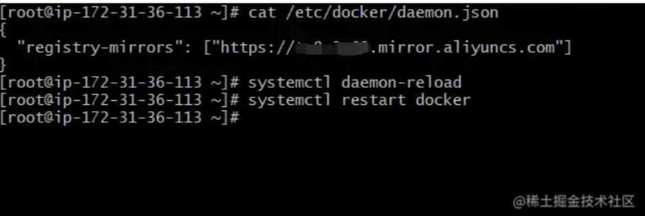
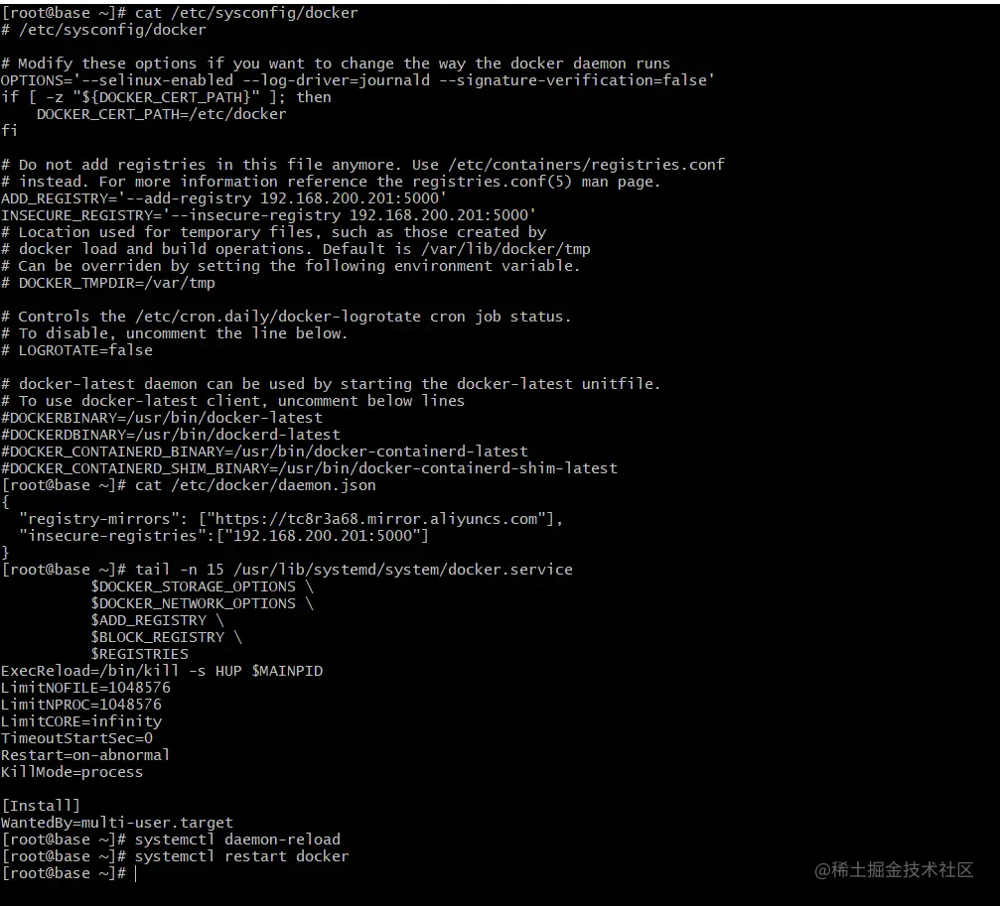

# Docker 仓库

仓库（Repository）是集中存放镜像的地方

## Docker Hub

目前 Docker 官方维护了一个公共仓库 Docker Hub，其中已包括了超 15,000 个镜像。大部分需求都可通过在其中直接下载镜像来实现

可以通过执行 `docker login` 并输入用户名、密码和邮箱来完成注册和登录。注册成功后，本地用户目录的 .dockercfg 中将保存用户的认证信息

用户无需登录即可通过 docker search 命令来查找官方仓库中的镜像，并利用 docker pull 命令来将其下载到本地

实例：

```sh
# 以 centos 为关键词进行搜索
docker search centos

# 从 dockerhub 拉去 ubuntu 镜像
docker pull ubuntu
```

补充，云服务厂商通常会提供 Docker Hub 镜像加速服务，例如阿里云：





## 私有仓库

当然因为种种原因，使用公共仓库可能并不方便，用户可使用 docker 提供的私有仓库镜像搭建自己的私有仓库

docker-registry 是官方提供的工具，可用于构建私有的镜像仓库。搭建方法：

```sh
# 运行本地仓库容器
docker run -dit --name registry --restart=always -p 5000:5000 registry

# 修改 docker 配置文件
vi /etc/sysconfig/docker
# 添加
# 172.31.36.113 为宿主机局域网IP地址，请自行更改为自己的IP地址
ADD_REGISTRY='--add-registry 192.168.200.201:5000'
INSECURITY_REGISTRY='--insecure-registry 192.168.200.201:5000'

vi /etc/docker/daemon.json
# 添加
# 注意上一行后面需要增加，
"insecure-registry":["192.168.200.201:5000"]

vi /usr/lib/systemd/system/docker.service
# 删除 $INSECURE_REGISTRY \ 这一行

# 重新加载
systemctl daemon-reload
systemctl restart docker
```


