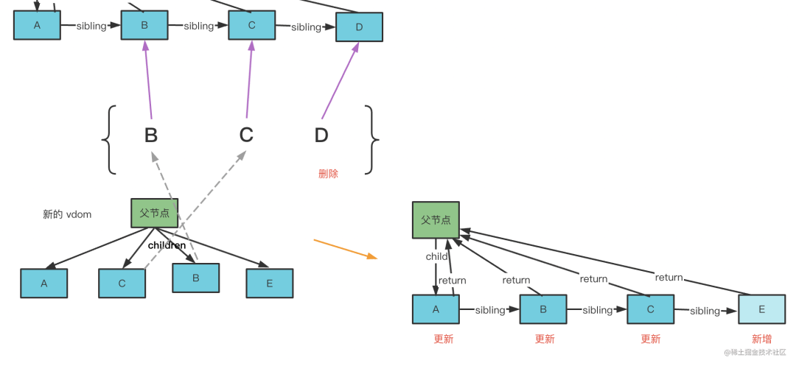

# react diff 算法概述

React 是基于 vdom 的前端框架，组件 render 产生 vdom，然后渲染器将其渲染出来。state 更新时，组件会重新 render，产生新的 vdom。浏览器平台下，为了减少 dom 的创建，React 会对两次的 render 结果做 diff，尽量复用 dom 提高性能

diff 算法是前端框架中较复杂的部分，这里只做概述

## Fiber 架构

首先先过下 react 的 fiber 架构。React 通过 jsx 描述页面结构：

```jsx
function Profile() {
	return (
		<div>
			
			<h3>{[user.firstName, user.lastName].join(" ")}</h3>
		</div>
	);
}
```

经过 babel 编译会变成 render function：

```jsx
import { jsx as _jsx } from "react/jsx-runtime";
import { jsxs as _jsxs } from "react/jsx-runtime";

const profile = _jsxs("div", {
	children: [
		_jsx("img", {
			src: "avatar.png",
			className: "profile",
		}),
		_jsx("h3", {
			children: [user.firstName, user.lastName].join(" "),
		}),
	],
});
```

render function 执行结果就是 vdom，即 React Element 的实例：


在 16 之前，React 直接递归渲染 vdom ，setState 触发重新渲染，对比渲染出的新旧 vdom，对差异部分进行 dom 操作

而在 16 之后，为优化性能，会先把 vdom 转换成 fiber，即从树转换成链表，然后再渲染。整体渲染流程分成两个阶段：

- render 阶段：从 vdom 转换成 fiber，并对需要 dom 操作的节点打上 effectTag 标记。该过程称为 reconcile（调和），且可被打断，由 scheduler 调度执行
  
- commit 阶段：对有 effectTag 标记的 fiber 节点进行 dom 操作，并执行所有的 effect 副作用函数

diff 算法作用在 reconcile 阶段：第一次渲染无需 diff，直接 vdom 转 fiber；再次渲染时，会产生新的 vdom，这时候要和之前的 fiber 做下对比，决定怎么产生新的 fiber，对可复用节点打上修改标记，剩余的旧节点打上删除标记，新节点打上新增标记

## React 的 diff 算法

首先介绍下做 diff 的原因：

首先不做 diff 也可行，每次渲染都直接把 vdom 转成 fiber 即可，无需和之前的做对比。就如 SSR 时，直接把组件渲染成字符串，第二次渲染也是如此，并无必要再和之前字符串比对，看有哪些字符可复用

但在浏览器中 dom 创建成本很高，若不做 dom 复用，则严重影响性能

diff 算法的目的就是对比两次渲染结果，找到可复用的部分，剩下的该删除删除，该新增新增

具体实现，比如父节点下有 A、B、C、D 四个子节点，则渲染出的 vdom 类似如下：


经 reconcile 之后，会变成如下的 fiber 结构：


那如果再次渲染的时候，渲染出了 A、C、B、E 的 vdom，这时候怎么处理呢？


再次渲染出 vdom 时，也要进行 vdom 转 fiber 的 reconcile 阶段，但要尽量能复用之前的节点。如何复用？一一对比，先把之前的 fiber 节点放到一个 map 里，key 就是节点的 key：


然后每个新 vdom 都去这个 map 里查找下有没有可复用的，找到了就移动过来，打上更新的 effectTag：


这样遍历完后，map 里剩下的都是不可复用的，打上删除的 effectTag；若 vdom 中还有没找到复用节点的，就打上新增的 effectTag

这样就实现了更新时的 reconcile，即上面的 diff 算法，其核心就是找到可复用的节点，剩下的旧节点删掉，新节点新增

但有时可再简化下，例如上次渲染是 A、B、C、D，这次渲染也是 A、B、C、D，则直接顺序对比即可，没必要建立 map 再找。所以 React 的 diff 算法是分成两次遍历的：

1. 第一轮遍历：一一对比 vdom 和老的 fiber，若可复用就处理下一个节点，否则就结束遍历。若所有新的 vdom 处理完了，则把剩下的老 fiber 节点删掉即可；若还有 vdom 没处理，就进行第二次遍历
2. 第二轮遍历：把剩下的老 fiber 放到 map 里，遍历剩下的 vdom，从 map 里查找，若找到了，就移动过来。这轮遍历完后，剩余的老 fiber 删掉，剩余的 vdom 新增

这样就完成了新 fiber 结构的创建，即 reconcile 的过程。例如上述例子，第一轮遍历是这样的：


一一对比新 vdom 和老 fiber，发现 A 可复用，就创建新 fiber 节点并打上更新标记；C 不可复用，所以结束第一轮遍历，进入第二轮：



把剩下的老 fiber 节点放到 map 里，然后遍历新 vdom 节点，从 map 中找到的就是可复用的，移动过来打上更新标记；遍历完之后，剩下的老 fiber 节点删掉，剩下的新 vdom 新增。这样就完成了更新时的 reconcile 过程

## 总结（RAW）

<!-- react 是基于 vdom 的前端框架，组件渲染产生 vdom，渲染器把 vdom 渲染成 dom。

浏览器下使用 react-dom 的渲染器，会先把 vdom 转成 fiber，找到需要更新 dom 的部分，打上增删改的 effectTag 标记，这个过程叫做 reconcile，可以打断，由 scheducler 调度执行。reconcile 结束之后一次性根据 effectTag 更新 dom，叫做 commit。

这就是 react 的基于 fiber 的渲染流程，分成 render（reconcile + schedule）、commit 两个阶段。

当渲染完一次，产生了 fiber 之后，再次渲染的 vdom 要和之前的 fiber 对比下，再决定如何产生新的 fiber，目标是尽可能复用已有的 fiber 节点，这叫做 diff 算法。

react 的 diff 算法分为两个阶段：

第一个阶段一一对比，如果可以复用就下一个，不可以复用就结束。

第二个阶段把剩下的老 fiber 放到 map 里，遍历剩余的 vdom，一一查找 map 中是否有可复用的节点。

最后把剩下的老 fiber 删掉，剩下的新 vdom 新增。

这样就完成了更新时的 reconcile 过程。

其实 diff 算法的核心就是复用节点，通过一一对比也好，通过 map 查找也好，都是为了找到可复用的节点，移动过来。然后剩下的该删删该增增。

理解了如何找到可复用的节点，就理解了 diff 算法的核心。 -->
