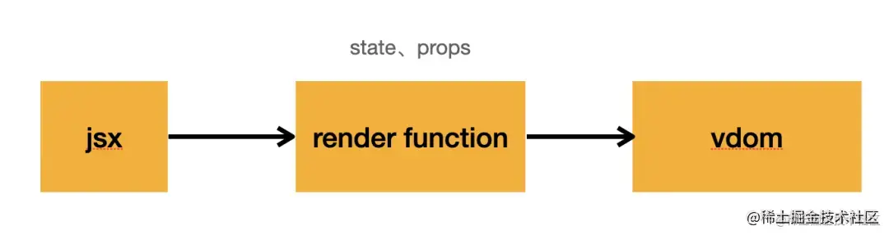
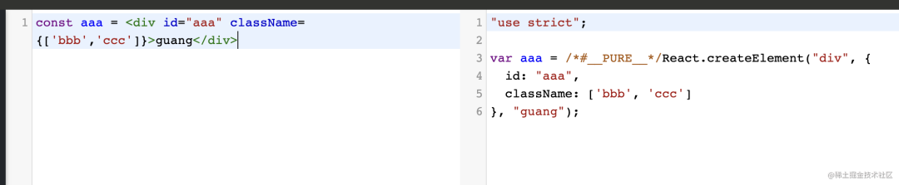
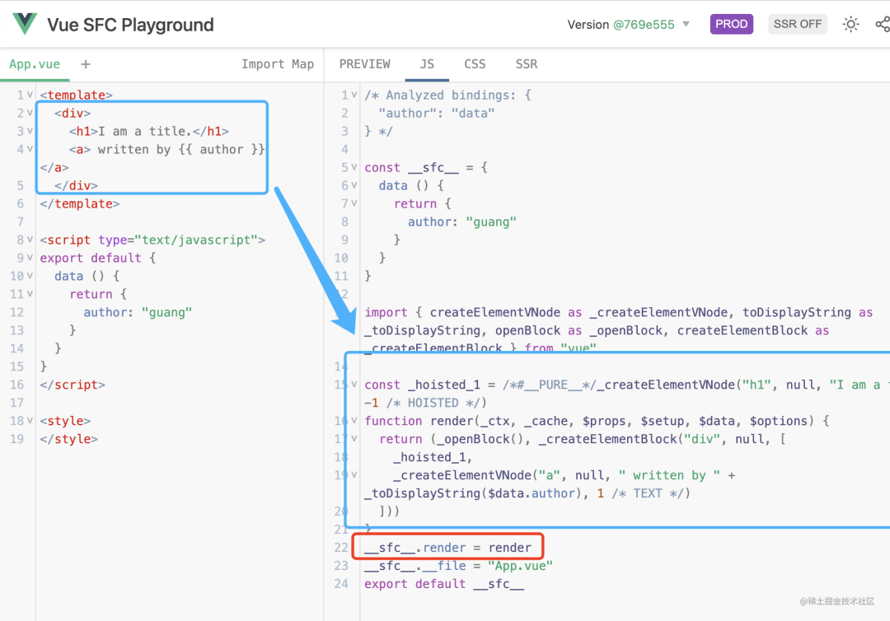
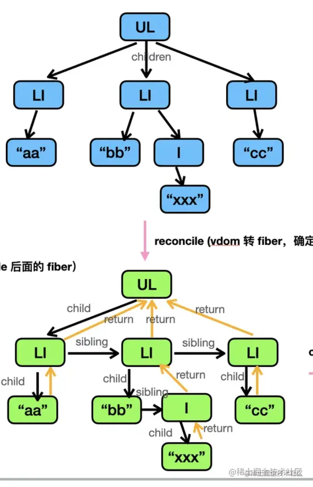

# React 原理概览

## vdom

react 和 vue 都是基于 vdom 的前端框架，相对于操作真实 dom 好处在于：

1. 渲染就是用 dom api 对真实 dom 做增删改，若已渲染了一个 dom 要再更新，则须遍历其所有属性重新设置，如 id、clasName、onclick 等。而 dom 的属性是很多的，许多根本用不到，却在更新时要跟着重设一遍。而有了 vdom 就能只把关心的属性单独摘出来用 JS 对象表示
2. 有了 vdom 后，就不再和 dom 强绑定了，可以渲染到别的平台，如 native、canvas 等

vdom 用 JS 对象表示最终渲染的 dom，如：

```js
{
  type: 'div',
  props: {
    id: 'aaa',
    className: ['bbb', 'ccc'],
    onClick: function() {}
  },
  children: []
}
```

再用渲染器将其渲染出来。但让开发去写这样的 vdom 还是太麻烦了，大家更熟悉 html 的方式，所以要引入编译手段

## dsl 的编译

dsl（domain specific language）即领域特定语言之意，html、css 都是 web 领域的 dsl

直接写 vdom 太麻烦，所以前端框架通常会设计一套 dsl，编译成 render function，执行后产生 vdom。vue 和 react 皆是如此



vue 的 template compiler 是自己实现的，而 react 的 jsx 的编译器是 babel 实现的

比如我们可以这样写：



编译成 render function 后再执行就得到了 vdom，接下来就由渲染器将其渲染了

## 渲染 vdom

渲染 vdom 即通过 dom api 增删改 dom

例如一个 div，则需 `document.createElement` 创建元素，然后 setAttribute 设置属性，addEventListener 设置事件监听器等；若是文本，需用 `document.createTextNode` 来创建

所以根据 vdom 类型不同，写个 if else，分别做不同处理即可。不管 vue 还是 react，渲染器里类似如下的 `if else` 是少不了的：

```js
switch (vdom.tag) {
	case HostComponent:
	// 创建或更新 dom
	case HostText:
	// 创建或更新 dom
	case FunctionComponent:
	// 创建或更新 dom
	case ClassComponent:
	// 创建或更新 dom
}
```

react 里是通过 tag 来区分 vdom 类型的，如 HostComponent 就是元素，HostText 就是文本，FunctionComponent、ClassComponent 就分别是函数组件和类组件

而组件的渲染就涉及到了组件原理

## 组件

我们的目标是通过 vdom 描述界面，在 react 里会使用 jsx，而后者有时是基于 state 动态生成的。要把 state 和 jsx 关联起来，就得封装成 function、class 或者 option 对象的形式，然后在渲染时执行它们拿到 vdom 即可

此即组件的实现原理：

```js
switch (vdom.tag) {
	case FunctionComponent:
		const childVdom = vdom.type(props);
		render(childVdom);
	// ...
	case ClassComponent:
		const instance = new vdom.type(props);
		const childVdom = instance.render();
		render(childVdom);
	// ...
}
```

若是是函数组件，则传入 props 执行它，拿到 vdom 之后再递归渲染；如果是 class 组件，则创建其实例对象，调用 render 方法拿到 vdom，同样再递归渲染

vue 的 option 对象组件也是类似：

```js
const option = {
	data: {},
	props: {},
	render(h) {
		return h("div", {}, "");
	},
};

const childVdom = option.render();
render(childVdom);
```

而平时写的单文件组件（sfc）形式，也是通过专门编译器，将 template 编译成 render function，再挂到 option 对象的 render 方法上：



所以组件本质只是对产生 vdom 的逻辑做封装，其形式并不重要，无论函数、option 对象、class 形式皆可

## 状态管理

基于 vdom 的前端框架渲染流程都差不多，vue 和 react 很多方面是一样的。但管理状态方式不一样，vue 有响应式，而 react 则是 setState 的 api 方式，这正是此二者最大的区别，也导致了后面架构演变方向的不同

react 通过 setState api 触发状态更新，并重新渲染整个 vdom；而 vue 通过对状态做代理，get 时收集，在修改状态时就可触发对应组件的 render 了

而 react 为何不直接渲染对应组件呢？想象以下场景：

父组件将其 setState 函数传递给子组件，子组件调用了它。此时更新虽是子组件触发，但要渲染的就不仅是该子组件了，还有其父组件。同理，某个组件更新实际上可能触发任意位置的其他组件更新，所以必须重新渲染整个 vdom

而 vue 之所以可做到精准更新变化的组件，是因为响应式代理：无论子组件、父组件、或其他位置组件，只要用到了对应的状态，就会被作为依赖收集起来，状态变化时就可触发其 render，不管是组件是在哪里

这就是为何 react 需重新渲染整个 vdom，而 vue 不用。此问题也导致了后来两者架构上的差异

## react 架构的演变

react15 时，其与 vue 的渲染流程还是很像的，都是递归渲染 vdom，增删改 dom 。但因为 react 的 setState 会渲染整个 vdom，而一个应用的所有 vdom 可能很庞大，计算量就很大。而在浏览器中 js 计算时间太长会阻塞渲染，会占用每一帧的动画、重绘重排时间，这样动画就会卡顿

于是就产生了将计算量拆分，每一帧计算一部分，而不阻塞动画渲染的思路。即改造为了 fiber 架构

### fiber 架构

优化的目标是打断计算，分多次进行，但现在递归渲染是不能打断的，以下有两个原因：

1. 渲染时直接就操作了 dom 了，这时候打断，则已更新到 dom 的那部分该如何？

2. vdom 的 children，在打断后该如何找它的父节点？

第一个问题还容易想到解决方式：

渲染时不要直接更新到 dom，先只找到变化的部分，打个增删改的标记并创建好 dom，等全部计算完了一次性更新到 dom 即可。所以 react 把渲染流程分为了两部分：render 和 commit

- render 阶段会找到 vdom 中变化的部分，创建 dom，打上增删改的标记，称为 reconcile（调和）。reconcile 是可打断的，由 schedule 调度
- 之后全部计算完了，就一次性更新到 dom，称为 commit

这样，react 就把之前类似 vue 的递归渲染，改造成了 render（reconcile + schdule） + commit 两阶段的渲染。至此，react 和 vue 架构上的差异逐渐变大

而第二个问题，如何在打断后还能找到父节点及其他兄弟节点呢？

现有 vdom 是不行的，需再记录下 parent、sibling 信息，因而 react 创造了 fiber 的数据结构



除 children 信息外，还额外多了 sibling、return，分别记录着兄弟节点、父节点的信息。该数据结构也叫 fiber（既是一种数据结构，也代表 render + commit 的渲染流程）

react 会先把 vdom 转换成 fiber，再去进行 reconcile，这样就是可打断的了。因为现在不再是递归，而是循环了：

```js
function workLoop() {
	while (wip) {
		performUnitOfWork();
	}

	if (!wip && wipRoot) {
		commitRoot();
	}
}
```

react 里有一 workLoop 循环，每次循环做一个 fiber 的 reconcile，当前处理的 fiber 会放在全局变量 workInProgress 上。当循环完了，即 wip 为空了，就执行 commit 阶段，将 reconcile 结果更新到 dom

每个 fiber 的 reconcile 会根据类型来做不同处理。当处理完了当前 fiber 节点，就把 wip 指向 sibling、return 来切到下个 fiber 节点：

```js
function performUnitOfWork() {
	const { tag } = wip;

	switch (tag) {
		case HostComponent:
			updateHostComponent(wip);
			break;
		case FunctionComponent:
			updateFunctionComponent(wip);
			break;
		case ClassComponent:
			updateClassComponent(wip);
			break;
		case Fragment:
			updateFragmentComponent(wip);
			break;
		case HostText:
			updateHostTextComponent(wip);
			break;
		default:
			break;
	}

	if (wip.child) {
		wip = wip.child;
		return;
	}

	let next = wip;

	while (next) {
		if (next.sibling) {
			wip = next.sibling;
			return;
		}
		next = next.return;
	}

	wip = null;
}
```

函数组件和 class 组件的 reconcile 和之前讲的一样，就是调用 render 拿到 vdom，然后继续处理渲染出的 vdom：

```js
function updateClassComponent(wip) {
	const { type, props } = wip;
	const instance = new type(props);
	const children = instance.render();
	reconcileChildren(wip, children);
}

function updateFunctionComponent(wip) {
	renderWithHooks(wip);
	const { type, props } = wip;
	const children = type(props);
	reconcileChildren(wip, children);
}
```

循环执行 reconcile，在每次处理前判断一下是不是有更高优先级的任务，就能实现打断了。所以在每次处理 fiber 节点的 reconcile 前，都先调用下 shouldYield 方法：

```js
function workLoop() {
	while (wip && shouldYield()) {
		performUnitOfWork();
	}

	if (!wip && wipRoot) {
		commitRoot();
	}
}
```

shouldYiled 方法就是判断待处理任务队列有没有优先级更高的任务，有的话就先处理那边的 fiber，这边的先暂停一下。此即 fiber 架构的 reconcile 可打断的原理。通过 fiber 的数据结构，加上循环处理前每次判断下是否打断来实现

聊完了 render 阶段（reconcile + schedule），接下来就进入 commit 阶段

前面说过，为变为可打断的，reconcile 阶段并不会真正操作 dom，只会创建 dom 然后打个 effectTag 的增删改标记。而 commit 阶段根据标记来更新 dom 即可

是 commit 阶段要再遍历一次 fiber 来查找有 effectTag 的节点，更新 dom 么？这样没问题，但没必要。完全可在 reconcile 时把有 effectTag 的节点收集到一个队列里，然后 commit 阶段直接遍历此队列即可。该队列称为 effectList，react 会在 commit 阶段遍历前者，并根据 effectTag 来增删改 dom

dom 创建前后就是 useEffect、useLayoutEffect 及一些函数组件生命周期函数执行的时候。useEffect 被设计成了在 dom 操作前异步调用，useLayoutEffect 是在 dom 操作后同步调用，为什么？

- 因为都要操作 dom 了，这时候若来个 effect 同步执行，计算量很大，会毁掉 fiber 架构带来的优势。所以 effect 是异步的，不会阻塞渲染
- 而 useLayoutEffect，顾名思义即是想在此阶段拿到一些布局信息，dom 操作完以后就可以，且都渲染完了，自然也就可同步调用了

实际上 react 把 commit 阶段也分成了 3 个小阶段：before mutation、mutation、layout。

- mutation 即遍历 effectList 来更新 dom
- mutation 之前的是 before mutation，会异步调度 useEffect 的回调函数
- mutation 之后就是 layout 阶段，此阶段已可拿到布局信息，会同步调用 useLayoutEffect 的回调函数。且这个阶段还可拿到新的 dom 节点，会更新下 ref

至此，对 react 的新架构，render、commit 两大阶段都干了什么就理清了

## 总结（RAW）

<!-- react 和 vue 都是基于 vdom 的前端框架，之所以用 vdom 是因为可以精准的对比关心的属性，而且还可以跨平台渲染。

但是开发不会直接写 vdom，而是通过 jsx 这种接近 html 语法的 DSL，编译产生 render function，执行后产生 vdom。

vdom 的渲染就是根据不同的类型来用不同的 dom api 来操作 dom。

渲染组件的时候，如果是函数组件，就执行它拿到 vdom。class 组件就创建实例然后调用 render 方法拿到 vdom。vue 的那种 option 对象的话，就调用 render 方法拿到 vdom。

组件本质上就是对一段 vdom 产生逻辑的封装，函数、class、option 对象甚至其他形式都可以。

react 和 vue 最大的区别在状态管理方式上，vue 是通过响应式，react 是通过 setState 的 api。我觉得这个是最大的区别，因为它导致了后面 react 架构的变更。

react 的 setState 的方式，导致它并不知道哪些组件变了，需要渲染整个 vdom 才行。但是这样计算量又会比较大，会阻塞渲染，导致动画卡顿。

所以 react 后来改造成了 fiber 架构，目标是可打断的计算。

为了这个目标，不能边对比边更新 dom 了，所以把渲染分为了 render 和 commit 两个阶段，render 阶段通过 schedule 调度来进行 reconcile，也就是找到变化的部分，创建 dom，打上增删改的 tag，等全部计算完之后，commit 阶段一次性更新到 dom。

打断之后要找到父节点、兄弟节点，所以 vdom 也被改造成了 fiber 的数据结构，有了 parent、sibling 的信息。

所以 fiber 既指这种链表的数据结构，又指这个 render、commit 的流程。

reconcile 阶段每次处理一个 fiber 节点，处理前会判断下 shouldYield，如果有更高优先级的任务，那就先执行别的。

commit 阶段不用再次遍历 fiber 树，为了优化，react 把有 effectTag 的 fiber 都放到了 effectList 队列中，遍历更新即可。

在dom 操作前，会异步调用 useEffect 的回调函数，异步是因为不能阻塞渲染。

在 dom 操作之后，会同步调用 useLayoutEffect 的回调函数，并且更新 ref。

所以，commit 阶段又分成了 before mutation、mutation、layout 这三个小阶段，就对应上面说的那三部分。

我觉得理解了 vdom、jsx、组件本质、fiber、render(reconcile + schedule) + commit(before mutation、mutation、layout)的渲染流程，就算是对 react 原理有一个比较深的理解了。 -->
