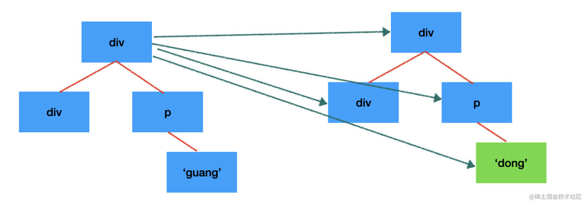
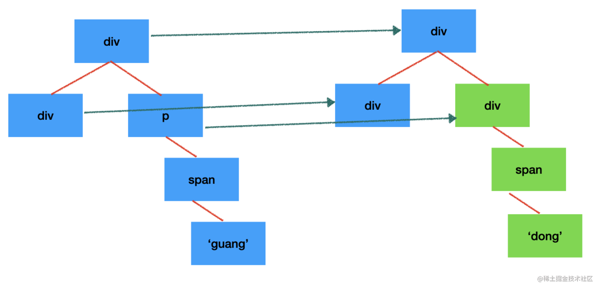
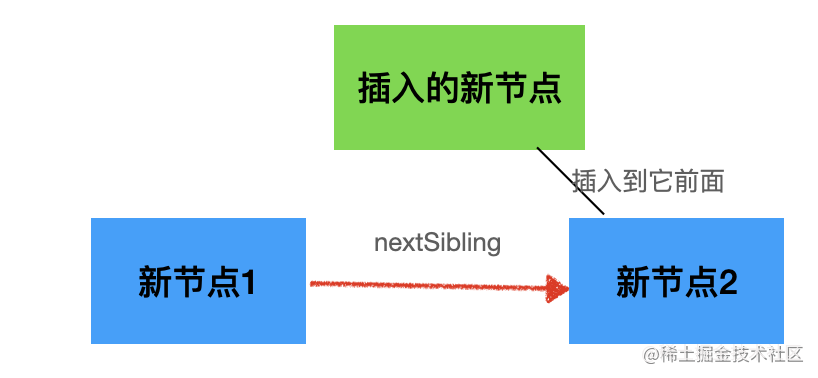
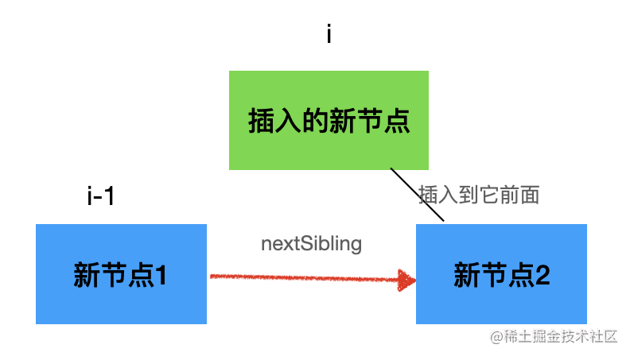
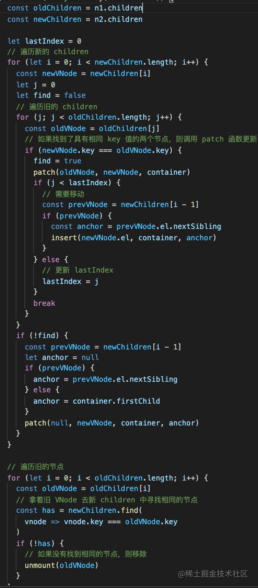
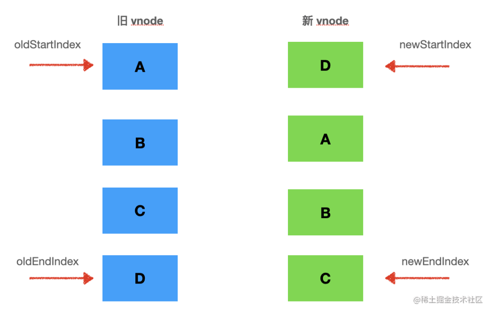
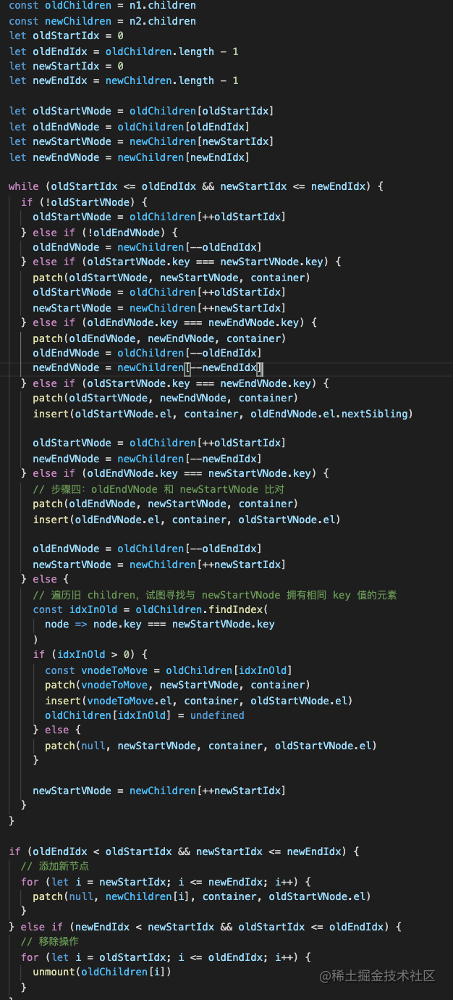

# Vue2 双端 diff 算法

Vue 和 React 都是基于 vdom 的前端框架，组件渲染会返回 vdom，渲染器再把 vdom 通过增删改的 api 同步到 dom

再次渲染时，会产生新的 vdom，渲染器会对比两棵 vdom 树，对有差异的部分通过增删改的 api 更新到 dom。这里对比两棵 vdom 树，找到有差异的部分的算法，叫 diff 算法

diff 算法是渲染器中最复杂的部分，也是面试的热点问题。今天先探究下 Vue 的 diff 算法

## diff 算法

两棵树做 diff，复杂度为 O(n^3) ：每个节点都要去和另一棵树的全部节点对比一次，这就是 n；若找到有变化的节点，执行插入、删除、修改也是 n 的复杂度；所有的节点都是这样，再乘以 n。所以是 O(n \* n \* n) 的复杂度



也意味着 1000 个节点，渲染一次要处理 1000 的 3 次方即 10 亿次，这样的复杂度对于前端框架来说不可接受。所以前端框架的 diff 约定了两种处理原则：

- 只做同层的对比
- type 变了就不再对比子节点

因为 dom 节点做跨层级移动的情况是较少的，一般都是同一层级 dom 的增删改。这样只要遍历一遍，对比一下 type 即可， O(n) 的复杂度

而 type 变了就不再对比子节点，能省下一大片节点的遍历。另外，因为 vdom 中记录了关联的 dom 节点，执行 dom 的增删改也不需要遍历，是 O(1)的，整体的 diff 算法复杂度就是 O(n)



这样 1000 个节点渲染一次最多对比 1000 次，复杂度在可接受范围。当然还存在问题：

比如一组节点，假设 5 个，类型是 ABCDE，下次渲染出来的是 EABCD，这时逐一对比，发现 type 不一样，就会全部重新渲染。且根据 type 不同也不再对比子节点的原则，若这些节点有子节点，也会重新渲染

dom 操作是较慢的，这样 diff 算法复杂度虽低，但重新渲染的性能也不高。所以，diff 算法除考虑本身的时间复杂度外，还要考虑另一因素：dom 操作次数

上例的 ABCDE 变为 EABCD，明显只需要移动一下 E 即可，根本无需创建新元素。但如何对比出是同节点发生了移动呢？最好是每个节点都是唯一标识

所以当渲染一组节点时，前端框架会让开发者指定 key，通过 key 来判断是否有点节点只是发生了移动，从而直接复用

这样，diff 算法处理一组节点的对比时，就要根据 key 来再做一次算法的优化。通常把基于 key 的两组节点 diff 算法称为多节点 diff 算法，它是整个 vdom 的 diff 算法的一部分

## 简单 diff

假设渲染 ABCD 一组节点，再次渲染是 DCAB，而多节点 diff 算法的目的是为了尽量复用节点，通过移动节点代替创建

所以对新 vnode 数组的每个节点都需判断下是否在旧 vnode 数组中有对应 key ，有的话就移动到新的位置，没有的话再创建新的。如下：

```js
const oldChildren = n1.children;
const newChildren = n2.children;

let lastIndex = 0;
// 遍历新的 children
for (let i = 0; i < newChildren.length; i++) {
	const newVNode = newChildren[i];
	let j = 0;
	let find = false;
	// 遍历旧的 children
	for (j; i < oldChildren.length; j++) {
		const oldVNode = oldChildren[j];
		// 如果找到了具有相同 key 值的两个节点，则调用 patch 函数更新
		if (newVNode.key === oldVNode.key) {
			find = true;
			patch(oldVNode, newVNode, container);
			// 处理移动...
			break;
		}
	}
	// 没有找到就是新增了
	if (!find) {
		const prevVNode = newChildren[i - 1];
		let anchor = null;
		if (prevVNode) {
			anchor = prevVNode.el.nextSibling;
		} else {
			anchor = container.firstChild;
		}
		patch(null, newVNode, container, anchor);
	}
}
```

这里的 patch 函数的作用为：更新节点属性；重设事件监听器；若无对应旧节点则插入节点，但需传入一个其之后的节点作为锚点（anchor）

因此大致流程即为：遍历处理新的 vnode，先从旧的 vnode 数组中查找对应的节点，若找到则代表可复用，接下来只要移动即可；若未找到，则执行插入，锚点是上一节点的 nextSibling



找到可复用节点后，该移动到哪里呢？其实新 vnode 数组中记录的顺序就是目标的顺序，所以把对应节点按照此顺序来移动即可

```js
const prevVNode = newChildren[i - 1];
if (prevVNode) {
	const anchor = prevVNode.el.nextSibling;
	insert(newVNode.el, container, anchor);
}
```

要插入到 i 的位置，则要取 i-1 位置节点的 nextSibling 做为锚点来插入当前节点



但是并非所有节点都需移动，例如处理到第二个新 vnode，发现其在旧的 vnode 数组中的下标为 4，说明本来就是在后面了，则就无需移动了。反之若是查找到对应旧 vnode 在当前 index 之前才需移动。即：

```js
let j = 0;
let find = false;
// 遍历旧的 children
for (j; j < oldChildren.length; j++) {
	const oldVNode = oldChildren[j];
	// 如果找到了具有相同 key 值得两个节点，则调用 patch 函数更新之
	if (newVNode.key === oldVNode.key) {
		find = true;
		patch(oldVNode, newVNode, container);

		if (j < lastIndex) {
			// 旧的 vnode 数组的下标在上一个 index 之前，需要移动
			const prevVNode = newChildren[i - 1];
			if (prevVNode) {
				const anchor = prevVNode.el.nextSibling;
				insert(newVNode.el, container, anchor);
			}
		} else {
			// 无需移动
			// 更新 lastIndex
			lastIndex = j;
		}
		break;
	}
}
```

查找新 vnode 在旧的 vnode 数组中的下标，若找到则说明对应的 dom 是可复用的，先 patch 一下，再移动。移动的话判断下标是否在 lastIndex 之后，如本来就在后面，则不用移动，更新下 lastIndex 就行；而如下标在 lastIndex 之前，说明需要移动，移动到的位置前面已分析，即新 vnode 数组 i-1 的后面。这样就完成了 dom 节点的复用和移动

新 vnode 数组全部处理完后，旧数组中可能还剩下一些不需要的，删除之：

```js
for (let i = 0; i < oldChildren.length; i++) {
	const oldVNode = oldChildren[i];
	// 拿着旧 VNode 去新 children 中寻找相同节点
	const has = newChildren.find((vnode) => vnode.key === oldVNode.key);
	if (!has) {
		// 如果没有找到相同的节点，则移除
		unmount(oldVNode);
	}
}
```

这样就完成了两组 vnode 的 diff 和对应 dom 的增删改

小结一下：diff 算法的目的是根据 key 复用 dom 节点，通过移动节点而非创建新节点来减少 dom 操作。
对于每个新 vnode，在旧 vnode 数组中根据 key 查找一下，如未找到则新增 dom 节点，如果找到则可复用

复用时根据下标判断是否要移动，如下标在 lastIndex 之后则无需，因为本来就在后面，反之就要移动

最后，把旧 vnode 数组中未再次出现的节点从 dom 树中删除

以下是一个完整 diff 算法的实现：



## 双端 diff

简单 diff 算法是从一个方向逐个处理的，性能并非最好，因为有时会做一些没必要的移动。如旧的 vnode 数组是 ABCD，新的 vnode 数组是 DABC，按照简单 diff 算法，A、B、C 都需要移动

如何优化呢？思路是从两个方向同时对比，即双端 diff 算法：需要 4 个指针，分别指向新旧两个 vnode 数组的头尾



头尾指针向中间移动，直到 oldStartIdx <= oldEndIdx 且 newStartIdx <= newEndIdx，说明处理完了全部节点

每次分别对比两个头指针指向节点、两个尾指针指向节点，一头一尾指向的节点，是不是 key 值一致，即可复用的。若可复用则直接用，调用 patch 更新；若是头尾这种，还要移动下位置。即：

```js
while (oldStartIdx <= oldEndIdx && newStartIdx <= newEndIdx) {
	if (oldStartVNode.key === newStartVNode.key) {
		// 头头
		patch(oldStartVNode, newStartVNode, container);
		oldStartVNode = oldChildren[++oldStartIdx];
		newStartVNode = newChildren[++newStartIdx];
	} else if (oldEndVNode.key === newEndVNode.key) {
		// 尾尾
		patch(oldEndVNode, newEndVNode, container);
		oldEndVNode = oldChildren[--oldEndIdx];
		newEndVNode = newChildren[--newEndIdx];
	} else if (oldStartVNode.key === newEndVNode.key) {
		// 头尾，需要移动
		patch(oldStartVNode, newEndVNode, container);
		insert(oldStartVNode.el, container, oldEndVNode.el.nextSibling);
		oldStartVNode = oldChildren[++oldStartIdx];
		newEndVNode = newChildren[--newEndIdx];
	} else if (oldEndVNode.key === newStartVNode.key) {
		//尾头，需要移动
		patch(oldEndVNode, newStartVNode, container);
		insert(oldEndVNode.el, container, oldStartVNode.el);
		oldEndVNode = oldChildren[--oldEndIdx];
		newStartVNode = newChildren[++newStartIdx];
	} else {
		// 头尾未找到可复用节点
	}
}
```

头头和尾尾的对比比较简单，头尾和尾头的对比还要移动节点。例如旧 vnodes 的头节点是新的 vnodes 的尾节点，则要将其移动到旧的 vnodes 的尾节点位置。即：

```js
insert(oldStartVNode.el, container, oldEndVNode.el.nextSibling);
```

插入节点的锚点是 oldEndVNode 对应的 dom 节点的 nextSibling

---

而若旧 vnodes 的尾节点是新 vnodes 的头结点，则要将其移动到旧 vnodes 的头结点的位置。即：

```js
insert(oldEndVNode.el, container, oldStartVNode.el);
```

插入节点的锚点节点是 oldStartVNode 对应的 dom 节点（因为要插在它之前）

双端进行对比，能尽可能减少节点移动次数。当然，还要处理下没有可复用节点的情况：若双端都没有可复用节点，则在旧节点数组中找，找到了就移过来，且原位置置为 undefined。未找到则插入一个新节点。即：

```js
const idxInOld = oldChildren.findIndex(
	(node) => node.key === newStartVNode.key
);

if (idxInOld > 0) {
	const vnodeToMove = oldChildren[idxInOld];
	patch(vnodeToMove, newStartVNode, container);
	insert(vnodeToMove.el, container, oldStartVNode.el);
	oldChildren[idxInOld] = undefined;
} else {
	patch(null, newStartVNode, container, oldStartVNode.el);
}
```

因为有了一些 undefined 节点，所以要加上空节点的处理逻辑：

```js
if (!oldStartVNode) {
	oldStartVNode = oldChildren[++oldStartIdx];
} else if (!oldEndVNode) {
	oldEndVNode = newChildren[--oldEndIdx];
}
```

这样就完成了节点复用和移动的逻辑。至于确实没有可复用节点的那些节点，经过前面移动后，剩下的节点都被移动到了中间，若新 vnode 有剩余，则批量新增，若旧 vnode 有剩余则批量删除

因为前面一个循环的判断条件是 `oldStartIdx <= oldEndIdx && newStartIdx <= newEndIdx`，这样如果 old vnode 多了，最后 newStartIdx 会小于 newEndIdx；如果 new vnode 多了，最后 oldStartIdx 会小于 oldEndIdx。因而判断条件应为：

```js
if (oldEndIdx < oldStartIdx && newStartIdx <= newEndIdx) {
	// 添加新节点
	for (let i = newStartIdx; i <= newEndIdx; i++) {
		patch(null, newChildren[i], container, oldStartVNode.el);
	}
} else if (newEndIdx < newStartIdx && oldStartIdx <= oldEndIdx) {
	// 移除操作
	unmount(oldChildren[i]);
}
```

这就是一个完整 diff 算法了，包括查找可复用节点、移动节点、新增和删除节点。因为从两侧查找节点，会比简单 diff 算法性能更好一些。如 ABCD 到 DABC，简单 diff 算法需要移动 ABC 三个节点，而双端 diff 算法只需移动 D 一个节点

小结一下：双端 diff 是头尾指针向中间移动的同时，对比头头、尾尾、头尾、尾头是否可以复用，若可以则移动对应 dom 节点；若头尾未找到可复用节点就遍历 vnode 数组来查找，然后移动对应下标的节点到头部。最后还剩下的旧 vnode 就批量删除，剩下的新 vnode 就批量新增



双端 diff 算法是 Vue2 采用的 diff 算法，性能还不错。Vue3 又对此进行了升级，称为快速 diff 算法（待续）

## 总结

<!-- React 和 Vue 都是基于 vdom 的前端框架，组件产生 vdom，渲染器再把 vdom 通过增删改的 dom api 更新到 dom。

当再次渲染出 vdom 时，就要新旧两棵 vdom 树做 diff，只更新变化的 dom 节点。

两棵树的 diff 是 O(n^3) 的，时间复杂度太高，因此前端框架规定了只做同层 diff，还有 type 不一样就认为节点不一样，不再对比子节点。这样时间复杂度一下子就降到了 O(n)。

但是对于多个子节点的 diff 不能粗暴的删除和新增，要尽量复用已有的节点，也就是通过移动代替新增。

所以多节点的时候，要指定 key，然后 diff 算法根据 key 来查找和复用节点。

简单 diff 算法是依次根据 key 查找旧节点的，移动的话通过 lastIndex 判断，大于它就不用动，小于它才需要移动。剩下的节点再批量删除和新增。

但是简单 diff 算法局限性还是比较大的，有些情况下性能并不好，所以 vue2 用的是双端 diff 算法。

双端 diff 算法是头尾指针向中间移动，分别判断头尾节点是否可以复用，如果没有找到可复用的节点再去遍历查找对应节点的下标，然后移动。全部处理完之后也要对剩下的节点进行批量的新增和删除。

其实 diff 算法最重要的就是找到可复用的节点，然后移动到正确的位置。只不过不同的算法查找顺序不一样。

vue2 是用的双端 diff 的算法，而 vue3 则通过最长递增子序列的算法做了进一步的优化，关于优化后的 diff 算法，我们之后再聊。 -->
