# Vue3 响应式原理（reactive + computed）

响应式是 Vue 的特色，就是在被观察的数据变化时做一系列联动处理

在前端框架里，被观察的目标是状态。状态一般是多个，会通过对象的方式来组织。所以，观察状态对象每个 key 的变化，联动做一系列处理即可。我们需要维护这样的数据结构：

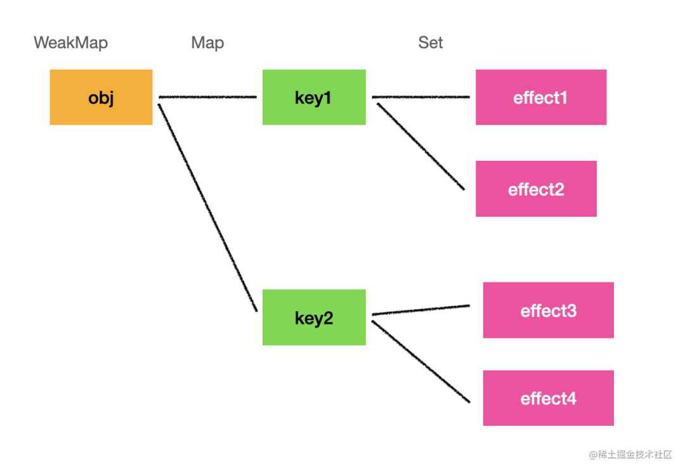

状态对象的每个 key 关联着一系列 effect 副作用函数，即在前者变化时联动执行的逻辑，存于一个 Set 中。而所有的 key（字符串形式） - effectsSet 映射则存于一个 Map 中，后者在对象存在时存在，对象销毁时跟着销毁（对象都没了自然也无需维护每个 key 关联的 effect 了）

而 WeakMap 正好具有这样的特性，WeakMap 的 key 必须为一个对象，value 可为任意数据。前者销毁时，后者也会销毁。所以，响应式的 Map 会存于 WeakMap 中，key 为原对象

该数据结构正是响应式的核心数据结构。例如以下的状态对象：

```js
const obj = {
	a: 1,
	b: 2,
};
```

其响应式数据结构的创建如下：

```js
const depsMap = new Map();

const aDeps = new Set();
depsMap.set("a", aDeps);

const bDeps = new Set();
depsMap.set("b", bDeps);

const reactiveMap = new WeakMap();
```

产出的数据结构即为：

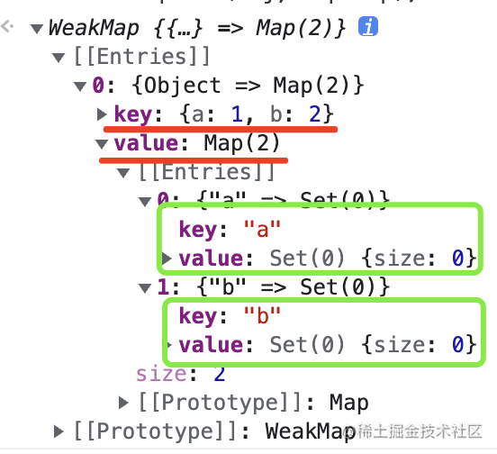

接着添加 deps 依赖，比如一个函数依赖了 a，则要添加到 a 的 deps 集合里：

```js
// 依赖了 a 的函数
const fn = () => console.log(obj.a);
effect(fn);

// ...在 effect 中...
const depsMap = reactiveMap.get(obj);
const aDeps = depsMap.get("a");
aDeps.add(fn);
```

## 基本响应式

这样维护 deps 功能上并无问题，但若让用户手动添加 deps 则不但会侵入业务代码，而且还容易遗漏。所以还要做自动依赖收集，在读取状态值时就建立与该状态的依赖关系

很容易想到可代理状态的 get 来实现，通过 `Object.defineProperty` 或 Proxy 都可行：

```js
const data = {
	a: 1,
	b: 2,
};

let activeEffect;
function effect(fn) {
	activeEffect = fn;
	fn();
}

// 注意 reactiveMap 集合了所有的响应式对象，是一个 WeakMap
const reactiveMap = new WeakMap();
const obj = new Proxy(data, {
	get(targetObj, key) {
		let depsMap = reactiveMap.get(targetObj);
		if (!depsMap) {
			reactiveMap.set(targetObj, (depsMap = new Map()));
		}

		let deps = depsMap.get(key);
		if (!deps) {
			depsMap.set(key, (deps = new Set()));
		}
		deps.add(activeEffect);

		return targetObj[key];
	},
});
```

effect 会执行传入的回调函数 fn，当在 fn 中读取 obj.a 时，就会触发 get 并会拿到对象的响应式 Map，从里面取出 a 对应的 deps 集合，往里面添加当前的 effect 函数。这样就完成了一次依赖收集。

而当修改 obj.a 时，要通知所有的 deps，所以还要代理 set：

```js
set(targetObj, key, newVal) {
  targetObj[key] = newVal

  const depsMap = reactiveMap.get(targetObj)
  if (!depsMap) return

  const effects = depsMap.get(key)
  effects && effects.forEach(fn => fn())
}
```

基本的响应式完成，测试一下：

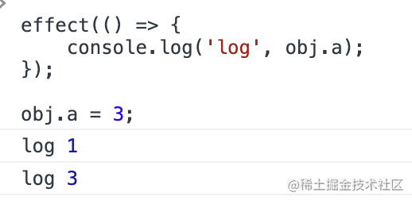

打印了两次，第一次是 1，第二次是 3:

- effect 会先执行一次传入的回调函数，触发 get 来收集依赖，这时候打印的 obj.a 是 1
- 接着当 obj.a 赋值为 3 后，会触发 set，执行收集的依赖，这时候打印 obj.a 是 3

依赖也正确收集到了：

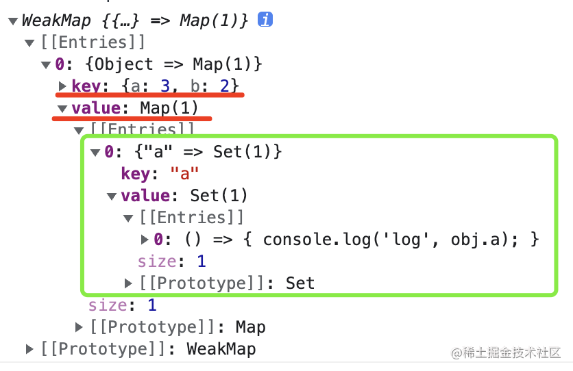

## 处理分支切换

当然，现在的实现还不完善，存在一些问题如：代码里有分支切换，上次执行会依赖 obj.b 而下次执行又不依赖了，这时就有了无效依赖

这样一段代码：

```js
const obj = {
	a: 1,
	b: 2,
};
effect(() => {
	console.log(obj.a ? obj.b : "nothing");
});
obj.a = undefined;
obj.b = 3;
```

1. 初次执行 effect 函数时 obj.a 为 1，这时会走到分支一：即又依赖了 obj.b

2. 而当把 obj.a 修改为 undefined，触发 set 并执行所有依赖函数后，又会走到分支二，不再依赖 obj.b

3. 再把 obj.b 修改为 3，按理说此时并无依赖 b 的函数，但执行后发现：

   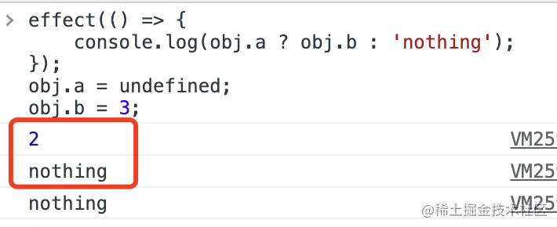

   1. 第一次打印 2 是对的，即走到了分支一，打印 obj.b
   2. 第二次打印 nothing 也是对的，这时走到分支二
   3. 但第三次打印 nothing 就不对了，因为此时 obj.b 已无依赖函数，但却还是打印了

此时打印下 deps 会发现，obj.b 的 deps 并未清除。因而解决方案即每次添加依赖函数前（即执行依赖函数的前一步）先将后者从所有引用它的 deps 中清除

于是需要改造下现有的 effect 函数：将传入的依赖函数包装进 effectFn 中（也是在依赖收集时被真正存入 deps Set 中的），在后者上添加 deps 属性（引用计数数组）以记录哪些 deps Set 与自己存在引用关系（该过程在 get 依赖收集之前）

当触发 get 收集依赖时，便将 deps Set 反向记录到 deps 数组中

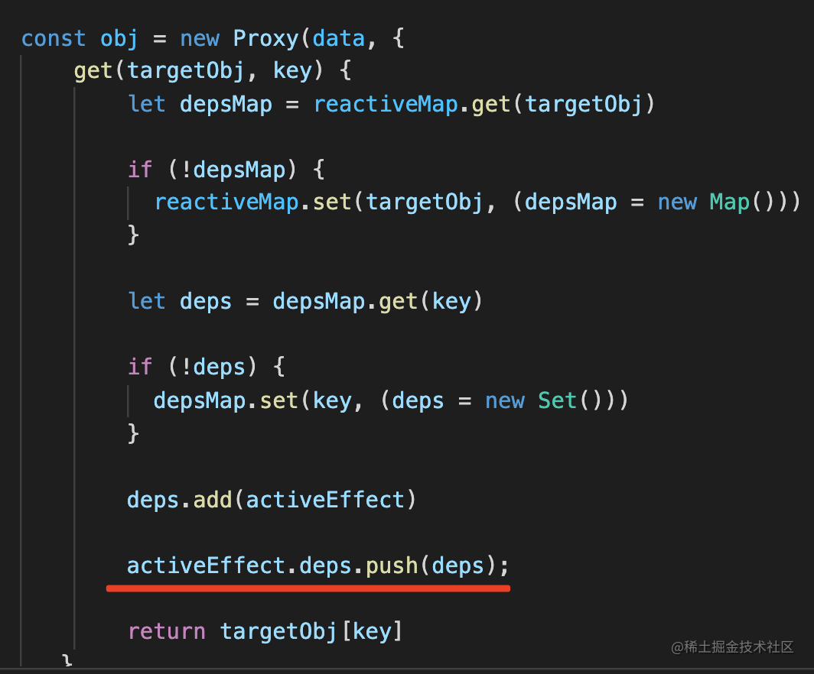

这样下次再执行该 wrapper 函数时，便可将后者从引用到自身的所有 deps set 中删除

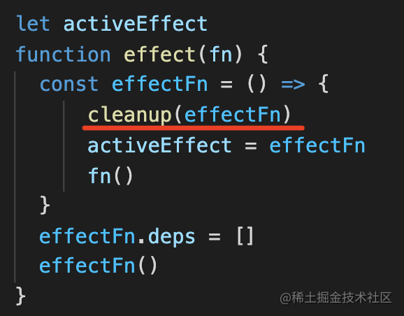

cleanup 实现如下：

```js
function cleanup(effectFn) {
	for (let i = 0; i < effectFn.deps.length; i++) {
		const deps = effectFn.deps[i];
		deps.delete(effectFn);
	}
	effectFn.deps.length = 0;
}
```

全删完后将 deps 数组也置空。再来测试下：

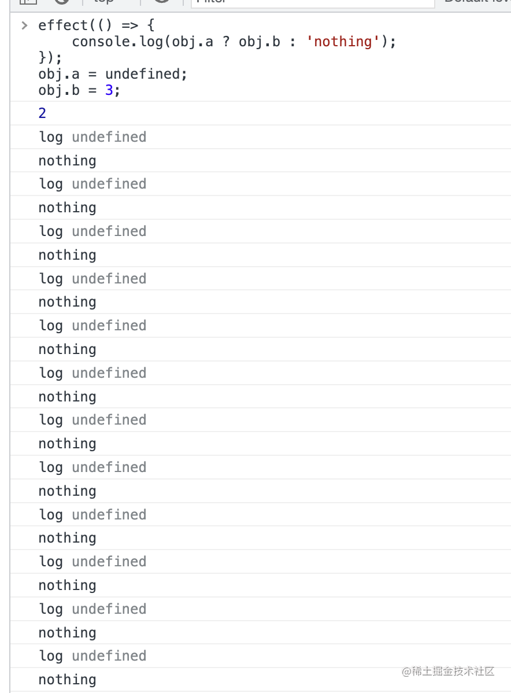

发现陷入了死循环，而问题出在这里：

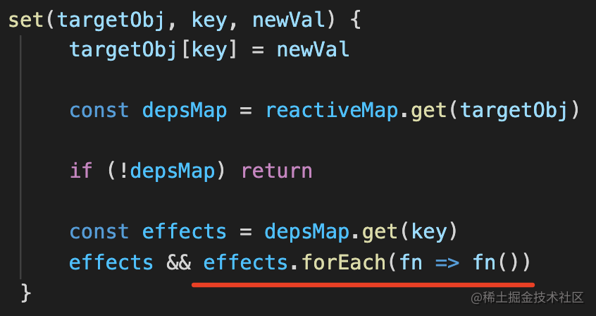

<!--

第一次翻阅 HcySunYang 的 Vue.js 设计与实现一书时，内心无疑是复杂的... 后来理清思路了再回首，觉得需要先掌握几点大原则...

1. 暂时放开依赖收集、deps 之类的名词，转而更精准的描述
2. 梳理出完整的调用链路

...为了行文流程，先放在最前面...

第一次：执行 effect， -> 将依赖函数包装进 effectFn 内 -> 调用后者 -> 将自身从所有与其存在引用关系的 deps Set 中删除并置空引用计数数组，再（间接）调用依赖函数 -> 触发 get -> 通过中间变量 activeEffect 获取到当前 effectFn ->
存入 deps Set 中（完成依赖收集）

后续次：赋值 -> 触发 set -> 根据 key 从 reactiveMap 中获取对应的 deps Set -> 遍历执行 deps Set 中所有 effectFn -> 将自身从所有与其存在引用关系的 deps Set 中删除并置空引用计数数组，再（间接）调用依赖函数 -> 触发 get
-> 通过中间变量 activeEffect 获取到当前 effectFn -> 存入 deps Set 中
（完成依赖收集）
-->

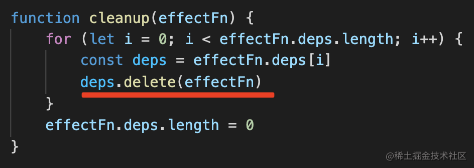

触发 set 时会遍历执行当前 key 对应 deps Set 中所有 effectFn，遍历的每一轮都会先将当前 effectFn 从 deps Set 中删除，尔后在依赖收集时再加回来（作为新成员）。这样 Set 中每一轮增加一个“新成员”，因而永远遍历不完

而解决方式就是创建第二个 Set，只用于遍历：

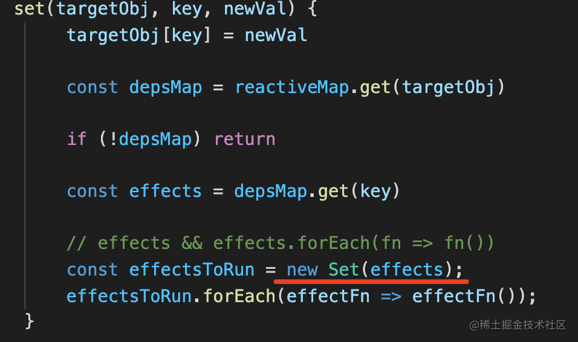

这样就不会无限循环了。再测试一次：

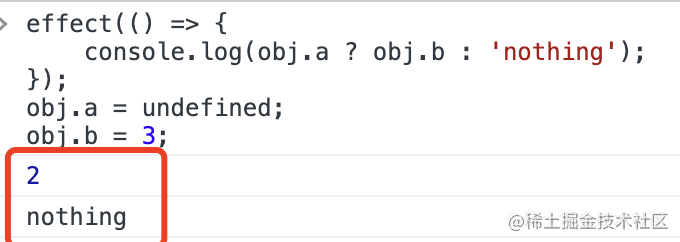

当 obj.a 赋值为 undefined 后，再次执行 effect 函数，obj.b 的 deps 集合就被清空了，所以修改 obj.b 不会打印任何东西

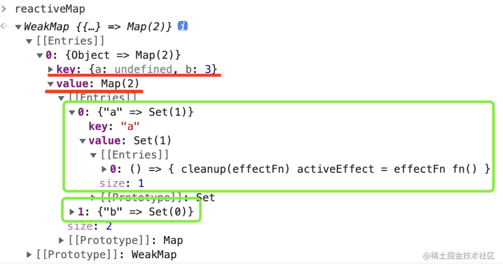

## 处理 effect

然而还有可优化点，一个问题：若 effect 嵌套了，则依赖还能正确收集么？毕竟组件是可嵌套的，而组件里会写 effect，也就等于 effect 嵌套了。所以必须支持嵌套，首先做下测试：

```js
effect(() => {
	console.log("effect1");
	effect(() => {
		console.log("effect2");
		obj.b;
	});
	obj.a;
});
obj.a = 3;
```

按理说：

1. 首先会打印一次 effect1，一次 effect2
2. 而 obj.a 修改为 3 后，会触发一次 effect1 的打印，执行内层 effect，又触发一次 effect2 的打印

也就是会打印 effect1、effect2、effect1、effect2，但测试后发现：

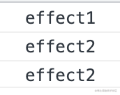

正确打印 effect1、effect2 后，第三次打印的是 effect2。这说明 obj.a 修改后并未执行外层函数，而是执行的内层函数。原因参见以下代码：

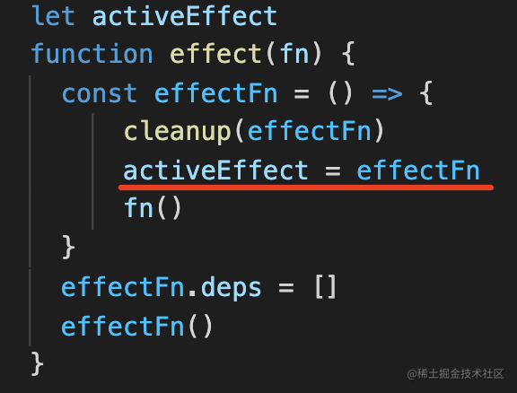

每次执行 effectFn 时，都会将其赋值给一个中间变量 activeEffect，帮助收集依赖。而当依赖函数存在嵌套时，内层 effectFn 的执行会修改 activeEffect，这样收集到的就只会是最深层的依赖函数

因此需要以栈的数据结构来记录依赖函数间的嵌套关系，如下：

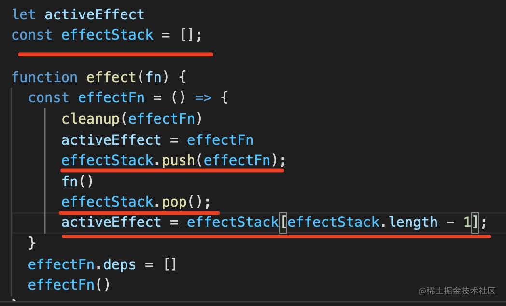

执行依赖函数前将当前 effectFn 入栈，执行完后出栈，保持 activeEffect 始终指向栈顶 effectFn，这样就保证收集到了依赖的正确

类似思想的应用还有很多，需要保存和恢复上下文时，都是这样加一个栈。再测试一下：

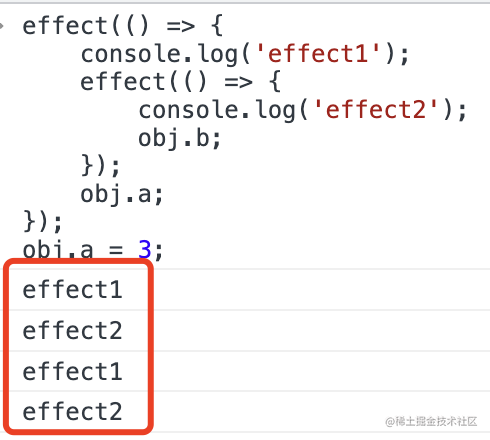

现在的打印就对了，至此响应式系统就算比较完善了。全部代码如下：

```js
const data = {
	a: 1,
	b: 2,
};

let activeEffect;
const effectStack = [];

function effect(fn) {
	const effectFn = () => {
		cleanup(effectFn);

		activeEffect = effectFn;
		effectStack.push(effectFn);
		fn();
		effectStack.pop();
		activeEffect = effectStack[effectStack.length - 1];
	};
	effectFn.deps = [];
	effectFn();
}

function cleanup(effectFn) {
	for (let i = 0; i < effectFn.deps.length; i++) {
		const deps = effectFn.deps[i];
		deps.delete(effectFn);
	}
	effectFn.deps.length = 0;
}

const reactiveMap = new WeakMap();
const obj = new Proxy(data, {
	get(targetObj, key) {
		let depsMap = reactiveMap.get(targetObj);
		if (!depsMap) {
			reactiveMap.set(targetObj, (depsMap = new Map()));
		}

		let deps = depsMap.get(key);
		if (!deps) {
			depsMap.set(key, (deps = new Set()));
		}
		deps.add(activeEffect);
		activeEffect.deps.push(deps);
		return targetObj[key];
	},
	set(targetObj, key, newVal) {
		targetObj[key] = newVal;
		const depsMap = reactiveMap.get(targetObj);
		if (!depsMap) return;
		const effects = depsMap.get(key);

		const effectsToRun = new Set(effects);
		effectsToRun.forEach((effectFn) => effectFn());
	},
});
```

## 实现 computed

<!--
compute 函数需要满足什么？
1. 本质是一种依赖函数
2. 但不需要像其他依赖函数一样一上来就被执行以供依赖收集，而是在它被使用时才开始
3. 自带缓存，只在其依赖值改变后再被取值时才真正重新计算
-->

简单回顾：响应式系统的核心就是一个 WeakMap --- Map --- Set 的数据结构

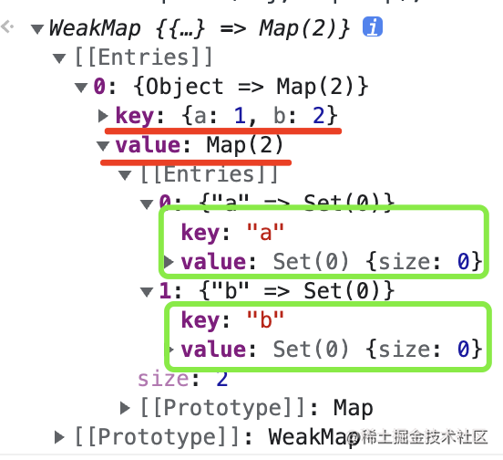

- WeakMap 的 key 为原对象，value 是响应式 Map。这样当对象销毁时，对应的 Map 也会销毁
- Map 的 key 为对象的每个属性，value 是依赖该对象属性的 effect 函数的集合 Set

然后用 Proxy 代理对象的 get 方法，收集依赖该对象属性的 effect 函数到对应 key 的 Set 中

还要代理对象的 set 方法，修改对象属性的时候调用所有该 key 的 effect 函数

上文中按照这样的思路实现了一个较完善的响应式系统，今天继续实现 computed

首先将之前的代码重构一下，把依赖收集和触发依赖函数的逻辑抽离成 track 和 trigger 函数：

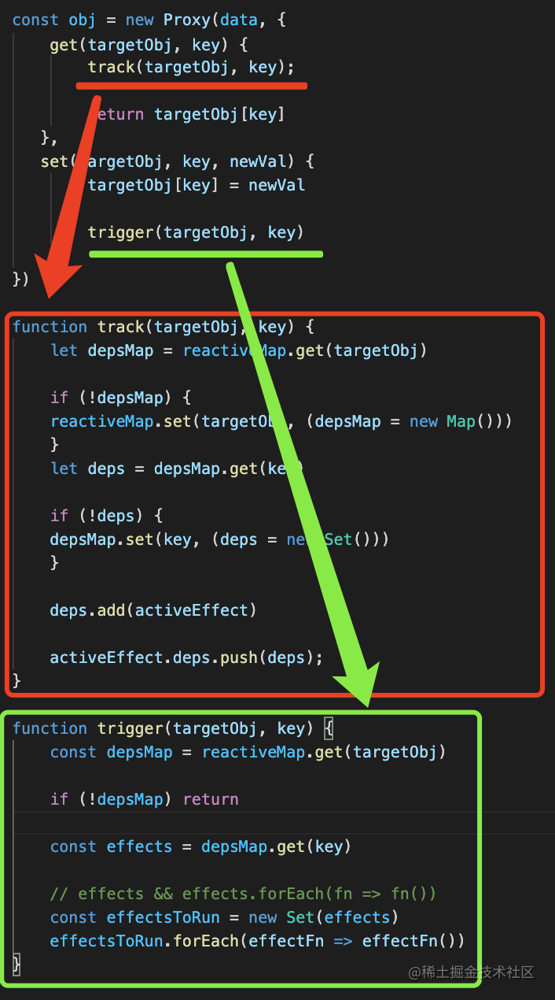

逻辑不变，但抽离出来后清晰多了。然后继续实现 computed，后者的使用大概如下：

```js
const value = computed(() => {
	return obj.a + obj.b;
});
```

对比下 effect，区别只是多了个返回值：

```js
effect(() => {
	console.log(obj.a);
});
```

所以基于 effect 实现 computed 就是如下：

<!-- computed 也可视为一种依赖 -->

```js
function computed(fn) {
	const value = effect(fn);
	return value;
}
```

当然现在的 effect 是没有返回值的，要加一下：

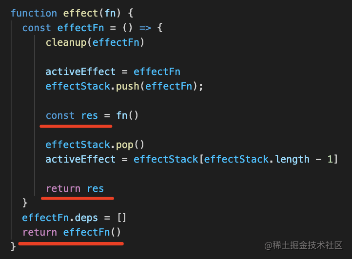

在之前 effect 函数的基础上把返回值记录下来返回。现在 computed 就能返回计算后的值了：

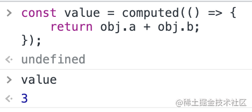

<!--
确切说法应为：用 effect 处理依赖函数会导致后者首先被立即执行一次，但对 compute 函数来说并无必要，初次处理只需将其封装成 effectFn 并返回即可
（真正的依赖收集是在 effectFn 被执行时完成的）
---
而后该 effectFn被执行时（通过 computedObj.value 触发其 getter 间接调用）便完成了依赖收集
 -->

现在数据一变，所有依赖函数都会执行，但 compute 函数并无此必要，只需在依赖数据变了之后执行。所以需对 effect 函数添加 lazy option 以使 effectFn 可不立刻执行

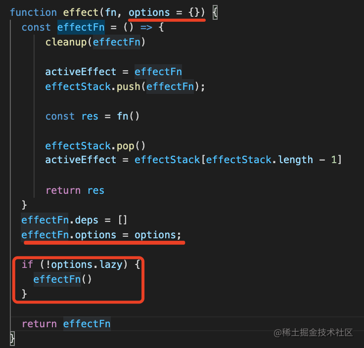

接着在 computed 内调用 effect 函数时就带上 `{ lazy: true }`，令相应的 effectFn 不执行，而是返回出来

同时在 computed 里创建并返回一个对象，在其 value getter 触发时才调用 effectFn 拿到最新值

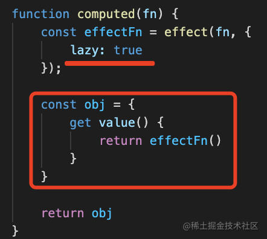

测试下：

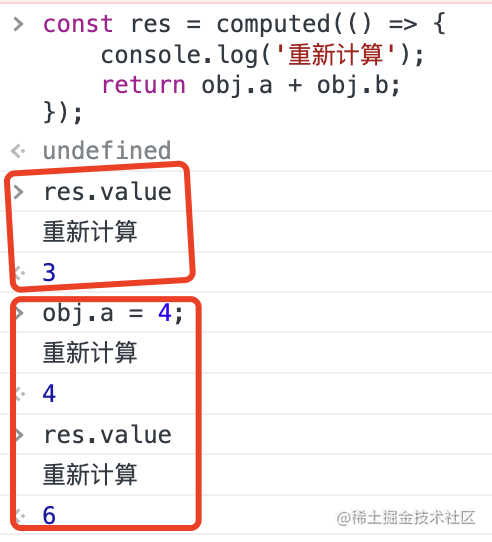

可看到现在 computed 返回值的 value 属性是能拿到计算后的值的，且修改了 `obj.a` 后会重新执行计算函数(因为已完成了依赖收集)，再次拿 value 时也能得到新更改后的值

只是多执行了一次计算，因为 `obj.a` 变的时候会执行所有依赖后者的 effectFn（包括被 computed 处理的）

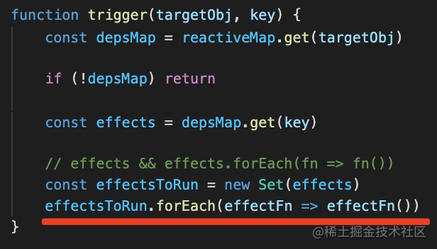

这样并无必要，可给加上调度的功能：执行 effectFn 时若发现其 options 中存在 scheduler，则不调用，而是将该 effectFn 交由 scheduler 处理

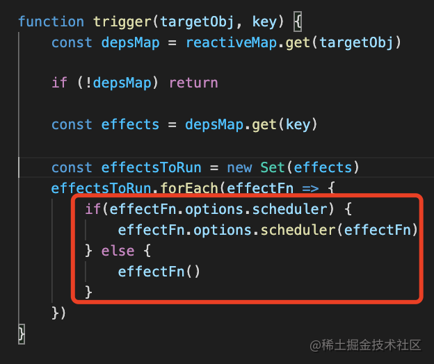

这样就可自己控制 effect 函数的执行了

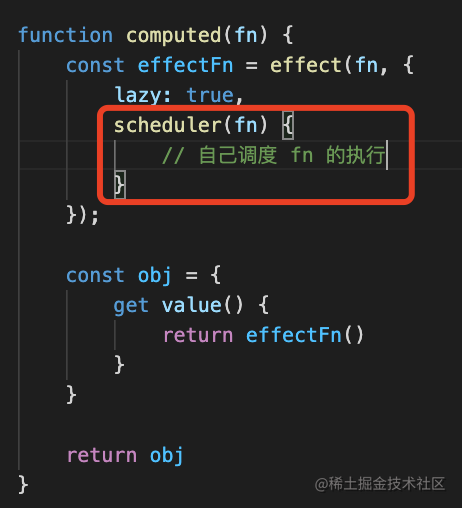

后再试一下刚才的代码：

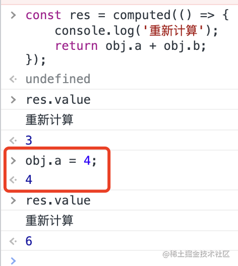

可看到，`obj.a` 变了后并未立即执行 compute 函数来重新计算（因为加了 sheduler 来自己调度）。但还有一问题：每次访问 res.value 都要计算，是否能加个缓存，只当依赖数据变了才计算，否则直接取缓存

因此需要加个标记：

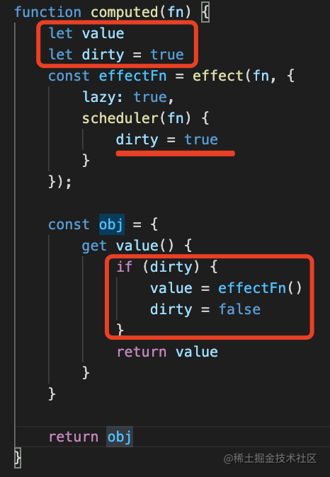

在 scheduler 被调用时就说明数据变了，dirty 设置为 true，然后取 value 时就重新计算，之后再改为 false，下次取 value 就直接拿计算好的值了。测试下：

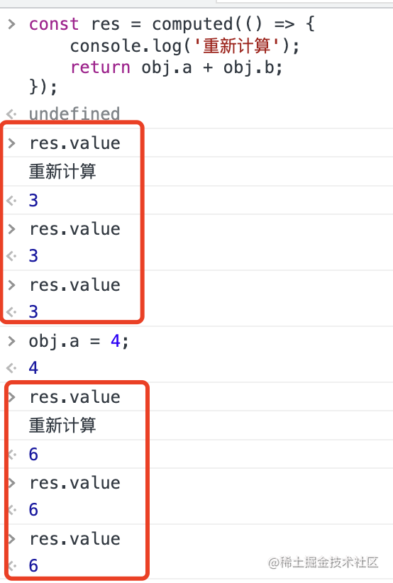

1. 访问 computed 值的 value 属性时，会第一次计算，后面就直接拿计算好的值
2. 修改其依赖的数据后，再次访问 value 属性会再次重新计算，接着再访问又会直接拿计算好的值

现在, computed 还剩下最后一个问题，如以下代码：

```js
let res = computed(() => {
	return obj.a + obj.b;
});

effect(() => {
	console.log(res.value);
});
```

在一个 effect 函数里用到了 computed 值，按理说 obj.a 变了，computed 的值也会变，应该触发所有的 effect 函数。但实际并没有：

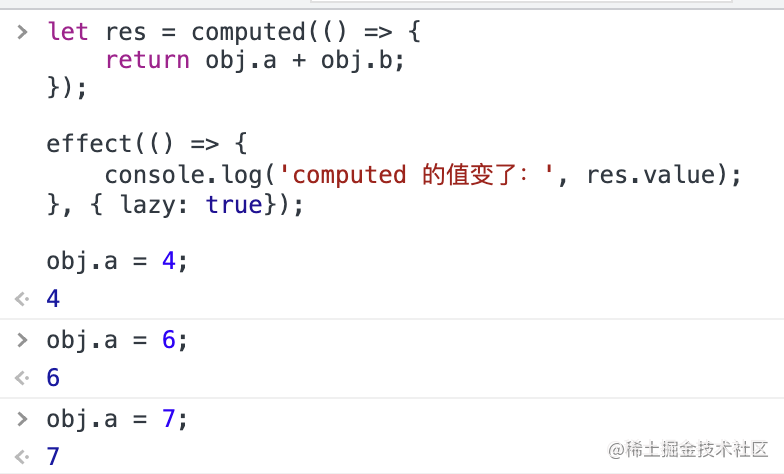

原因在于返回的 computed 值并非响应式的对象，需要将其变为响应式的，即 get 时 track 收集依赖，set 时触发依赖的执行（也是响应式大体原则）：

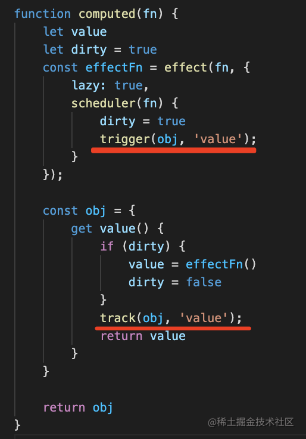

再试一下：

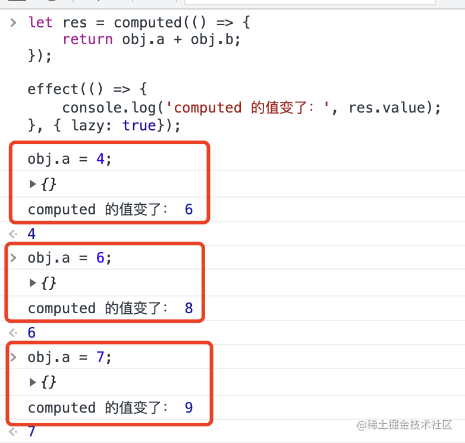

现在 computed 值变了就能触发依赖它的 effect 了，至此 computed 就很完善了。完整代码如下：

```js
const data = {
	a: 1,
	b: 2,
};

let activeEffect;
const effectStack = [];

function effect(fn, options = {}) {
	const effectFn = () => {
		cleanup(effectFn);

		activeEffect = effectFn;
		effectStack.push(effectFn);

		const res = fn();

		effectStack.pop();
		activeEffect = effectStack[effectStack.length - 1];

		return res;
	};
	effectFn.deps = [];
	effectFn.options = options;

	if (!options.lazy) {
		effectFn();
	}

	return effectFn;
}

function computed(fn) {
	let value;
	let dirty = true;
	const effectFn = effect(fn, {
		lazy: true,
		scheduler(fn) {
			if (!dirty) {
				dirty = true;
				trigger(obj, "value");
			}
		},
	});

	const obj = {
		get value() {
			if (dirty) {
				value = effectFn();
				dirty = false;
			}
			track(obj, "value");
			console.log(obj);
			return value;
		},
	};

	return obj;
}

function cleanup(effectFn) {
	for (let i = 0; i < effectFn.deps.length; i++) {
		const deps = effectFn.deps[i];
		deps.delete(effectFn);
	}
	effectFn.deps.length = 0;
}

const reactiveMap = new WeakMap();

const obj = new Proxy(data, {
	get(targetObj, key) {
		track(targetObj, key);

		return targetObj[key];
	},
	set(targetObj, key, newVal) {
		targetObj[key] = newVal;

		trigger(targetObj, key);
	},
});

function track(targetObj, key) {
	let depsMap = reactiveMap.get(targetObj);

	if (!depsMap) {
		reactiveMap.set(targetObj, (depsMap = new Map()));
	}
	let deps = depsMap.get(key);

	if (!deps) {
		depsMap.set(key, (deps = new Set()));
	}

	deps.add(activeEffect);

	activeEffect.deps.push(deps);
}

function trigger(targetObj, key) {
	const depsMap = reactiveMap.get(targetObj);

	if (!depsMap) return;

	const effects = depsMap.get(key);

	const effectsToRun = new Set(effects);
	effectsToRun.forEach((effectFn) => {
		if (effectFn.options.scheduler) {
			effectFn.options.scheduler(effectFn);
		} else {
			effectFn();
		}
	});
}
```
