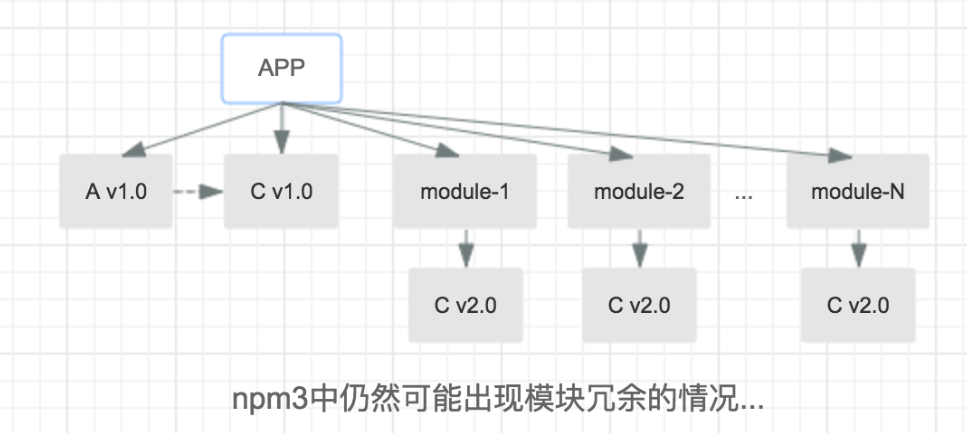
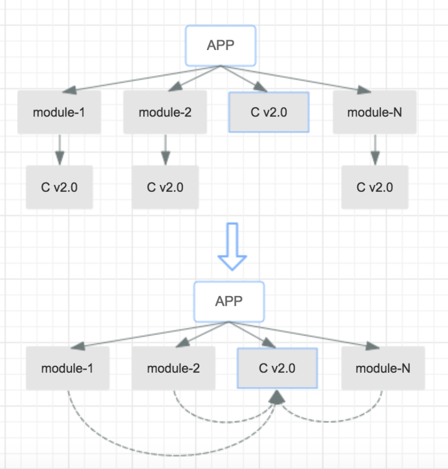

# 面试题解析之工程化

## npm 模块安装机制（假设整体 install）

- 查找`.npmrc`文件，优先级：项目级 > 用户级 > 全局级 > npm 内置

- 执行 preinstall 钩子（若有定义）

- 检查项目中是否有`package-lock.json`：

  - 若无从`package.json`的 dependencies、devDependencies 中确定首层依赖，并逐层寻找深层依赖（多进程）

  - 若有则检查其与`package.json`中依赖是否一致：

    - 一致, 直接使用`package-lock.json`

    - 不一致，则依据`package.json`确定依赖，并更新`package-lock.json`

- 获取模块：

  - 在下载前先确定其版本：

    - 若版本描述文件（`npm-shrinkwrap.json`或`package-lock.json`）中有具体版本号则直接获取

    - 否则根据 semver 从仓库中查询合适版本，例如`package.json`中`^1.1.0`的版本号对应仓库中`1.x.x`形式的最新版本

  - 根据上一步获取到的模块压缩包地址（resolved 字段），先检查本地缓存：有则直接拿，否则从仓库下载

- 尽可能扁平化。例如安装某二级（或更低层级）模块时：

  - 若第一层级未有同名模块，则置于该层的 node_modules 中

  - 若第一层级有兼容（根据 semver）模块，则直接复用

  - 若第一层级已有不兼容模块，则置于其父模块层级下方

  以上仍可能出现冗余情况，例如：

  

  此时再利用`npm dedupe`去除冗余模块：将凡是能去除的冗余二级模块，“重定向”到兼容的一级模块中

  

- 更新项目的 node_modules，并执行模块生命周期函数 preinstall -> install -> postinstall（若定义）

- 执行项目自身生命周期 install -> postinstall -> prepublish -> prepare（若定义）

<!-- TODO：了解下 npm / yarn 缓存机制，参见：

https://juejin.cn/post/7060844948316225572
https://juejin.cn/post/6844903785018425351#heading-4
 -->

## 运行 npm run 时发生了什么

库项目`package.json`/bin 字段指向的地址
