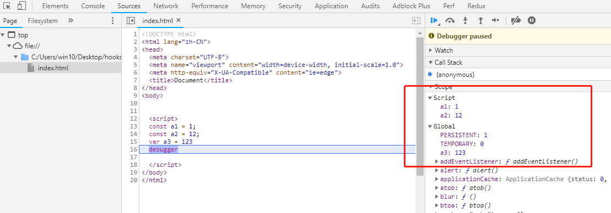

# 面试题解析之基础

## ['1', '2', '3'].map(parseInt) what & why ?

`parseInt()` 基于指定进制来解析一个数值（字符串类型），返回对应的十进制整数或 NaN

```js
const intValue = parseInt(str[, radix]);
```

- **str**：要被解析的值。若非字符串，则将其转换为(使用 ToString)，开头的空白符会被忽略
- **radix**：2-36 之间整数，表示上述字符串的进制，默认为 10

注意若 radix 为 undefined 或 0 时，将作如下处理：

- 若 str 以"0x"或者"0X"开头, 则默认十六进制
- 若 str 以"0"开头, 则默认八进制或者十进制（具体由实现环境决定，ECMAScript 5 规定用 10，但并非所有浏览器都遵循，因此 radix 的值必须明确）
- 若 str 以其它任何值开头，则默认十进制

回到具体事例：

```js
["1", "2", "3"].map(parseInt);
// 等价于
["1", "2", "3"].map((item, index) => {
	return parseInt(item, index);
});
// 因而返回的值分别为：
1; // parseInt('1', 0)
NaN; // parseInt('2', 1) 不存在一进制
NaN; // parseInt('3', 2) 二进制中不可能存在三
```

## 3 种判断数组方法的优劣

### Object.prototype.toString.call()

每个继承 Object 的对象都有 toString 方法，若后者未被重写则会返回 `[Object type]`(type 为对象类型)。但当除 Object 外类型直接调用该方法时，返回的都是内容字符串(因为被重写了)，所以需使用 call 或 apply 来改变 toString 方法的执行上下文

```js
const an = ["Hello", "An"];
an.toString(); // "Hello,An"
Object.prototype.toString.call(an); // "[object Array]"
```

该方法能判断所有基本数据类型（含 null 和 undefined），常用于判断浏览器内置对象

```js
Object.prototype.toString.call("An"); // "[object String]"
Object.prototype.toString.call(1); // "[object Number]"
Object.prototype.toString.call(Symbol(1)); // "[object Symbol]"
Object.prototype.toString.call(null); // "[object Null]"
Object.prototype.toString.call(undefined); // "[object Undefined]"
Object.prototype.toString.call(function () {}); // "[object Function]"
Object.prototype.toString.call({ name: "An" }); // "[object Object]"
Object.prototype.toString.call([]); // "[object Array]"
```

### instanceof

该操作符机制是判断左值的原型链中能否找到右值的 prototype（原型），缺点在于不能用于判断原始类型，且所有对象类型 instanceof Object 都为 true

```js
[] instanceof Array; // true
[] instanceof Object; // true
```

### Array.isArray()

用于判断对象是否为数组，在检测 Array 时优于 instanceof ，因为该方法可透过 iframe

```js
const iframe = document.createElement("iframe");
document.body.appendChild(iframe);

const xArray = window.frames[window.frames.length - 1].Array;
const arr = new xArray(1, 2, 3); // [1,2,3]

// 正确检测出
Array.isArray(arr); // true
Object.prototype.toString.call(arr); // true
// 检测失败
arr instanceof Array;
```

当然由于是 ES5 新增的方法，所以可能存在兼容性问题 ，必要时可用 `Object.prototype.toString.call()` 替代

## 全局作用域中，const 和 let 声明的变量不在 window 上，则在哪里？如何获取？

在 ES5 中，顶层对象的属性与全局变量等价，var 和 function 声明的全局变量便属于顶层对象属性

```js
var a = 12;
function f() {}

console.log(window.a); // 12
console.log(window.f); // f(){}
```

ES6 中，var 和 function 声明的全局变量不变；但 let、const、class 声明的全局变量，不属于顶层对象属性

```js
let aa = 1;
const bb = 2;

console.log(window.aa); // undefined
console.log(window.bb); // undefined
```

通过断点可在浏览器中看到：



全局作用域中，let 和 const 声明的全局变量并未在全局对象中，而在一个块级作用域（Script）中。因而只能在定义变量的块级作用域中获取

```js
let aa = 1;
const bb = 2;

console.log(aa); // 1
console.log(bb); // 2
```

## 下面的代码打印什么内容，为什么？

```js
var b = 10;
(function b() {
	b = 20;
	console.log(b);
})();
```

此题的重点：非匿名自执行函数，函数名只读

```js
var b = 10;
(function b() {
	/* 内部作用域，会先查找是否有已有变量b的声明，有就直接赋值20。这里发现了具名函数 function b(){}，但 IIFE 的函数无法进行赋值（内部机制，类似const），所以无效 */
	b = 20;
	console.log(b); // [Function b]
	console.log(window.b); // 10
})();

// 而严格模式下能看到报错
(function b() {
	"use strict";
	b = 20; // "Uncaught TypeError: Assignment to constant variable."
	console.log(b);
})();

// 变体
(function b() {
	window.b = 20;
	console.log(b); // [Function b]
	console.log(window.b); // 20是必然的
})();

// 变体
(function b() {
	var b = 20; // IIFE 内部变量
	console.log(b); // 20
	console.log(window.b); // 10
})();
```

## 使用 sort() 对数组 [3, 15, 8, 29, 102, 22] 进行排序，输出结果

sort 函数，可接收一个函数，其返回值用于比较两个数的相对顺序

- 无函数时默认按照 UTF-16 排序，对于字母数字可以利用 ASCII 进行记忆

  ```js
  [3, 15, 8, 29, 102, 22].sort(); // [102, 15, 22, 29, 3, 8]
  ```

- 带函数的比较，例如以下，则根据 compareFn 的返回值来排序

  ```js
  [3, 15, 8, 29, 102, 22].sort((a, b) => a - b);
  ```

  - 若返回值 > 0，则 a 在 b 之后
  - 若返回值 < 0，则 a 和 b 之前
  - 若返回值 = 0，则 a 和 b 相对顺序不变（并非所有浏览器都遵守）

## 箭头函数与普通函数的区别是什么？构造函数可用 new 生成实例，箭头函数可以吗？

箭头函数与普通函数相比，有以下几点差异：

1. 内部的 this 指向定义时所在作用域的 this 值，而非调用时所在的对象
2. 未绑定 arguments 对象，若在函数体中调用后者则会向作用域链中查询
3. 不绑定 super 和 new.target
4. 不能用作 Generator 函数，不可以使用 yield
5. 无 prototype 属性
6. 不可用 new 实例化对象，因为：
   - 无 this 值，无法使其指向实例对象
   - 无 prototype，而 new 实例化时会将构造函数的 prototype 赋值给新对象的 `__proto__`

关于 new 实例化方面，普通函数有两个内部方法: `[[Call]]`和`[[Construct]]`:

- 直接调用时执行`[[Call]]`方法, 直接执行函数体
- new 调用时执行`[[Construct]]`方法, 创建一个实例对象

箭头函数无`[[Construct]]`方法, 不能被用作构造函数

## 数组内有 10 万个数据，取第一个元素和第 10 万个元素的时间相差多少

数组可直接根据索引取的对应元素，不管哪个位置时间复杂度都是 O(1)

结论：消耗时间几乎一致，差异可以忽略不计

补：JavaScript 无真正意义数组，本质是对象，其索引看起来是数字，实际会被转成字符串并作为属性名（key）来使用。所以无论取什么位置的元素，都是用 key 精确查找哈希表的过程，消耗时间大致相同

## 输出以下代码执行的结果并解释为什么

```js
var obj = {
	2: 3,
	3: 4,
	length: 2,
	splice: Array.prototype.splice,
	push: Array.prototype.push,
};
obj.push(1);
obj.push(2);
console.log(obj);
```

涉及知识点：

- 类数组：对象形式，具有 splice 方法和 length 属性的都可视为类数组

- push 方法：具有通用性，可应用于类数组对象。根据 length 属性决定插入值的位置，若 length 无法转为数值或不存在时，插入元素的索引为 0。且后一种情况下（不存在），还会创建它

题分析：该 obj 中定义了 splice 和 push，分别对应数组原型中的同名方法：

1. 调用 obj 方法 push(1) 时，此时其 length 为 2，所以会插入到第三项（`obj[2]`），将原为 3 的属性值改为 1，同时 length 加 1
2. 同理，第二次执行时，`obj[3]` 被赋值为 2，length 再加 1

因此输出为：`Object(4) [empty × 2, 1, 2, splice: ƒ, push: ƒ]`，其 length 为
