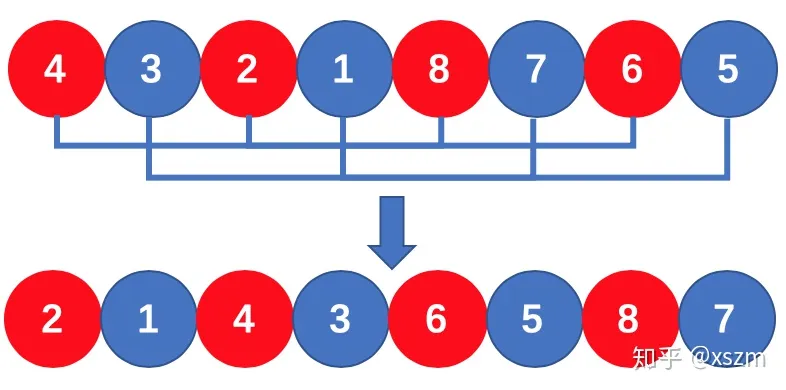
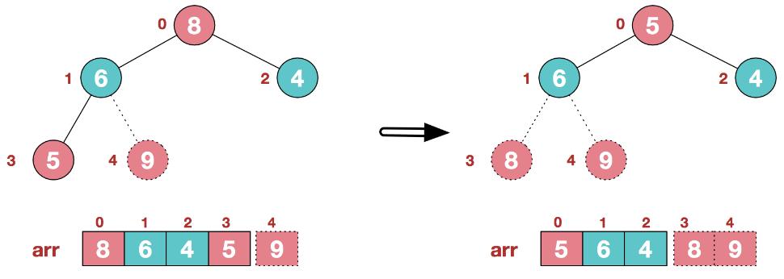

<!-- ---
lang: zh-CN
title: 页面的标题2
description: 页面的描述
--- -->

# 排序算法概述

排序算法可分为内部、外部排序，前者将数据记录在内存中进行排序；后者因数据量大，无法一次容纳全部排序记录，因而过程中需访问外存。常见内部排序算法如下：


关于时间、空间复杂度：


关于稳定性：

若在待排序列中，存在多个相同关键字记录，且排序后后者相对顺序不变，则该排序算法是稳定的，否则即是不稳定

- 稳定：冒泡排序、插入排序、归并排序、基数排序
- 不稳定：选择排序、快速排序、希尔排序、堆排序

名词解释：

- n：数据规模
- k："桶"的个数
- In-place：占用常数内存，不占用额外内存
- Out-place：占用额外内存
- 稳定性：见上文

## 冒泡排序（Bubble Sort）

每趟迭代无序区序列，通过前后元素两两比较找出最大值置于有序区的最前方。直到无序区全部转为有序区，类似泡泡经不断“交换”慢慢浮到顶端

可优化点：记录下每趟迭代中最后发生交换的地方，其后即可视为有序区，作为下一次迭代的终点


```js
function bubbleSort(arr) {
	const len = arr.length;
	for (let i = 0; i < len - 1; i++) {
		for (let j = 0; j < len - 1 - i; j++) {
			if (arr[j] > arr[j + 1]) {
				swap(arr, j, j + 1);
			}
		}
	}
	return arr;
}

function bubbleSortOptimize(arr) {
	let end = arr.length - 1;
	while (end > 0) {
		let tail = end;
		for (let i = 0; i < end; i++) {
			if (arr[i] > arr[i + 1]) {
				swap(arr, i, i + 1);
				tail = i + 1;
			}
		}
		end = Math.min(tail, end - 1);
	}
	return arr;
}

function swap(arr, i, j) {
	const temp = arr[i];
	arr[i] = arr[j];
	arr[j] = temp;
}
```

## 选择排序（Selection Sort）

- 从无序序列中找出最小（大）元素，置于起始位置（视为有序序列末尾）
- 从剩余无序序列中找出最小（大）元素，置于有序序列末尾
- 重复，直到无序区均全部转为有序


```js
function selectionSort(arr) {
	const len = arr.length;
	let minIndex;
	for (let i = 0; i < len - 1; i++) {
		// i 即内层循环的起点
		minIndex = i;
		for (let j = i + 1; j < len; j++) {
			// minIndex 始终指向最小值索引
			if (arr[j] < arr[minIndex]) minIndex = j;
		}
		// swap
		[arr[i], arr[minIndex]] = [arr[minIndex], arr[i]];
	}
	return arr;
}
```

## 插入排序 (Insertion Sort)

原理类似理牌。有序序列在前，无序序列在后，每趟抽取后者中的第一条，并在前者中从后往前查找合适位置插入（逐步扩大有序区），直至全部有序


```js
function insertionSort(arr) {
	const len = arr.length;
	let index, target;
	// head 即无序区的头部
	for (let head = 1; head < len; head++) {
		// 接下来要比较的索引
		index = head - 1;
		// 每趟从无序区抽取的条目
		target = arr[head];
		// 将有序区中所有大于条目值的元素均往后移一位
		while (index >= 0 && arr[index] > target) {
			arr[index + 1] = arr[index];
			index--;
		}
		// 插入
		arr[index + 1] = target;
	}
	return arr;
}
```

## 壳排序（Shell Sort）

改良版插入排序。依次对无序序列中一定间隔的子序列做插入排序（使之宏观有序），不断缩小间隔直到相邻元素。<!-- 该间隔称为增量，（初始）增量为 h 的排序称为 h-排序。 -->如以下序列：


1. 先以较大间隔（4）将无序序列分组，分别为（示例中以不同颜色区分）:

```
8	7	6	5	4	3	2	1
8	-	-	-	4
	7	-	-	-	3
		6	-	-	-	2
			5	-	-	-	1
```

并依次对后者做插入排序得：

```
4	3	2	1	8	7	6	5
4	-	-	-	8
	3	-	-	-	7
		2	-	-	-	6
			1	-	-	-	5
```


2. 接着缩小间隔（2）重新分组，分别为：

```
4	3	2	1	8	7	6	5
4	-	2	-	8	-	6
	3	-	1	-	7	-	5
```

依次插入排序得：

```
2	1	4	3	6	5	8	7
2	-	4	-	6	-	8
	1	-	3	-	5	-	7
```



3. 因最小间隔（1）无需再分组，直接对整体做插入排序得：

```
1	2	3	4	5	6	7	8
```

```js
function shellSort(arr) {
	const len = arr.length;
	let gap = 1;
	// 定义初始间隔，如：
	// 10 => 4
	// 100 => 40
	while (gap < len / 3) {
		gap = gap * 3 + 1;
	}
	// 得出间隔缩减序列，截止为 1，如：
	// 10 => 4, 1
	// 100 => 40, 13, 4, 1
	for (; gap > 0; gap = Math.floor(gap / 3)) {
		// 对每个按间隔划分出的子序列做插入排序
		for (let head = gap; head < len; head++) {
			let index = head - gap;
			const target = arr[head];
			while (head >= 0 && arr[index] > target) {
				arr[index + gap] = arr[index];
				index -= gap;
			}
			arr[index + gap] = target;
		}
	}
	return arr;
}
```

## 归并排序（Merge Sort）

典型的分治法（Divide and Conquer）<!-- 。两种实现方式：自上而下的递归、自下而上的迭代 -->


```js
// 递归法
function mergeSort(arr) {
	const len = arr.length;
	if (len === 1) return arr;
	const middle = Math.floor(len / 2);
	const left = arr.slice(0, middle);
	const right = arr.slice(middle);
	return merge(mergeSort(left), mergeSort(right));
}

function merge(left, right) {
	const result = [];

	while (left.length && right.length) {
		if (left[0] <= right[0]) {
			result.push(left.shift());
		} else {
			result.push(right.shift());
		}
	}

	while (left.length) {
		result.push(left.shift());
	}

	while (right.length) {
		result.push(right.shift());
	}

	return result;
}
```

## 快速排序（Quick Sort）

分治法原理结合冒泡排序（在大多数顺序性较弱的随机数列上优于归并排序）。步骤如下：

1. 从序列中挑出一个元素，称为基准（pivot）

2. 排序，比基准值小的元素置于其之前，大的置于之后。该操作称为分区（partition），将序列分为左右子序列

3. 递归地为（上一步生成的）子序列重复执行上述操作


```js
// 方法一
function quickSort(arr, left = 0, right = arr.length - 1) {
	if (left < right) {
		const partitionIndex = partition(arr, left, right);
		// 取序列第一个元素为基准
		quickSort(arr, left, partitionIndex - 1);
		quickSort(arr, partitionIndex + 1, right);
	}

	return arr;
}

function partition(arr, pivotIndex, end) {
	const pivot = arr[pivotIndex];
	let tail = pivotIndex + 1;
	// 本质就是将比基准小的元素聚集起来
	for (let i = tail; i <= end; i++) {
		if (arr[i] < pivot) {
			swap(arr, i, tail);
			// 始终指向最后发生交换的索引的后一位
			tail++;
		}
	}
	// 将最后交换元素与基准互换，后者即为分割点
	swap(arr, pivotIndex, tail - 1);
	// 返回分割点索引
	return tail - 1;
}

function swap(arr, i, j) {
	const temp = arr[i];
	arr[i] = arr[j];
	arr[j] = temp;
}

// 方法二
function quickSort2(arr, left = 0, right = arr.length - 1) {
	if (left < right) {
		const partitionIndex = partition2(arr, left, right);
		quickSort2(arr, left, partitionIndex - 1);
		quickSort2(arr, partitionIndex + 1, right);
	}
	return arr;
}

function partition2(arr, pivotIndex, end) {
	// 第一个元素为基准并缓存
	const pivot = arr[pivotIndex];
	while (pivotIndex < end) {
		while (pivotIndex < end && arr[end] > pivot) {
			end--;
		}
		// 覆盖 arr[pivotIndex]，此时 arr[end] 既是多余的（可被覆盖）
		arr[pivotIndex] = arr[end];

		while (pivotIndex < end && arr[pivotIndex] <= pivot) {
			pivotIndex++;
		}
		// 覆盖上面的 arr[end]，此时有 arr[pivotIndex] 是多余的（可被覆盖）
		arr[end] = arr[pivotIndex];
	}
	// 将缓存的基准移到分割点位置
	arr[pivotIndex] = pivot;
	return pivotIndex;
}
```

## 推排序（Heap Sort）

堆是具有以下性质的完全二叉树：

- 大顶堆：每个结点值均大于等于其左右子结点值
- 小顶堆：每个结点值均小于等于其左右子结点值


二叉树相关要点：

- 序号为 i 节点的左右子节点序号分别为：`2i+1`、`2i+2`
- 若共 l 个节点，则最后一个非叶子节点序号为：`Math.floor(l/2)`

由此可得：

- 大顶堆：`arr[i] >= arr[2i+1] && arr[i] >= arr[2i+2]`
- 小顶堆：`arr[i] <= arr[2i+1] && arr[i] <= arr[2i+2]`

例如对某大顶堆节点按从上到下、从左到右编号，则可映射为如下数组：


堆排序的基本思想：将序列构造为大顶堆，将堆顶与末尾元素交换（即将最大元素移入有序区）；用剩余（排除末尾）元素重新构造大顶堆，重复执行前述操作... 例如给定以下无序序列


- 步骤一：将无序序列构造为大顶堆

  1. 从最后一个非叶子结点（1）开始，从左至右，从下至上进行调整

     

  2. 找到倒数第二个非叶节点（0），调整

     

  3. 上面调整又导致了子树（1）的混乱，继续调整。结束

     

- 步骤二：将堆顶元素与末尾元素交换（排除出无序区）。再重复

  1. 堆顶元素（0）和末尾元素（4）交换

     

  2. 调整结构使之继续满足堆定义（得到第二大元素）

     

  3. 将堆顶元素（0）和末尾元素（3）交换

     

- 步骤三：如此反复，最终使整个序列有序

  

```js
let len;

function buildMaxHeap(arr) {
	len = arr.length;
	//  Math.floor(len / 2) 即最后一个非叶子节点序号
	for (let i = Math.floor(len / 2); i >= 0; i--) {
		heapify(arr, i);
	}
}

function heapify(arr, i) {
	const left = 2 * i + 1;
	const right = 2 * i + 2;
	let largest = i;

	// 堆会逐步缩减，因而 left < len 呼应后面的 len--，约束左子节点位于堆范围内。下同
	if (left < len && arr[left] > arr[largest]) {
		largest = left;
	}

	if (right < len && arr[right] > arr[largest]) {
		largest = right;
	}

	if (largest !== i) {
		swap(arr, i, largest);
		heapify(arr, largest);
	}
}

function swap(arr, i, j) {
	const temp = arr[i];
	arr[i] = arr[j];
	arr[j] = temp;
}

function heapSort(arr) {
	buildMaxHeap(arr);

	for (let i = arr.length - 1; i > 0; i--) {
		swap(arr, 0, i);
		len--;
		heapify(arr, 0);
	}
	return arr;
}
```

## 计数排序（Counting Sort）

非比较排序，只适用于整数序列。原理：

1. 找出无序序列中的最大（max）、最小（min）项
2. 准备另一个长度为 `max-min+1` 的数组
3. 若序列中存在值为 n 的项，则该数组下标为 n 元素值加 1（初始值为 0）
4. 使用该数组反向填充序列

```js
function countingSort(arr) {
	const min = Math.min(...arr);
	const max = Math.max(...arr);
	const bucket = Array.from({ length: max - min + 1 }).fill(0);

	for (let i = 0; i < arr.length; i++) {
		bucket[arr[i] - min]++;
	}

	let sortedIdx = 0;
	for (let j = 0; j < bucket.length; j++) {
		while (bucket[j] > 0) {
			arr[sortedIdx++] = j + min;
			bucket[j]--;
		}
	}

	return arr;
}
```

## 桶排序（Bucket Sort）

```js
function bucketSort() {}
```
