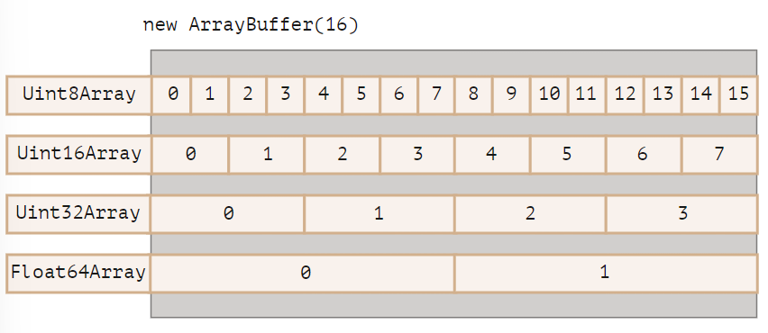
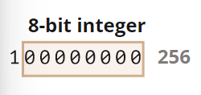
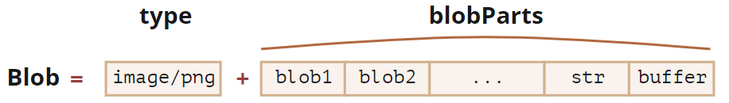

# 二进制和文件概述

在 Web 开发中处理文件时（创建、上传、下载），常遇到二进制数据

JavaScript 中有多种二进制数据类型，如：ArrayBuffer、TypedArray、DataView、Blob、File 等

## ArrayBuffer

最基本二进制对象，也是其他所有二进制对象的底层，是对定长连续内存空间的引用

```js
const buffer = new ArrayBuffer(16); // 分配 16 字节的连续内存空间，用 0 填充
buffer.byteLength; // 16
```

操作 ArrayBuffer 需借助视图，透过后者来解释内部的字节，示意如下：



视图总称 ArrayBufferView，可分为 TypedArray 和 DataView

ArrayBuffer 和 ArrayBufferView 又可总称为 BufferSource，意为任何类型的二进制数据

:::warning ArrayBuffer 不是数组

ArrayBuffer 与 Array 无任何共同之处：

1. 其长度固定
2. 其占用固定的内存空间
3. 要访问单个字节，需要借助视图，而非 `buffer[index]`

:::

### TypedArray

TypedArray（类型化数组），并非具体构造器，而是具有相同方法和属性的一系列对象总称。其底层为 ArrayBuffer，具有索引，可迭代，分为以下具体类型：

- **Uint8Array**、**Uint16Array**、**Uint32Array**：将底层 ArrayBuffer 视为 8、16、32 位无符号整数序列（以下同理）
- **Int8Array**、**Int16Array**、**Int32Array**
- **Float32Array**、**Float64Array**
- **Uint8ClampedArray**：钳形 8 位无符号整数序列（参见下文）

创建方式如下（此处 `TypedArray` 可替换为任意具体类型）：

1.  `new TypedArray(buffer, [byteOffset], [length])`：在给定 ArrayBuffer 上创建类型化数组，可选参数：

    - byteOffset：起始位置，默认为 0
    - length：默认至 ArrayBuffer 末尾，否则将只涵盖其一部分

2.  `new TypedArray([array | object | typedArray])`：根据给定数组、类数组对象或类型化数组，创建相同长度类型化数组并复制其内容以填充：

    ```js
    const arr = new Uint8Array([0, 1, 2, 3]);
    console.log(arr.length); // 4
    console.log(arr[1]); // 1
    ```

3.  `new TypedArray([length])`：创建指定长度的类型化数组（未指定则为 0），其字节长度为 `length * TypedArray.BYTES_PER_ELEMENT`

    ```js
    const arr = new Uint16Array(4);
    console.log(Uint16Array.BYTES_PER_ELEMENT); // 2
    console.log(arr.byteLength); // 8
    ```

:::tip 提示
类型化数组离不开底层 ArrayBuffer，即使在初始化时未提供（对应以上第 2、3），也会在底层自动创建
:::

#### 方法和属性

类型化数组可迭代，具有常规数组方法（map、slice、find、reduce 等），但以下除外：

- 无 splice：无法删除一个值，类型化数组本质还是 ArrayBuffer 的视图
- 无 concat 方法

还有两个额外方法：

- `typedArr.set(fromArr, [offset])`：从 offset（默认为 0）开始，将 fromArr 中的所有元素复制到 arr
- `arr.subarray([begin, end])` 在同一 ArrayBuffer 上创建 begin 到 end（不包括）的同类型视图。相较 slice，此方法不复制数据

可通过以下属性访问底层 ArrayBuffer：

- buffer：即被引用的 ArrayBuffer
- byteLength：ArrayBuffer 的长度

例如：

```js
const buffer = new ArrayBuffer(16);
const view = new Uint32Array(buffer);
console.log(Uint32Array.BYTES_PER_ELEMENT); // 4，每个值 4 字节
console.log(view.length); // 4，存储了4个值
console.log(view.byteLength); // 16, 按字节计算的长度

view[0] = 123456;
for (let num of view) {
	console.log(num); // 123456, 0, 0, 0
}

// 从一个视图转到另一个视图
const arr8 = new Uint8Array([0, 1, 2, 3]);
const arr16 = new Uint16Array(arr8.buffer);
```

#### 越界行为

向类型化数组写入越界值会切除多余位，如将 256（100000000）写入 Uint8Array 后仅存储最右边 8 位（低位有效），因此结果为 0，即原始数字对 `2^8` 的取模



而 Uint8ClampedArray 会将大于 255 的数字存为 255，将负数存为 0，适用于图像处理

### DataView

相较于类型化数组，DataView 可视为 ArrayBuffer 上的未类型化视图，允许以多种格式访问任意偏移量（offset）的数据。即在调用方法时选择格式，而非构造时

语法：`new DataView(buffer, [byteOffset], [byteLength])`

- **buffer**: 底层 ArrayBuffer，不同于类型化数组，DataView 不会自行创建 ArrayBuffer
- **byteOffset**: 视图的起始字节位置（默认为 0）
- **byteLength**: 视图的字节长度（默认至 buffer 末尾）

示例，从同一 ArrayBuffer 中提取不同格式的数字：

```js
// 相当于 4 字节长度的 ArrayBuffer，并以 255（11111111） 填充
const buffer = new Uint8Array([255, 255, 255, 255]).buffer;
const dataView = new DataView(buffer);
dataView.getUint8(0); // 255
dataView.getUint16(0); // 65535 （最大 16 位无符号整数）
dataView.getUint32(0); // 4294967295（最大 32 位无符号整数）
dataView.setUint32(0, 0); // 将 4 个字节全部设为 0
```

DataView 适用于混合格式数据存储在同一缓冲区时，例如存储一个成对序列（16 位整数相邻 32 位浮点数）

### TextDecoder 和 TextEncoder

内建的 TextDecoder 对象用于将二进制数据（BufferSource）读取为字符串。首先初始化：

```js
const decoder = new TextDecoder([label], [options]);
```

- **label**：编码格式，默认 utf-8，但也支持 big5、windows-1251 等
- **options** 可选对象：
  - **fatal**：布尔值，默认 false 。若为 true 则遇无效（不可解码）字符时抛出错误，否则用字符 `\uFFFD` 替换
  - **ignoreBOM**：布尔值，若为 true 则忽略 BOM（可选的字节顺序 Unicode 标记），很少用到

再解码：

```js
const str = decoder.decode([input], [options]);
```

- **input**：要被解码的 BufferSource
- **options** 可选对象：
  - **stream**：在解码流（decoder 以数据块（chunk）为参数重复调用）中，多字节字符可能偶尔会在块与块间被分割。位 true 则告知 TextDecoder 记住“未完成”字符，合并在下一个数据中解码

而 TextEncoder 则相反，将字符串编码为二进制。创建语法：

```js
const encoder = new TextEncoder();
```

其仅支持 utf-8 编码，且仅能编码为 Uint8Array。以下方法：

- **encode(str)**：根据字符串返回 Uint8Array
- **encodeInto(str, destination)** 将 str 编码到 Uint8Array 中

例如：

```js
const encoder = new TextEncoder();
encoder.encode("Hello"); // uint8Array —— 72,101,108,108,111
```

## Blob

Blob 表示具有（多媒体）类型的二进制数据，可直接用于 XMLHttpRequest、fetch 等请求方法，也方便被媒体元素、`<iframe>`等引用

Blob 由可选的 type 和 blobParts 组成



创建 Blob 的语法为：`new Blob([blobParts], [options])`

- **blobParts**：Blob/BufferSource/String 类型值的数组
- **options** 可选对象：
  - type：Blob 类型，通常是 MIME 类型，如 `image/png`
  - endings：是否转换换行符，使 Blob 对应于当前操作系统的换行符（\r\n 或 \n），默认为 transparent（不转换），也可为 native（转换）

例如：

```js
// 根据字符串创建 Blob
const htmlBlob = new Blob(["<html>…</html>"], { type: "text/html" });
// 根据类型化数组创建 Blob
const typedArray = new Uint8Array([72, 101, 108, 108, 111]);
const textBlob = new Blob([hello, " ", "world"], { type: "text/plain" });
```

Blob 自带提取片段方法：`blob.slice([byteStart], [byteEnd], [contentType])`

- byteStart: 起始位置，默认为 0，可为负值
- byteEnd: 结束位置（默认为末尾），可为负值
- contentType: 新 blob 的 type，默认与源 blob 相同

:::tip Blob 对象不可改变
类似于字符串，Blob 中数据无法被更改，但可借助 slice 创建新的 Blob
:::

### 为 Blob 创建 URL

`URL.createObjectURL` 为 Blob 创建唯一的 URL，形式为 `blob:<origin>/<uuid>`，其仅在当前文档打开状态下有效，并允许``、`<a>` 及其他期望 URL 的对象引用

而当下载/上传 Blob 时，其 type 属性自然也成了 `Content-Type`

有如以下例子：

```html
<!-- download 特性强制浏览器下载而非导航 -->
<a download="hello.txt" href="#" id="link">Download</a>

<script>
	const blob = new Blob(["Hello, world!"], { type: "text/plain" });
	link.href = URL.createObjectURL(blob);
</script>
```

也可动态创建链接，并通过 `link.click()` 模拟点击，来实现自动下载。例如：

```js
const link = document.createElement("a");
link.download = "hello.txt";

const blob = new Blob(["Hello, world!"], { type: "text/plain" });
link.href = URL.createObjectURL(blob);
link.click();
URL.revokeObjectURL(link.href);
```

浏览器内部存有此类 URL → Blob 映射，后者存在时，Blob 也存在于内存中不被释放，直到文档退出时（unload）映射被自动清除

而`URL.revokeObjectURL(url)`可手动清除映射，因而允许 Blob 被删除（若无其他引用）并释放内存：

- 当使用 Blob 进行即时下载时（如上例），可立即调用 `URL.revokeObjectURL(link.href)`
- 而当用于链接时（上上例），若调用 `URL.revokeObjectURL(link.href)` 会使链接失效

### Blob 转换为 base64

Blob 还通过内建的 FileReader 对象转换为 base64 编码字符串，该编码将二进制数据表示为 0-64 ASCII 码组成的字符串，可在 data-url 中使用

data-url 形式为 `data:[<mediatype>][;base64],<data>`，使用方式与常规 url 一样。例如，如下展示一张笑脸：<Smile />

@[code{2-4} vue](./Smile.vue)

以下为通过 base64 下载 Blob 的示例：

```js
const link = document.createElement("a");
link.download = "hello.txt";

const blob = new Blob(["hello, world!"], { type: "text/plain" });

const reader = new FileReader();
reader.readAsDataURL(blob); // 将Blob转换为base64并调用onload
reader.onload = function () {
	link.href = reader.result; // data url
	link.click();
};
```

相较而言 `URL.createObjectURL(blob)` 会更简单快捷

:::tip 比较
**URL.createObjectURL(blob)**

- 若介意内存则需撤销（revoke）该 url
- 直接访问 Blob，无需编码/解码

**Blob 转换为 data url**

- 无需撤销操作
- 对大 Blob 进行编码时，性能和内存会有损耗

:::

### Image 转换为 blob

为方便上传，可先将图像转换为 Blob，后者通过 `<canvas>` 来实现：

- 调用 `canvas.drawImage` 在 canvas 上绘制图像
- 调用 `canvas.toBlob(callback, format, quality)` 创建一个 Blob，并在完成后以该 Blob 为入参调用 callback

示例如下：

```js
const img = document.querySelector("img");
// 生成同尺寸 canvas
const canvas = document.createElement("canvas");
canvas.width = img.clientWidth;
canvas.height = img.clientHeight;

const context = canvas.getContext("2d");
context.drawImage(img, 0, 0); // 此方法允许裁剪图像
canvas.toBlob((blob) => {
	const link = document.createElement("a");
	link.download = "example.png";
	link.href = URL.createObjectURL(blob);
	link.click();
	URL.revokeObjectURL(link.href);
}, "image/png");
```

### Blob 转换为 ArrayBuffer

若要执行低级别处理时，可通过 `blob.arrayBuffer()` 获取最底层的 ArrayBuffer

### Blob 转换为 Stream

当处理大型 blob 时，将其转换为 stream 会非常有用。后者是一种特殊对象，可从中逐步读取/写入数据（详见[此文](https://developer.mozilla.org/en-US/docs/Web/API/Streams_API)）

Blob 的 stream() 方法即返回一个 ReadableStream（可读流），示例：

```js
const readableStream = blob.stream();
const stream = readableStream.getReader();

while (true) {
	const { done, value } = await stream.read();
	if (done) {
		console.log("all blob processed.");
		break;
	}
	console.log(value);
}
```

## File 和 FileReader

### File

File 对象继承自 Blob，并提供了 name、lastModified 等属性，有两种获取方式：

1. 通过构造器：`new File(fileParts, fileName, [options])`

- **fileParts**: Blob/BufferSource/String 类型值的数组
  - **fileName**: 文件名字符串
  - **options**: 可选对象：
    - **lastModified**: 最后一次修改的时间戳（整数日期）

2. 更常见的，从 `<input type="file">` 或拖放等浏览器接口来获取。file 将从 OS 中获取相关信息，例如：

   ```html
   <input type="file" onchange="showFile(this)" />
   <script>
   	function showFile(input) {
   		const file = input.files[0]; // 因可选择多个文件， input.files 是一类数组对象
   		console.log(`File name: ${file.name}`); // 例如 my.png
   		console.log(`Last modified: ${file.lastModified}`); // 例如 1552830408824
   	}
   </script>
   ```

### FileReader

FileReader 对象的唯一目的是从 Blob（或 File）对象中读取数据，其使用事件来传递数据

构造函数：`const reader = new FileReader()`

主要方法：

- **readAsArrayBuffer(blob)**：将数据读取为二进制格式的 ArrayBuffer，用于执行低级别的二进制操作，而非诸如切片等高级操作（blob 提供原生方法）
- **readAsText(blob, [encoding])**：将数据读取为给定编码（默认 utf-8）字符串
- **readAsDataURL(blob)**：读取二进制数据，并将其编码为 base64 的 data url
- **abort()**：取消操作

读取过程中，有以下事件：

- progress： 在读取过程中出现
- loadstart： 开始加载
- load： 读取完成，未出现 error
- abort： 调用了 abort()
- error： 出现 error
- loadend： 读取完成，无论成功或失败

读取完成后访问读取结果：

- reader.result（如果成功）
- reader.error（如果失败）

一个读取文件的示例：

```html
<input type="file" onchange="readFile(this)" />

<script>
	function(input) {
		const file = input.files[0]

		const reader = new FileReader()
		reader.readAsText(file)
		reader.onload = function() {
			console.log(reader.result)
		}
		reader.onerror = function() {
			console.log(reader.error)
		}
	}
</script>
```

:::tip Web Workers 中可使用 FileReaderSync

FileReader 有一种同步的变体 FileReaderSync，其读取方法 read\* 不会生成事件，而是返回结果。不过仅在 Web Worker 中可用
:::
