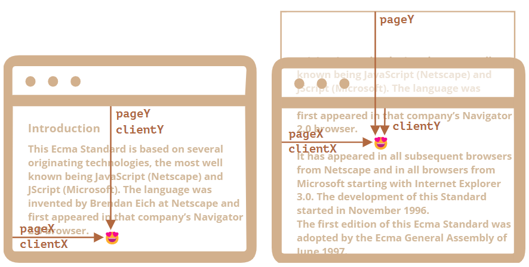
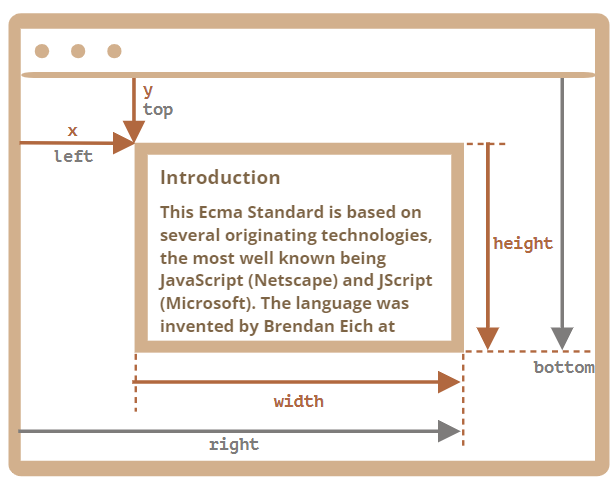

# 元素坐标概述

元素的坐标系有两种：

- **窗口坐标**（clientX/clientY）：相对于窗口顶部/左侧边缘，对应于 `position:fixed`。在事件对象中也会涉及
- **文档坐标**（pageX/pageY）：相对于文档顶部/左侧边缘，类似于 `position:absolute`

页面开始滚动时，窗口与文档的左上角重合，坐标相等；文档移动后，元素相对窗口坐标发生变化，而相对文档坐标保持不变。示意图如下：



## 窗口坐标

### getBoundingClientRect

方法 `elem.getBoundingClientRect()` 返回内建 DOMRect 对象，表示 elem 所在最小矩形的窗口坐标，包含以下属性：

- **x/y**：矩形原点相对于窗口的 X/Y 坐标
- **width/height**：矩形的宽高（可为负）
- **top/bottom**：矩形顶部/底部边缘相对窗口上边缘的距离（派生）
- **left/right**：矩形左/右边缘相对窗口左边缘的距离（派生）

示意图如下：



可明显看出：

- left = x
- top = y
- right = x + width
- bottom = y + height

:::tip 注意
以上属性均可为浮点数，也可能负数（例如滚动页面使 elem 位于窗口上方）
:::

:::warning 注意

- IE 浏览器中无 x/y 属性

:::

### elementFromPoint(x, y)

`document.elementFromPoint(x, y)` 返回**窗口坐标** (x, y) 处嵌套最深的元素；若坐标不在**可见区域**内，则返回 null

## 文档坐标

并无标准方法获取元素的文档坐标，但可参照以下公式：

- pageY = clientY + 文档的垂直滚动出的部分的高度
- pageX = clientX + 文档的水平滚动出的部分的宽度

由此可推出 `getDocumentCoords(elem)` 方法：

```js
// 获取元素文档坐标
function getDocumentCoords(elem) {
	const box = elem.getBoundingClientRect();

	return {
		top: box.top + window.pageYOffset,
		right: box.right + window.pageXOffset,
		bottom: box.bottom + window.pageYOffset,
		left: box.left + window.pageXOffset,
	};
}
```

### 实例：

为在指定元素附近展示消息，且在页面滚动时保持相对位置，可定义以下方法：

```js
function createMessageUnder(elem, html) {
	const message = document.createElement("div");
	message.style.cssText = "position:absolute; color: red";
	message.innerHTML = html;

	const coords = getDocumentCoords(elem);
	message.style.left = coords.left + "px"; // 勿忘单位
	message.style.top = coords.bottom + "px"; // 勿忘单位

	return message;
}

// 插入 message 并保持5秒
const elem = document.getElementById("coords-show-mark");
const message = createMessageUnder(elem, "Hello, world!");
document.body.append(message);
setTimeout(() => message.remove(), 5000);
```
