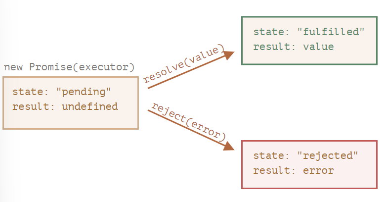

# Promise 概述

Promise 对象构造器语法如下：

```js
const promise = new Promise(function (resolve, reject) {
	/* executor */
});
```

传递给构造器的函数被称为 executor，在 Promise 对象创建时接受回调 resolve、reject 为入参并同步执行，当获得结果时应调用此二者之一：

- **resolve(value)**：执行成功时，入参可为任意数据
- **reject(error)**：出现错误时，入参建议为 Error 对象

Promise 对象具有以下内部属性（无法直接访问）：

- state：最初值为 pending，当 resolve 被调用时变为 fulfilled，或当 reject 被调用时变为 rejected
- result：最初值为 undefined，当 resolve 或 reject 被调用时即为各自对应的入参

示意如下：



:::warning 注意
executor 内只能调用一次 resolve 或 reject，此即决定了 Promise 的最终状态。任何再次调用都会被忽略
:::

## 消费者：then、catch

Promise 的结果可通过其 then 和 catch 方法来注册订阅

### then
