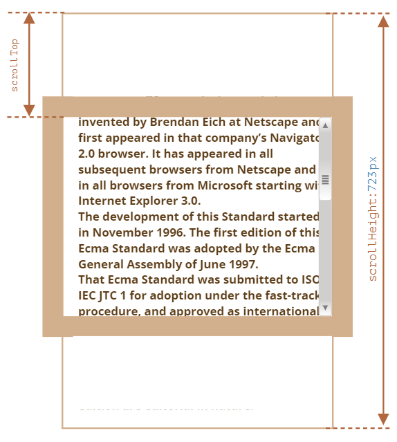

# 元素、窗口的尺寸与滚动概述

## 普通元素

从元素的部分属性中可获知尺寸及其他几何信息，以下为相关属性的整体示意图：


以上属性均为数字像素值（注意没有单位）

### offsetParent、offsetLeft/Top

- offsetParent 是最接近的祖先（ancestor），在渲染期间被用于计算坐标，为下列之一：

  - 定位元素（absolute、relative、fixed）
  - \<td\>、\<th\>、\<table\>
  - \<body\>

- 以下元素的 offsetParent 为 null：

  - 未显示的元素（自身或其祖先 `display:none` 、不在文档中）
  - \<body\> 或 \<html\> 元素
  - 带有 `position:fixed` 的元素

- offsetLeft/offsetTop 提供相对于 offsetParent 左上角的 x/y 坐标

例如：

```html
<main style="position: relative" id="main">
	<article>
		<div id="example" style="position: absolute; left: 180px; top: 180px">
			...
		</div>
	</article>
</main>
```

`<div>` 的 offsetParent 为 `<main>`


### offsetWidth/Height

元素的完整宽高（包括边框）


以上元素的 offsetWidth = CSS width（300px）+ padding（2 \* 20px）+ border（2 \* 25px）= 390

:::tip 注意
未显示元素（未插入至文档、自身或其祖先 `display:none`）的 offsetWidth\Height 为 0，可以此判断一个元素是否被隐藏：

```js
// 还需完善，要剔除大小为 0 的元素
function isHidden(elem) {
	return !elem.offsetWidth && !elem.offsetHeight;
}
```

:::

### clientTop/Left

元素内侧与外侧的相对坐标，如下：


注意与上/左边框宽度的区别：文档从右到左显示时，滚动条在左边，则 clientLeft 包含了其宽度

### clientWidth/Height

元素边框内区域的大小，包括 content width 和 padding，但不含滚动条宽度。而无 padding 时，此即内容区域的大小


### scrollWidth/Height

clientWidth/clientHeight + 滚动隐藏部分的尺寸


### scrollLeft/scrollTop

元素已滚动部分的尺寸



区别于以上所有只读属性，该属性可修改，且浏览器会滚动该元素，如：scrollTop 设为 0 则滚动到顶部；设为 1e9 则到底部

:::warning 不要从 CSS 中获取宽高尺寸信息（包括 getComputedStyle）
原因如下：

1. 元素尺寸表现还取决于 box-sizing
2. 元素的 width/height 解析值可能为 `auto`，（如内联元素）
3. 某些浏览器中滚动条会占用内容空间，因此内容的实际宽度会小于 CSS 宽度。而 clientWidth/clientHeight 会考虑到这一点

:::

## 窗口

为获取浏览器窗口（window）的尺寸信息，可借助与 `<html>` 标签相对应的根文档元素 `document.documentElement`

### 窗口的宽高

使用 `document.documentElement` 的 `clientWidth/clientHeight` 获取窗口的宽/高（不含滚动条尺寸）


区别于 `window.innerWidth/innerHeight`，后者包含了滚动条的宽度

:::warning DOCTYPE 很重要
HTML 中应始终包含 `<!DOCTYPE HTML>` ，否则会出现稀奇古怪的情况
:::

### 文档的完整宽高

可通过 `documentElement.scrollWidth/scrollHeight` 获得文档的完整大小。考虑到兼容性，更可靠的方法如下：

```js
const scrollHeight = Math.max(
	document.body.scrollHeight,
	document.documentElement.scrollHeight,
	document.body.offsetHeight,
	document.documentElement.offsetHeight,
	document.body.clientHeight,
	document.documentElement.clientHeight
);
```

### 文档的滚动

可使用 `document.documentElement.scrollLeft/scrollTop` 和 `window.pageXOffset/pageYOffset` （只读）获得文档的当前滚动

:::tip 提示
处于历史原因，还存在：

- `window.scrollX`—— 等同于 `window.pageXOffset`
- `window.scrollY`—— 等同于 `window.pageYOffset`

:::

可更改前者来滚动文档，或更通用的方法：

- `window.scrollBy(x,y)`：将页面相对于当前位置滚动 x 和 y 的距离
- ` window.scrollTo(pageX,pageY)`：滚动页面（可见部分左上角）至绝对坐标（相对于文档左上角）pageX，pageY
- `elem.scrollIntoView(top)`：滚动页面至 elem 可见，根据参数：
  - 若 top 为 true（默认），则 elem 上边缘将与窗口顶部对齐
  - 若 top 为 false，则 elem 底部边缘与窗口底部对齐

:::warning 注意
必须在 DOM 构建好后才通过 JS 滚动页面，例如在 `<head>` 脚本中滚动页面将无法正常工作
:::

要禁止文档滚动，可设置 `document.body.style.overflow = "hidden"`，相似方法也适用于普通元素。
:::tip 注意
该方法会使滚动条消失，内容会“跳进去”填充多出的空间，可在原滚动条位置处添加 padding 解决
:::
