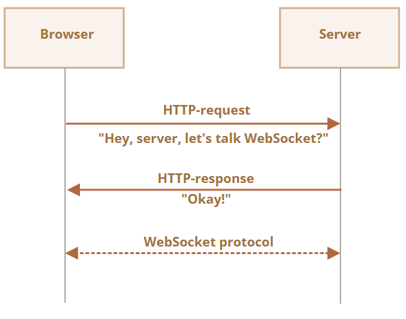

# WebSocket 概述

WebSocket 协议（描述于 RFC 6455），提供浏览器与服务器间建立持久连接来交换数据的方法。数据作为“包”双向传递，无需中断连接或额外的 HTTP 请求

WebSocket 原生支持跨源，不含重新连接（reconnection）、身份验证（authentication）等高级机制，无特殊 header 及其他限制，也不存在兼容性问题（旧服务器无法处理）

要打开 WebSocket 连接，需使用特殊协议 ws（或加密的 wss）创建连接实例，例如：

```js
const socket = new WebSocket("ws://javascript.info");
```

socket 一旦建立，即可监听其如下事件：

- **open**： 连接已建立
- **message**：接收到数据
- **error**： WebSocket 错误
- **close**： 连接已关闭

可用 `socket.send(data)` 发送数据，示例：（服务端对应代码参见 [server.js](https://zh.javascript.info/article/websocket/demo/server.js)）

```js
/* 
  响应为: “Hello from server, John”，等待 5 秒后，关闭连接
  事件顺序为：open → message → close
*/
const socket = new WebSocket(
	"wss://javascript.info/article/websocket/demo/hello"
);

socket.onopen = function () {
	console.log("[open] Connection established");
	console.log("Sending to server");
	socket.send("My name is John");
};

socket.onmessage = function (event) {
	console.log(`[message] Data received from server: ${event.data}`);
};

socket.onclose = function (event) {
	if (event.wasClean) {
		console.log(
			`[close] Connection closed cleanly, code=${event.code} reason=${event.reason}`
		);
	} else {
		// 服务器进程被杀死或网络中断时，event.code 通常为 1006
		console.log("[close] Connection died");
	}

	socket.onerror = function (error) {
		console.log(`[error] ${error.message}`);
	};
};
```

:::tip 始终使用 wss
wss 协议不仅被加密，而且更可靠：

ws 数据对任何中间人可见，旧的代理服务器可能不了解 WebSocket，会因看到奇怪的 header 而中止连接

wss 是基于 TLS 的 WebSocket（如同 HTTPS 是基于 TLS 的 HTTP），数据在发送方被传输安全层加密，在接收方被解密。即加密通过代理，后者看不到传输的内容，因而会让数据通过
:::

以下为深入学习：

## 建立连接

WebSocket 实例被创建后即开始连接：浏览器（通过 header）询问：“支持 WebSocket 吗？” 若服务器回复“支持”，则通信以 WebSocket 协议继续进行



以下为浏览器请求的 header 示例：

```
GET /chat
Host: javascript.info
Origin: https://javascript.info
Connection: Upgrade
Upgrade: websocket
Sec-WebSocket-Key: Iv8io/9s+lYFgZWcXczP8Q==
Sec-WebSocket-Version: 13
```

- `Origin`: 请求的源，主要用于让服务器决定是否用 WebSocket 与该源通信
- `Connection: Upgrade`：表示客户端想要更改协议
- `Upgrade: websocket`：表示更改为 websocket 协议
- `Sec-WebSocket-Key`：浏览器随机生成的安全密钥
- `Sec-WebSocket-Version`：WebSocket 协议版本

若服务器同意切换协议，则返回响应码 101：

```
101 Switching Protocols
Upgrade: websocket
Connection: Upgrade
Sec-WebSocket-Accept: hsBlbuDTkk24srzEOTBUlZAlC2g=
```

这里 Sec-WebSocket-Accept 由 Sec-WebSocket-Key 使用特殊算法重新编码，浏览器以此确保响应与请求相对应

接着就使用 WebSocket 协议传输数据，其结构为 frames

### 扩展和子协议

WebSocket 还可能有如下 header，分别描述了扩展和子协议：

- `Sec-WebSocket-Extensions: deflate-frame` 表示浏览器支持数据压缩。扩展与传输数据有关，扩展了 WebSocket 协议的功能。Sec-WebSocket-Extensions 头由浏览器自动发送，包含其支持的所有扩展列表

- `Sec-WebSocket-Protocol: soap, wamp` 表示还要传输 SOAP 或 WAMP（The WebSocket Application Messaging Protocol）协议中的数据。WebSocket 子协议已在 IANA catalogue 中注册，因此该头描述了将要使用的数据格式。可选，使用 `new WebSocket` 第二个参数设置，为子协议数组。例如：

  ```js
  const socket = new WebSocket("wss://javascript.info/chat", ["soap", "wamp"]);
  ```

  而服务器用同意使用的协议和扩展列表进行响应，例如以下请求：

  ```
  GET /chat
  Host: javascript.info
  Upgrade: websocket
  Connection: Upgrade
  Origin: https://javascript.info
  Sec-WebSocket-Key: Iv8io/9s+lYFgZWcXczP8Q==
  Sec-WebSocket-Version: 13
  Sec-WebSocket-Extensions: deflate-frame
  Sec-WebSocket-Protocol: soap, wamp
  ```

  服务器响应为：支持扩展 deflate-frame，但仅支持请求子协议中的 SOAP

  ```
  101 Switching Protocols
  Upgrade: websocket
  Connection: Upgrade
  Sec-WebSocket-Accept: hsBlbuDTkk24srzEOTBUlZAlC2g=
  Sec-WebSocket-Extensions: deflate-frame
  Sec-WebSocket-Protocol: soap
  ```

## 数据传输

WebSocket 通信由 frames（数据片段）组成，可从任意一方发送，有以下类型：

- **text frames**：文本数据
- **binary data frames**：二进制数据
- **ping/pong frames**：用于检查，从服务端发送，浏览器会自动响应
  ..以及 connection close frame 及其他服务 frames

`socket.send(data)` 方法可传入字符串或二进制数据（Blob、ArrayBuffer）；而当接收时，二进制类型由 `socket.binaryType` 决定，默认为 Blob

Blob 是高级二进制对象，可直接与 `<a>`、`` 等标签集成；但若处理时需访问单个数据字节，可改用 Arraybuffer：

```js
socket.binaryType = "arraybuffer";
// event.data 可为字符串或 arraybuffer（若是二进制数据）
socket.onmessage = (event) => {
	/* ... */
};
```

## 限速

可反复调用 `socket.send(data)`，但数据将先缓冲（储存）于内存，并在网速允许的情况下尽快发送出去

`socket.bufferedAmount` 储存了当前已缓冲待发送的字节数，可检查它以查看 socket 是否真的可用：

```js
// 每 100ms 检查一次 socket，仅当所有现有数据都已被发送时，再发送更多
setInterval(() => {
	if (socket.bufferedAmount === 0) {
		socket.send(/* moreData... */);
	}
}, 100);
```

## 连接关闭

通常一方要关闭连接时（浏览器和服务器具有相同权限），会发送一个 connection close frame。对应方法为：

```js
socket.close([code], [reason]);
```

- code：一个特殊的 WebSocket 关闭码（可选）
- reason：描述关闭原因的字符串（可选）

另一方通过 close 事件处理器获知，例如：

```js
socket.onclose = (event) => {
	console.log(event.code); // 1000
	console.log(event.reason); // Work complete
	console.log(event.wasClean); // true (clean close)
};
```

不能使用小于 1000 的数字码（数字码），常见的：

- **1000**：默认，正常关闭
- **1006**：无法手动设定该数字码，表示连接丢失（即无 close frame）

其他：

- **1001**：一方正在离开，如服务器正在关闭或者浏览器离开了该页面
- **1009**：消息太大，无法处理
- **1011**：服务器发生意外错误
  ... 完整列表参见 [RFC6455, §7.4.1](https://tools.ietf.org/html/rfc6455#section-7.4.1)

## 连接状态

可通过 `socket.readyState` 获取连接状态：

- **0**：CONNECTING，连接尚未建立
- **1**：OPEN，通信中
- **2**：CLOSING，连接关闭中
- **3**：CLOSED，连接已关闭
