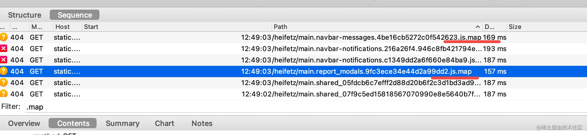
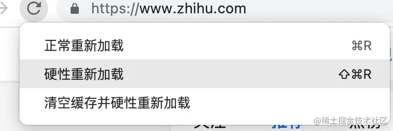

# 关于 HTTP 缓存

为提高网页打开速度，降低服务器负担，HTTP 设计了缓存功能

## Expires

HTTP 1.0 设计了 Expires header 用于指定资源过期时间，过期前不请求服务器，直接取上次下载并缓存的内容。如：`Expires: Wed, 21 Oct 2021 07:28:00 GMT`

但也有 bug：该时间为 GMT 时间，不存在时区问题。服务端会将当地时间转换为 GMT，如当前时间点 xxx，预期缓存时长为 yyy，则 Expires 即设置为 xxx + yyy。若浏览器时间准确则无问题，否则若其转换的 GMT 非 xxx，则具体缓存时长也并非 yyy 了，这就是问题

因而过期时间不能让服务端计算，而应让浏览器自己算

## max-age 指令

因而 HTTP 1.1 内改为 max-age 方式，例如：`Cache-Control: max-age=600` 代表资源缓存 600 秒

让浏览器自己算过期时间，也就没了 Expires 的问题（这也是同时存在 max-age 和 Expires 时会用前者的原因）。当然不同资源会有不同的 max-age，如打开 b 站首页会看到不同资源的 max-age 是不同的：

如一些库的 js 就设置了 31536000，1 年后过期，因为一般也不会变；而业务 js 设置了 600，即 10 分钟过期

而形式上也从 Expires `key: value` 形式 header 变成了 `key: k1=v1,k2=v2` 形式。这正是 HTTP 1.1 的设计，将缓存相关的 header 都集中到一起，都放在 Cache-Control header 里。所以名字上也不一样了：类似 `Expires: xxx` 称为消息头（header）；而 `Cache-Control: max-age=xxx` 里的 max-age 称为指令（directive）

但这样还不够，若到了过期时间，但是资源尚未变化，则再下载一次还是很没必要。所以要和服务端确认内容是否内容真的变了，只有变了才会重新下载。这是一个协商过程

## 协商缓存相关 header

所以 HTTP 1.1 又设计了协商缓存的 header

### Etag 和 Last-Modified

当资源过期时，浏览器要和服务端确认下是否有更新，较容易的方法是通过文件内容 hash 或最后修改时间，即 Etag 和 Last-Modified

### If-None-Match 和 If-Modified-Since

服务端返回资源时带上 etag 和 last-modified。则当 max-age 到期时，浏览器就会带上此二者请求服务器，询问资源有否更新

- 带上 etag 的 header 称为 If-None-Match：`If-None-Match: "bfc13a64729c4290ef5b2c2730249c88ca92d82d"`
- 带上 last-modified 的 header 称为 If-Modified-Since：`If-Modified-Since: Wed, 21 Oct 2015 07:28:00 GMT`

服务端若判断资源有变化，则返回 200，响应体带上新的内容；否则返回 304，响应体为空，浏览器直接读缓存

这样多了一个协商阶段，则本地缓存过期但是服务端资源未变化时就能避免重复下载。且若文件确定不会变，无需协商的话，则可用 immutable 指令（`Cache-control: immutable`）告知浏览器，该资源始终不变，无需协商。这样即使缓存过期也不会发验证 header（If-None-Match 和 If-Modified-Since）

### Cache-control 的其他指令

前面提的都是浏览器的缓存控制，但请求从浏览器到服务器过程中，可能会经过很多层代理。代理服务器的缓存如何控制？

### public、private、s-maxage

浏览器的缓存都是用户自己的，叫私有缓存；而代理服务器上的缓存大家都可访问，叫公有缓存。若某资源只想浏览器内缓存，则设置 private，否则设置 public

例如该设置令资源可在代理服务器缓存一年（代理服务器的 max-age 用 s-maxage 设置），浏览器里缓存 10 分钟：`Cache-control:public, max-age=600,s-maxage:31536000`

而该设置令资源只在浏览器内缓存：`Cache-control: private, max-age=31536000`

### max-stale、stale-while-revalidate、stale-if-error、must-revalidate

若想使用过期资源，可用指令：`Cache-control: max-stale=600`。stale 即不新鲜之意，即过期 10 分钟内资源还可使用，再长不行

也可设置 stale-while-revalidate，如：`Cache-control: stale-while-revalidate=600`，意为与浏览器协商尚未结束时，就先返回和使用过期资源

或设置 stale-if-error，如：`Cache-control: stale-if-error=600`，即若协商失败，就先返回和使用过期资源

原则上 max-age 过期时间并非完全强制，是可允许过期后用一段时间的。若想强制在缓存尚未协商完时不用过期资源，可用 must-revalidate 指令，如：`Cache-Control: max-age=31536000, must-revalidate`。顾名思义，若缓存失效则必须等验证结束，中间不能使用过期资源

可能有人会疑问：缓存不都是自己设置的么，还可一个允许过期，一个禁止过期？自己肯定不会，但是 CDN 厂商可能会

### no-store、no-cache

HTTP 也支持禁止缓存：`Cache-control: no-store`，如此则不会缓存文件，也就没了过期时间和之后的协商过程

如允许缓存，但是需每次都协商就用 no-cache：`Cache-control: no-cache`，其与 must-revalidate 的区别在于：前者相当于禁止强缓存，每次必须协商；而后者只是在强缓存过期后禁止用过期资源，必须协商

## 关于浏览器强刷的实现原理

网站缓存设置一般如此：入口设置 no-cache，其他资源设置 max-age~ 则入口文件会缓存但是每次都协商，保证及时更新；而其他资源不发请求，减轻服务端压力。例如 www.bilibili.com

可看到入口即 html 的请求设置了 no-cache，而其他所有后续资源都设置了强缓存 max-age。另外这里的 memory cache 和 disk cache 无需仔细区分，刚开始存于内存，关闭浏览器再打开时就变成磁盘加载了

可通过 is 过滤器来过滤 from-cache 的请求，即所有直接取强缓存的请求：

而若这些资源在强缓存期内做了更新，则只更新入口 html：如下，业务资源名字都带有 hash，新的 html 引用不同 hash 的资源即可：

也是因此，**入口 html 文件绝对不能强缓存**。这种入口 html 设置 no-cache，其他资源文件设置 max-age 的缓存方式一般视为最佳实践

但若开发时，强缓存文件想更新则需用到强制刷新，即 command + shift + R。若要洞悉其原理，需借助抓包工具 charles（[详情参见](https://link.juejin.cn/?target=https%3A%2F%2Fmp.weixin.qq.com%2Fs%3F__biz%3DMzg3OTYzMDkzMg%3D%3D%26mid%3D2247492108%26idx%3D1%26sn%3D525ad9bf283055d39d3c528ab1c94419%26chksm%3Dcf032d37f874a421d64bcc10e70393c8a90f97a26e4b9c4e71fd0311748e49032c6494f9bad5%26token%3D965494574%26lang%3Dzh_CN%23rd)）

强制刷新，可在 charles 内看到：

该请求的 Cache-Control 变成了 no-cache，即和服务端协商是否更新本地缓存。这就是强制刷新的实现原理！虽然 Chrome DevTools 隐藏了该行为，其中看到的依然是之前的 Cache-Control（就像它隐藏 sourcemap 文件请求一样）：

顺便提及，sourcemap 请求也可在 charles 里看到：

---

Chrome DevTools 还有个禁用缓存的功能，也是通过设置 Cache-Control 为 no-cache 实现的：

此外还有清空缓存并强制刷新的功能，是清掉本地的缓存再去协商，能保证一定拿到最新资源：

