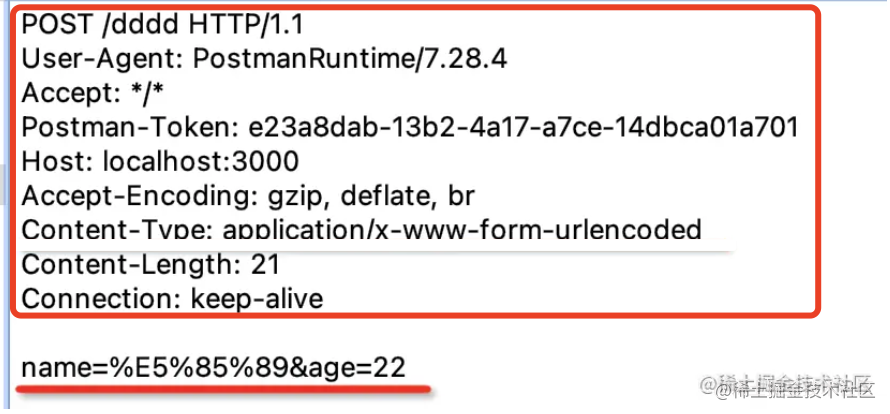
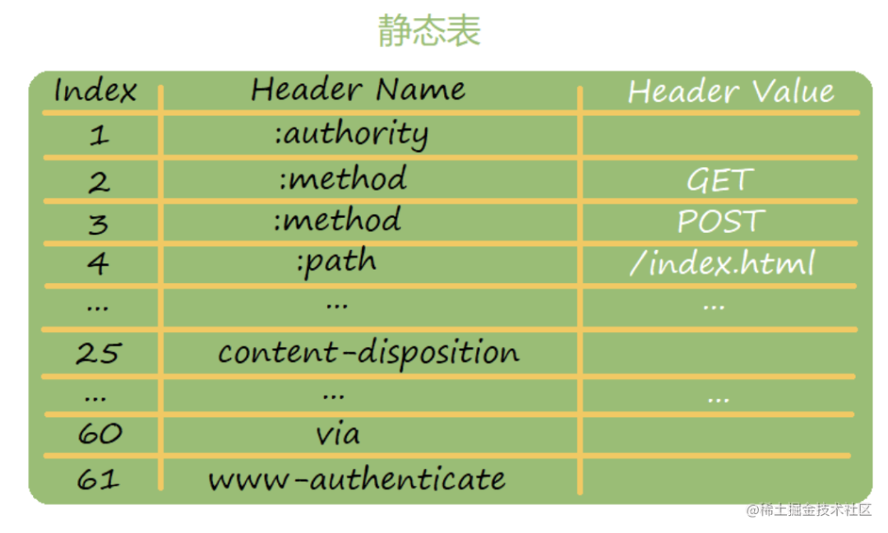

# 关于 HTTP2.0

HTTP 1.0 发布于 1996 年，奠定了 web 的基础；HTTP 1.1 发布于 1999 年，对功能上做了扩充；而 HTTP 2.0 发布于 2015 年，并无功能上的新增，只优化了性能

## HTTP 1.1 的问题

HTTP 下层协议为 TCP，需经三次握手才能建立连接

HTTP 1.0 时一次请求->响应结束即断开连接，下次请求时要重新建立：

为了减少此类重建 TCP 链接的消耗，HTTP 1.1 支持了 keep-alive。只要请求或响应头带上 `Connection: keep-alive`，即可告知先不要断开连接，之后还要用此连接发消息；直到需要断开时，再指定 `Connection: close`。这样就可用同一 TCP 连接进行多次 HTTP 请求响应了：

但这样虽减少了连接的建立，但性能上却存在队头阻塞的问题，即下次请求得等上次请求响应后才能发出。为解决此问题，HTTP 1.1 提出了管道的概念，即多个请求可并行发送，返回响应后再依次处理。如下：

这样虽能部分解决问题，但返回的响应仍要依次处理，无法彻底解决队头阻塞。因此管道化还是较鸡肋，现在绝大多浏览器都默认关闭，甚至都不支持

还有一种优化手段叫“域名分片”，CDN 一般都支持：浏览器一般与同一域名建立 6-8 个 TCP 链接，即 6-8 个队，若一队发生队头阻塞，则就放到其他的队里。这样就缓解了队头阻塞问题

建站时可利用这点，如把静态资源部署在不同的域名下。这样每一域名都能并发 6-8 个下载请求，网页打开速度自然就会快很多

---

此外，HTTP 1.1 还有 header 部分太大的问题，即便只传输几个字符，也得带上一大堆 header：

此类 header 都是文本形式，试想若是二进制，表示 true/false 直接 1 位即可，而文本须经过编码，“true” 就占了 4 个字节，即 32 位（32 倍的差距！）

因此 HTTP 1.1 时，需要尽量避免一些小请求，因为即使请求内容很少，也会带上一大段 header，尤其是有 cookie 的情况

因此网页就需打包，借助打包工具把模块合并成多个 chunk 来加载；需把小图片合并成大图片，通过调整 `background:position` 来使用；需把一些 css、图片等内联；而静态资源请求也要禁止携带 cookie

以上都是为减少请求次数以达到提高加载性能

## HTTP 2.0 的优化

综上， HTTP 底层 TCP 具有双向传输的能力，现在却只能通过请求-响应一问一答的方式，并未充分利用起 TCP 的能力。直到 HTTP2.0 的出现

### 流和帧

HTTP2 首先通过 ID 把请求和响应关联起来，此概念称为流（stream）；而之前提及的 header 需要单独优化，因此把 header 和 body 分开传送，称为不同的帧（frame），每个都是如下格式：

payload 是传输内容，先不赘述；header 部分最开始是长度，接着是该帧的类型，有以下几种：

- SETTINGS 帧：配置信息，告知对方如最大帧 size，是否支持 server push 等
- HEADERS 帧：请求或响应的 header
- DATA 帧：请求或响应的 body
- CONTINUATION 帧：若帧大小超过上限，则可分帧，用此可引用上一个帧
- PUSH_PROMISE 帧：服务端推送数据的帧（HTTP2 支持服务端推送）
- END_STREAM 帧：表示流传输结束（，然后再传输 RST_STREAM 结束当前流）
- RST_STREAM 帧，用于终止当前流

接着是 flags 标志位，在不同类型帧里会放不同内容：

如 header 帧会在 flags 中设置优先级，这样高优先级的流即可更早被处理。HTTP 1.1 时都是排队处理的，并无优先级可言，而 HTTP 2.0 通过流的方式实现了请求的并发，则自然需控制优先级了

后面还有 R，目前还是一个保留位

再后面就是流标识符 stream id 了，用于关联同一流的多个帧

### 帧的状态机

实际上帧是有很多种的，这些帧之间发送顺序不同，而不同的帧也会在不同状态下发送，也会改变流的状态。这里介绍下流的状态机，即流收到什么帧会进入什么状态，且在什么状态下会发送什么帧

1. 刚开始流是 idle 状态，即空闲
2. 收到或发送 HEADERS 帧以后会进入 open 状态
3. oepn 状态下可发送或接收多次 DATA 帧
4. 之后发送或接收 END_STREAM 帧进入 half_closed 状态
5. half_closed 状态下收到或者发送 RST_STREAM 帧就关闭流

此流程很容易理解：先发送 HEADER，再发送 DATA，之后告诉对方结束，即 END_STREAM，然后关闭 RST_STREAM

另外 HTTP2 还可服务端推送，所以还有另一条状态转换流程：

1. 流刚开始是 idle 状态
2. 接收到 PUSH_PROMISE 帧，即服务端推送过来的数据，变为 reserved 状态
3. reserved 状态可以再发送或接收 header
4. 之后进入 half_closed 状态
5. 后面的流程是一样的，也是 END_STREAM 和 RST_STREAM

此流程为 HTTP2 特有，即先推送数据，再发送 headers，然后结束流：

以上即 http2 发送一次请求、响应或者一次服务端推送的流程，都封装在一个个流里。流和流之间可以并发，还可设置优先级，这样自然就没了队头阻塞的问题，该特性叫**多路复用**，即复用同一链接，建立多条通路（流）的意思

而传输的 header 帧也是经过处理的，会以二进制方式表示，用做压缩。压缩算法是专门设计的，叫做 HPACK：
两端会维护一个索引表，通过下标来标识 header，这样传输量少了很多：

由于 header 里还有一行 `GET xxx/xxx` 的请求行，以及 `200 xxx` 的响应行，为统一处理就换成了 :host :path 等 header 来表示。这样发送时只需发送下标即可：

如 `:method: get` 就只需发送 `2: get`。该编码根据频率高低来设置，频率高的用小编码，此方式称为哈夫曼编码。这样就实现了 header 的压缩

至此 HTTP2.0 的主要特性介绍结束，即多路复用，服务端推送，头部压缩，二进制传输。其中最核心的是多路复用，即流和帧，流在什么状态下发送什么帧，其他特性均围绕此来设计

虽然 HTTP2.0 确实解决了 HTTP 1.1 的问题，但也并非完美。虽然 HTTP 层面无队头阻塞问题，多个请求响应可以并行处理，但同一流的多个帧还是有队头阻塞问题。因为 TCP 层面会保证顺序处理，丢失了会重传，这就导致了上一帧若未收到，下一帧就无法处理

该问题是 TCP 的可靠传输特性带来的，若想彻底解决队头阻塞问题，只能把 HTTP 底层传输协议换掉了。这也是 HTTP3 做的事情，其传输层协议换成了 UDP。当然后者当下还欠成熟，先重点关注 HTTP2 即可

## 总结（RAW）

<!-- 1996 年发布 HTTP 1.0，1999 年 HTTP 1.1，2015 年 HTTP 2.0。

1.1 和 2 之间间隔了 16 年，确实改变了很多，但只是性能方面的。

1.1 的问题是第二个请求要等第一个响应之后才能发出，就算用了管道化，多个响应之间依然也会阻塞，这就是“队头阻塞”问题。

而且 header 部分太大了，还是纯文本的，可能比 body 部分传的都多。

针对 1.1 的队头阻塞问题，我们会做域名分片，针对 header 过大的问题，我们会减少请求次数，也就是打包分 chunk、资源内联、雪碧图、静态资源请求禁止 cookie 等优化策略。

HTTP 2.0 解决了 1.1 的这些问题，通过多路复用，也就是请求和响应在一个流里，通过同一个流 id 来关联多个帧的方式来传输数据。多个流可以并发。

我们看了帧的格式，有长度、类型、stream id、falgs 还有 payload 等部分。

帧的类型还是挺多的，有 HEADRS、DATA、SETTINGS、PUSH_PROMISE、END_STREAM、EST_STREAM、等。

这些帧类型之间也不是毫无关联的，流在不同的状态下会发送、接收不同的帧，而且发送、接收不同的帧也会进入不同的状态。

理解 HTTP2.0 的 stream 就要理解这样的一个状态流转流程。

此外，HTTP 2.0 通过单独设计的 HPACK 算法对 header 做了压缩，也支持服务端推送。而且内容是通过二进制传输的，解决了 HTTP 1.1 的问题。

但是 HTTP 2.0 的底层是 TCP，它的可靠传输的特性使得同一个流内的多个帧依然是顺序传输的，依然有队头阻塞问题。也是因为 HTP 3把底层协议换成 UDP。

虽然还是有一些问题，但 HTTP 2.0 已经基本上把 HTTP 1.1 的各方面性能不好的点都优化到了极致，是很有意义的一次版本升级。 -->
