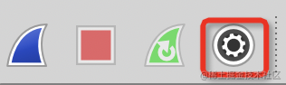
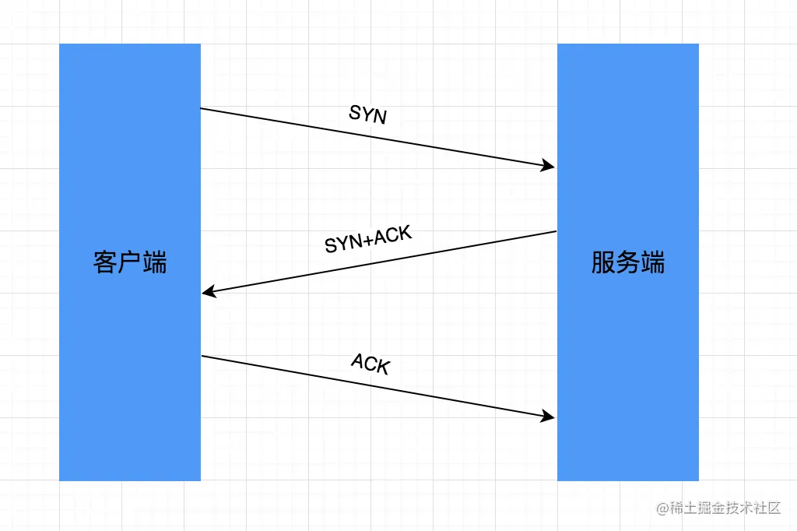
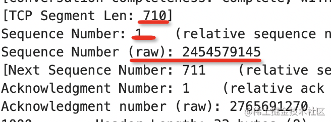

# 关于 TCP

HTTP 的底层是 TCP，但 chrome devtools 的 Network 只能分析 HTTP 请求。若要看到 TCP 层的数据包
推荐使用抓包工具 WireShark

首先准备如下服务端代码：

```js
const express = require("express");
const app = express();

app.get("/", function (req, res) {
	res.setHeader("Connection", "close");
	res.end("hello world");
});

app.listen(4000);
```

接着用 WireShark 抓包分析，打开后会看到如下设置按钮：



因为访问的是 localhost: 4000，所以选择本地回环地址的虚拟网卡，并输入抓包过滤条件 port 4000：


点击 start 开始录制，刷新浏览器，这样即可看到抓取的 TCP 数据包：


## TCP 基础知识

进一步分析前先了解一些 TCP 基础知识，TCP 头部结构如下：


1. TCP 是端口到端口的传输协议，所以开始是源端口和目的端口
2. 接下来是序列号（sequence number），表示当前包序号；后面是确认序列号（acknowledgment number），表示我收到了序号为 xxx 的包
3. 然后红框标出部分是 flags 标识位，通过 0、1 表示有无（这里只会用到 SYN、ACK、FIN）：
   - SYN：请求建立一个连接（说明这是链接的开始）
   - ACK：表示 ack number 是否是有效的
   - FIN：表示本端要断开链接了（说明这是链接的结束）

有了这些就可知如何区分 TCP 链接的开始和结束了

## 建立和断开连接

看一下抓到的包：


有 SYN 标志位是连接的开始，有 FIN 标志位是连接的结束，所以可分 3 段来看：

1. 首先是连接开始部分：

   

   所谓 TCP 三次握手，指的就是这个。4000 为服务端口，而 57454 为浏览器端口：

   1. 第一次握手：首先浏览器向服务器发送一个 SYN 的 TCP 请求，表示希望建立连接，序列号 Seq 为 0（严格来说，序列号相对值为 0，绝对值为 2454579144）

   

   2. 第二次握手：然后服务器向浏览器发送了一个 SYN 的 TCP 请求，表示希望建立连接，ACK 是 1，代表现在的 ack number 是有效的

   

   这里 ack number 相对值是 1，绝对值是 2454579145（上个 TCP 数据包 seq 绝对值加 1）。**TCP 连接中就是通过返回 seq number + 1 作为 ack number 来确认收到的**

   然后又返回了一个 seq number 给浏览器，相对值是 0， 绝对值是 2765691269

   3. 第三次握手：浏览器收到后返回了一个 TCP 数据包给服务器，ack number 自然是 2765691270，代表收到了连接请求

   

   这样浏览器和服务器各自向对方发送了 SYN 的建立连接请求，且都收到了对方确认，则 TCP 连接建立成功
   ，这就是 TCP 三次握手的原理：

   

2. 接下来看四次挥手部分：

   

   1. 浏览器向服务器发送了有 FIN 标志位的数据包，表示要断开连接
   2. 然后服务端返回了 ACK 包表示确认
   3. 之后服务端发送了 FIN 标志位数据包给浏览器，表示要断开连接
   4. 浏览器也返回了 ACK 的包表示确认

   这就完成了四次挥手的过程。其中具体确认还是靠 ack number = seq number + 1 来实现，与上面一样，就不展开了：

   
   

   这样通过抓包就理清了 TCP 建立和断开连接的过程：

   

为何握手是三次，挥手是四次呢？

- 挥手是一个 FIN，一个 ACK，一个 FIN + ACK，一个 ACK：

  

- 而握手是一个 SYN，一个 ACK + SYN，一个 ACK：

  

握手时把 ACK 和 SYN 合并到一个数据包了，因为只有一个 ack number；但挥手时则不能，两个 ack number 会导致冲突


## http 请求和响应


一次 HTTP 请求响应会有四个 TCP 数据包，其中两个与滑动窗口有关，先不展开。其余两个包，请求的 seq 如下：



而响应的 ack 如下：


相对值是 ack number = seq number + 1；但是绝对值不是，绝对值 2454579855 = 2454579145 + 710，即 ack number = seq number + segment len

当然这些细节暂不用深究，总之 HTTP 的请求和响应是通过序列号关联的。即使同一个 TCP 链接并行发送多个 HTTP 请求和响应，它们也能找到各自对应的那个，正是通过 seq number 和 ack number

当然实例中链接建立后发送了一个请求就断掉了。刷新浏览器，请求了两次，发现经历了两次连接建立、http 请求响应、连接断开：


这是设置了 Connection:close 的 header，其作用正是一次 http 请求响应结束就断开 TCP 链接


而改成 HTTP 1.1 支持的 keep-alive，并设置 keep-alive 细节为 timeout 10 （10s 后断开）后，再重启服务器并刷新浏览器：


可见一个 TCP 连接内发送了多次 http 请求响应（通过 SYN 开始，FIN 结束），这就是 keep-alive 的作用

另外还可发现只是浏览器向服务器发送了 FIN 数据包，服务器并未发给浏览器 FIN 数据包，这是因为 keep-alive 的 header 只是控制浏览器的断开连接行为，服务器的断开连接逻辑是独立的

## 总结

TCP 是从一个端口到另一个端口的传输控制协议，TCP header 中有序列号 seq number、确认序列号 ack number，还有几个标志位：

- SYN 标志位代表请求建立连接
- ACK 标志位代表当前确认序列号是有效的
- FIN 标志位代表请求断开连接

通过抓包分析可知 HTTP 请求的 TCP 流程，理清了三次握手（SYN、SYN + ACK、ACK）、四次挥手（FIN、ACK、FIN + ACK、ACK）对应的连接建立、断开流程。也可知为什么不能三次挥手（因为两个 ACK 冲突了）

而同一个 TCP 连接传输的多个 HTTP 请求响应也是通过 seq number 和 ack number 来关联的

通过分别测试 Connection：close 和 Connection：keep-alive 的情况，发现确实 keep-alive 能复用同一个 TCP 链接，减少频繁的连接建立和断开
