# 前端工具链概述

[原文](https://juejin.cn/post/6956602138201948196)

## 编译和转译

- 编译（compile）是把一门编程语言转成另一门编程语言的过程，一般为高级语言到低级语言
- 转译（transpile）是一种特殊的编译，是从高级语言到高级语言的编译，如从 C++ 转 Java，从 Typescript 转 Javascript、从 Javascript 转 Javascript、从 Css 转 Css 等

## 前端领域为何需要转译器

前端领域主要是 html、css、js：

- html 和 css 从源码 parse 成 dom 和 cssom，再生成 render tree 交给渲染引擎渲染。是从源码开始解释的：

  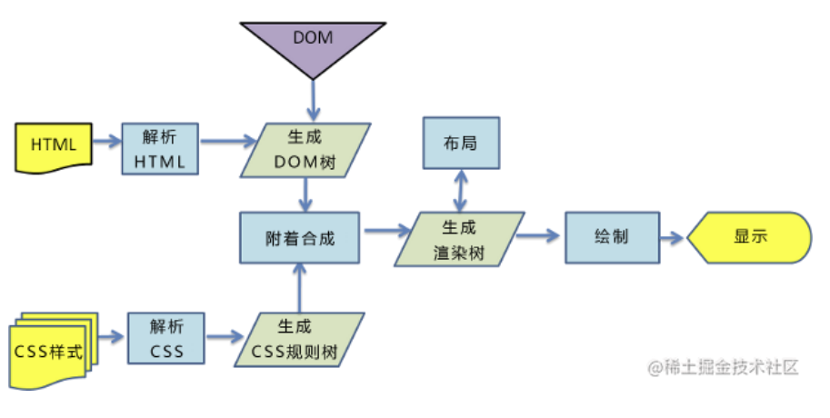

- js 是一门脚本语言，在运行时把源码 parse 成 AST，再转成字节码解释执行（V8 中直接转为机器码）。也是从源码开始：

  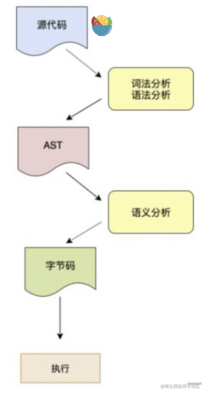

目标产物就是源码，所以前端场景下自然需要用到各种源码到源码的转译器

## 前端领域需要哪些转译器

转译是对源码做修改后生成源码（source to source）。前端领域需要哪些转译器呢？

### Javascript

- es 版本更新快， es 2015、es 2016、es 2017 等新特性目标环境下不支持，若想在开发时使用，就需转译器将这些特性转成目标环境支持的，比如 babel、typescript

- Javascript 是动态类型语言，无类型概念，无法提前进行类型检查。想给 Javascript 加入类型的语法语义，但又需编译完后把类型信息去掉，这也需要转译器，比如 typescript、flow

- 有些框架需要一些语法糖，比如 react 的 React.createElement 写起来太过麻烦，希望开发时能用类似 xml 的方式来书写，由转译器来把这些语法糖编译成具体的 api，比如 jsx

- 需要在编译期间对代码进行压缩和各种优化（删除死代码等），然后转成目标代码，比如 terser

- 需要在编译期间检查出一些代码规范错误，比如 eslint

### CSS

- 需要扩展一些能力，如变量、函数、循环、嵌套等等，使得 css 更容易管理。类似 scss、less、stylus 等 DSL（domain specific language），或 css next，这些都分别通过 scss、less、stylus、postcss 等转译器来转成目标 css

- 需要处理兼容性前缀（autoprefixer）、对 css 进行规范检查（stylelint）、css 模块化 （css modules）等，这些通过 postcss 转译器支持

### HTML

- 和 css 一样，也要扩展一些能力如继承、组合、变量、循环等，这些是 pug、moustache 等模版引擎支持的，也有各自的转译器把源码在编译期间转成目标代码（该转换也可能在运行时做）

- 支持各种内容转 html，比如 markdown 转 html 等，这可以通过 posthtml 来做转译

总之，前端领域需要很多转译器。下面介绍它们的原理

## 转译器原理

### 编译流程

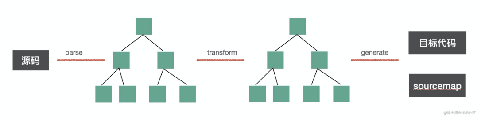

其实上述转译器编译流程类似，都需要 parse、transform、generate 这 3 个阶段。虽然具体名称可能不一，例如 postcss 把 genenrate 叫做 stringify，vue template compiler 把 transform 阶段叫做 optimize

而之所以需要这 3 个阶段，在于转译器转换前后都是源码字符串，要做转换，就要先理解代码，计算机理解代码的方式就是通过一定的数据结构来组织源码中的信息，该数据结构就是抽象语法树

之所以说是抽象，在于忽略了逗号、括号等分隔符；之所以是树，在于需要用树的父子关系来表示源码的嵌套关系。 总之抽象语法树是最适合计算机理解代码的数据结构

理解了代码（生成 AST）后，就要进行各种转换了。例如 terser 会做死代码删除等编译优化；babel 会做 es next 转目标环境 js；typescript compiler 会对 AST 进行类型检查；postcss 也会对 AST 做一系列的处理等等。这些都是针对 AST 的分析和增删改

虽然不同的转译器会对 AST 做不同处理，但整体编译流程类似，这是转译器的通用原理

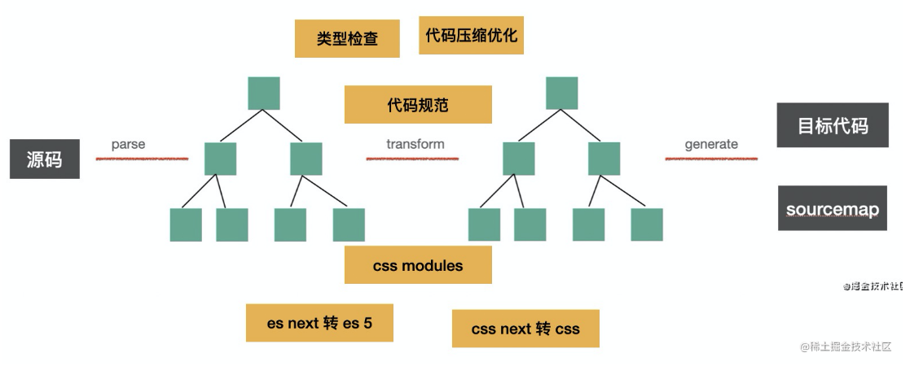

### sourcemap

转译器有个特点，就是都有 sourcemap，后者是生成的代码与源码间的映射关系，通过它就能映射到源码。转译器都是源码转源码，自然都会有 sourcemap

```js
{
  version: 3,
  file: "out.js",
  sourceRoot: "",
  sources: ["foo.js", "bar.js"],
  names: ["src", "maps", "are", "fun"],
  mappings: "AAgBC,SAAQ,CAAEA"
}
```

上面是一个示例 sourcemap 文件，对应字段含义如下：

- version：source map 的版本，目前为 3
- sourceRoot：转换前文件所在目录。若与转换前的文件在同一目录，该项为空
- sources：转换前的文件。该项为一数组，因为可能由多个源文件合并成一个目标文件
- names：转换前的所有变量名和属性名。把所有变量名提取出来，下面的 mapping 直接使用下标引用，可减少体积
- mappings：转换前代码与转换后代码的映射关系集合，用分号代表一行，每行的 mapping 用逗号分隔

可通过 url 方式或转成 base64 内联的方式来关联 sourcemap，浏览器会自动解析 sourcemap 并关联到源码。这样打断点、错误堆栈等都会对应到相应源码

### 线上报错定位到源码

开发时可使用 sourcemap 来调试，但生产环境则不能，要是将 sourcemap 传到生产环境算是大事故了。但线上报错时确实也需要定位到源码，该情况一般都是单独上传 sourcemap 到错误收集平台

例如 sentry 就提供了一个 sentry webpack plugin 支持在打包完成后把 sourcemap 自动上传到 sentry 后台，然后把本地 sourcemap 删掉。还提供了 sentry-cli 让用户可以手动上传。类似的分析平台还有字节的 dynatrace

### sourcemap 的原理

sourcemap 具体生成的逻辑可由 source-map 包（mozilla 提供）来完成，只需要提供每一个 mapping，即
`[源码中的行列号]，[目标代码中的行列号]`

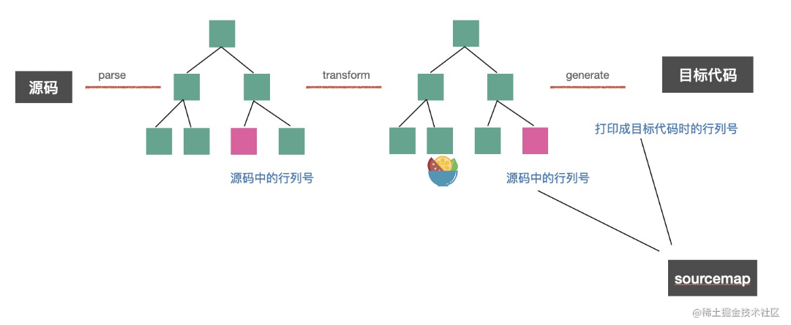

当源码 parse 成 AST 时，会在 AST 中保留其在源码中的位置（line、column），AST 进行转换并不会修改此行列号；生成目标代码时，又会计算出一个新的位置（line、column），两个位置合并起来就是一个 mapping，所有 AST 节点的 mapping 就能生成完整的 sourcemap

以上即 sourcemap 的生成原理

## 前端领域的转译器

下面来看下具体的转译器

### babel

babel 有两个主要作用：

- 将 es next、typescript、flow、jsx 等语法转为目标环境中支持的语法
- 引入缺失 api 的 polyfill

其编译流程是标准的 parse、transform、generate 3 步，提供了 api 和命令行的使用方式

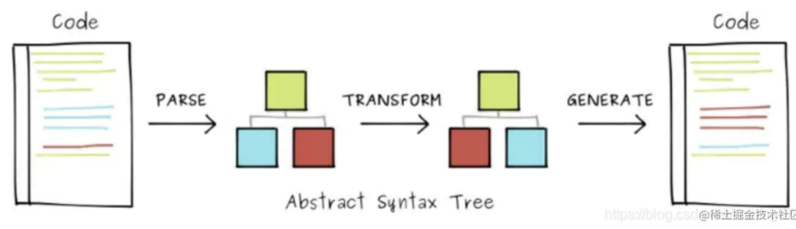

babel 7 包含这些包：

- @babel/parser 将代码转为 ast，可以使用 typescript、jsx、flow 等插件解析相关语法
- @babel/traverse 遍历 ast，调用 visitor 的函数
- @babel/generate 打印 ast 成目标代码，生成 sourcemap
- @babel/types 创建和判断 ast 节点
- @babel/template 根据代码模版批量创建 ast 节点
- @babel/core 转换源码成目标代码的完整流程，应用 babel 的内部转换插件

基于这些包的 api，可完成各种 JS 代码的转换。例如实现在 console.log 和 console.error 中插入一些参数的功能

思路即当遇到 `console.*` 对应的 CallExpression 节点时，在 arguments 参数内插入相应内容。

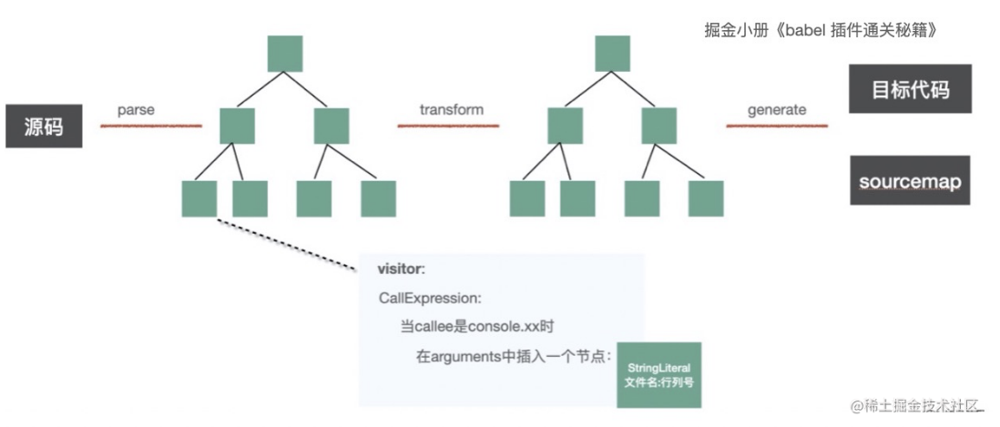

用代码实现如下：

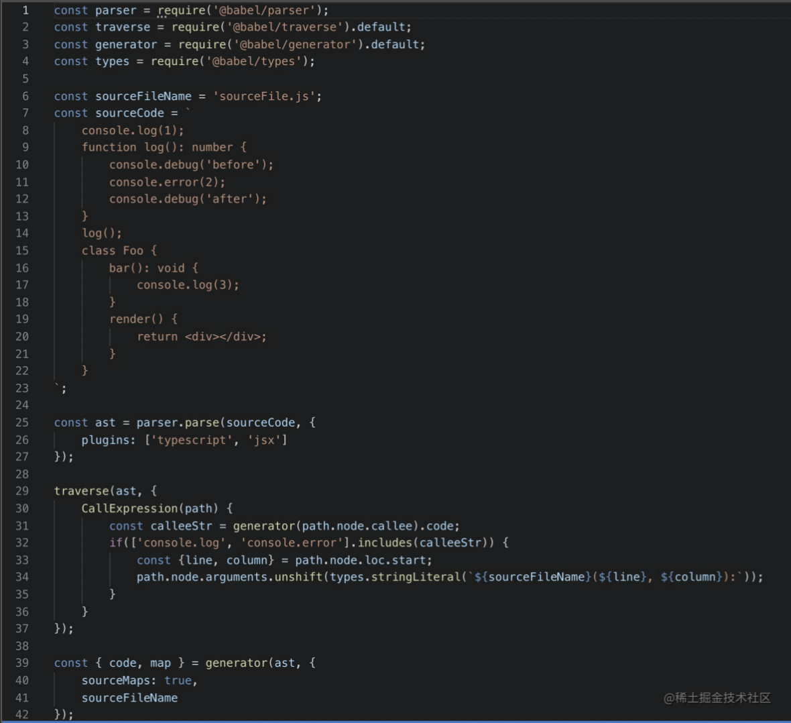

运行看下效果：

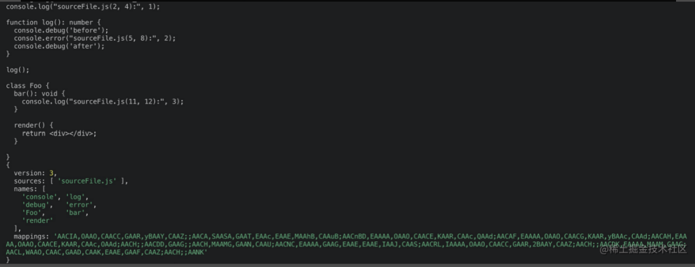

可以看到 console.log、console.error 中插入了相应的参数，并且也生成了 sourcemap。更多 babel 的原理和案例可关注掘金小册《babel 插件通关秘籍》

### typescript compiler

typescript 扩展了 Javascript 类型的语法语义，会首先进行类型推导，之后基于类型对 AST 进行检查，这样能在编译期间发现一些错误，之后会生成目标代码

typescript compiler 分为 5 部分：

- Scanner：从源码生成 Token （词法分析）
- Parser：从 Token 生成 AST（语法分析）
- Binder：从 AST 生成 Symbol （语义分析--生成作用域，进行引用消解（就是引用的变量是否被声明过））
- Checker：类型检查 （语义分析--类型检查）
- Emitter：生成最终的 JS 文件 （目标代码生成）


以上阶段也同样可对应 parse、transform、generate 三大阶段，不过多做了些语义分析（类型检查，babel 也同样会进行作用域的语义分析，类似 tsc 的 binder）

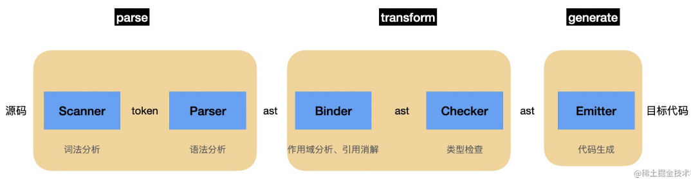

注：一般是在遍历过程中进行作用域的生成，所以语义分析放在了 transform 阶段。图中没有画出 AST 转换的部分，但实际是有的

typescript compiler 的 api 并不稳定，连文档都没有，但是在 typescript 包中暴露了出来的，是可用的。分别看下其中进行 parse、transform、generate 的 api：

- parse：ts 的类型往往要从多个文件中获得，需先创建 Program，然后从中拿某一个路径对应的 AST，即 SourceFile 对象。（与 babel 不同，后者直接源码 parse 成 AST 了，这里要两步）
  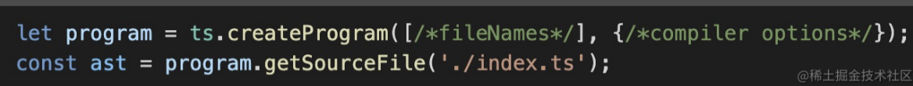

- transform: 通过 `ts.visitEachChild` 遍历 AST，通过 `ts.createXxx` 生成 AST，通过 `ts.updateXxx `替换 AST，通过 `ts.SyntaxKind` 来判断 AST 类型
  分别对应 @babel/traverse、 @babel/types 包的一些 api，(当学会了一个转译器，其余的转译器大同小异）
  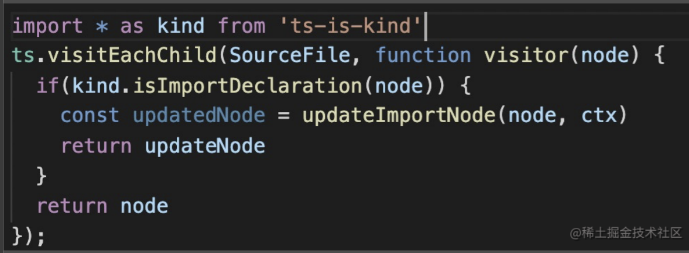

- generate：通过 printer 打印 AST 成目标代码
  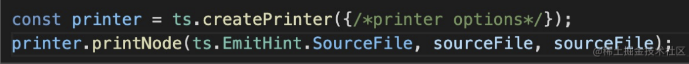

### tsc vs babel

自 babel 7 以后 @babel/parser 已支持解析 typescript 语法，关于该用 babel 还是官方 typescript compiler 编译 ts

通常用 babel 编译 ts，单独执行 tsc --noEmit 进行类型检查是比较好的方案。原因如下：

- babel 可以编译几乎全部的 ts 语法，有几个不支持的情况也可绕过去
- babel 生成代码会根据 targets 配置来按需转换语法以及引入 polyfill，能生成更小的目标代码。而 typescript 还是粗粒度的指定 es5、es3 的 target，不能按需转换，引入 polyfill 也是在入口全部引入，生成的代码体积会更大
- babel 插件丰富，typescript transform plugin 知道的人都不多，更不用说生态了
- babel 编译 ts 代码不会进行类型检查，速度会更快，想做类型检查时可单独执行 tsc --noEmit

综上

### eslint

eslint 可根据配置规则进行代码规范检查，部分规则可自动修复。用户配置一些 rule，eslint 会基于这些 rule 来对 AST 进行检查

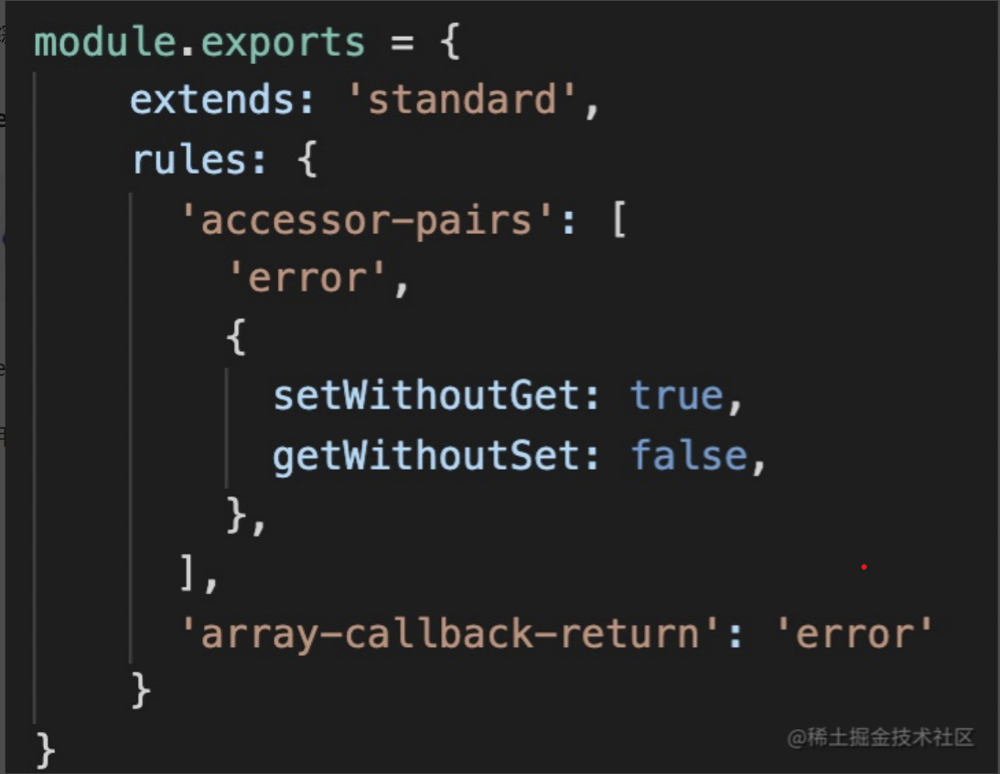

其同样提供了 api 和命令行两种方式，做工具链开发时会用到前者

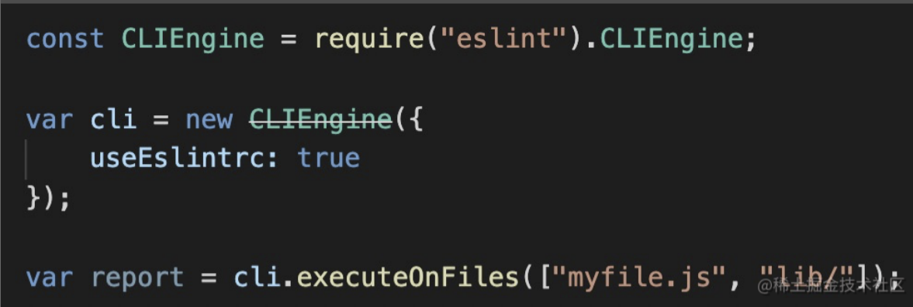

如下为 eslint 插件范例，相关 rule 为：检测到 console.time 即报错，并且可通过 --fix 自动删除

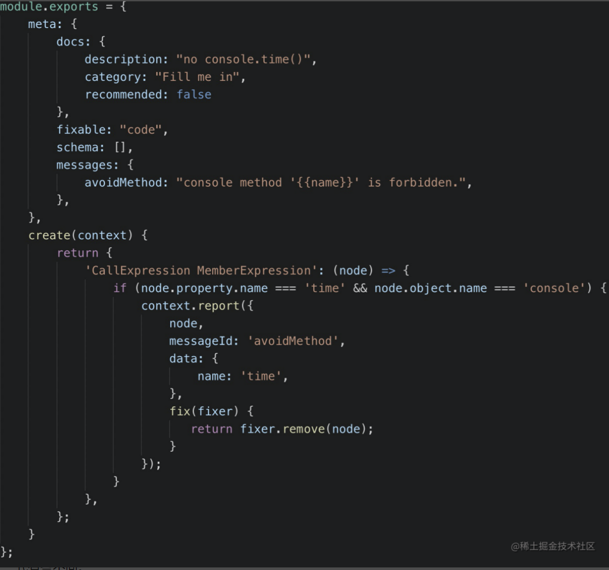

大体思路与 babel 插件差不多，都是 visitor 模式，声明对什么类型的 AST 节点进行什么操作，不过形式有些不同：

- 在 meta 里声明一些元信息，比如文档中展示什么信息、是否可以 fix、报错信息是什么等
- create 返回的 visitor 中可以拿到一些 api，例如调用 report api 就会进行报错，若制定了 fix 方法，还可在用户指定 --fix 参数时自动修复，例如这里的 fixer.remove 来删除 AST

### terser

terser 可对 JS 代码进行压缩、混淆、死代码删除等编译优化，基本也是前端工具链中的必备。最初是 uglifyjs，但前者因不支持 es6 以上代码的 parse 和优化，所以有了 terser

terser 支持各种压缩和混淆选项，参见[文档](https://github.com/terser/terser#minify-options)

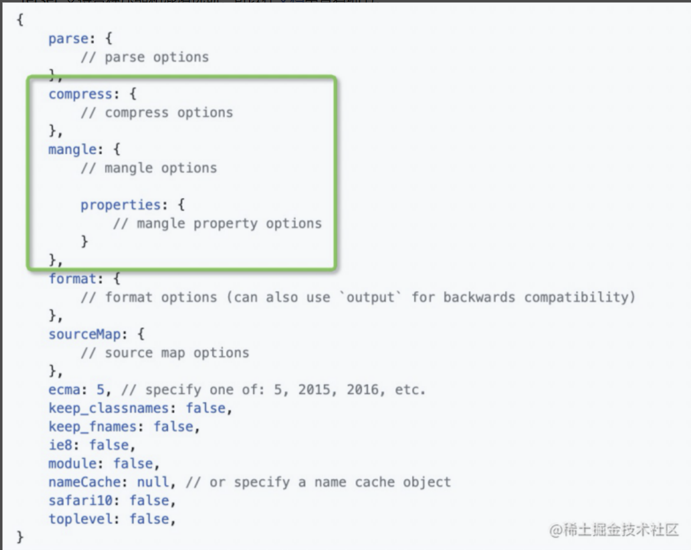

其同样支持 api 和命令行使用方式，api 的方式如下：

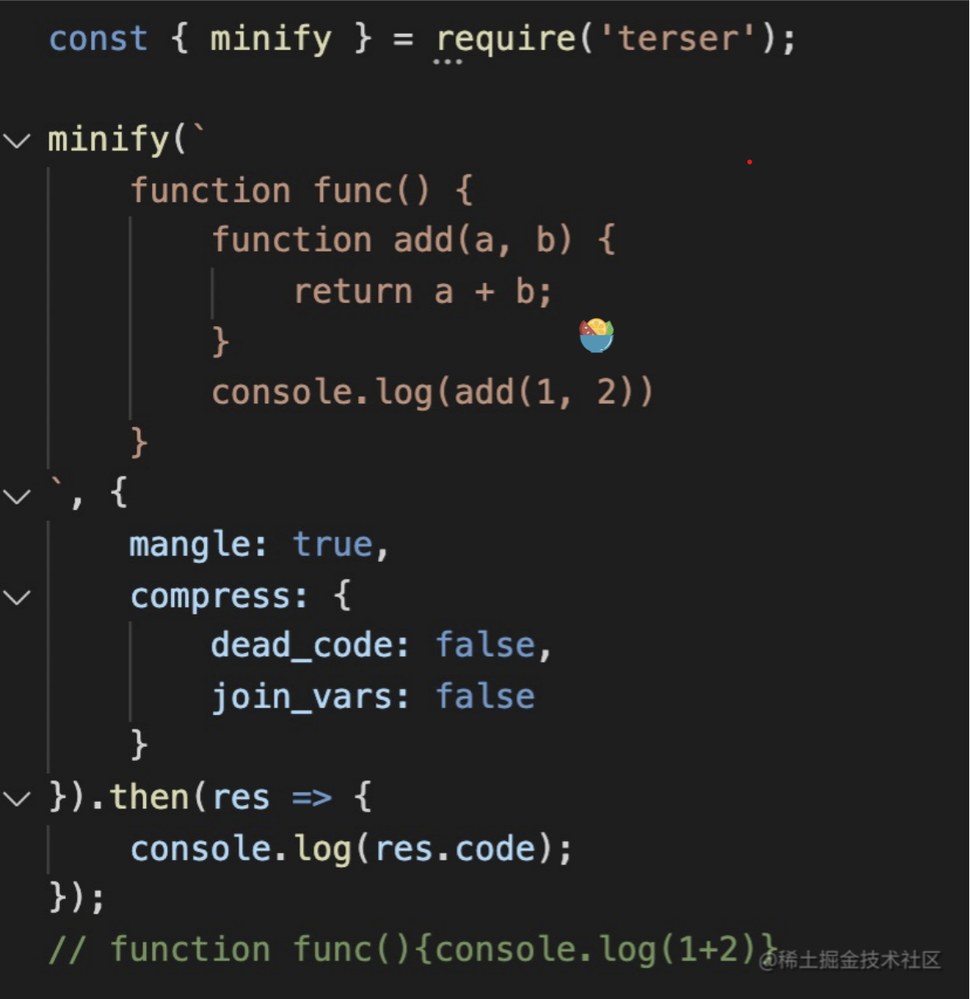

### SWC

swc 是用 rust 写的 JS 转译器，特点就是快，其目标是替代 babel。具体还需看后续发展

### postcss

css 转译器，支持插件且生态繁荣，它提供了 process、walk、stringify 的 api， 分别对应 parse、transform、generate 3 个阶段。例如下面一段提取 css 中所有依赖（url()、@import）的代码：

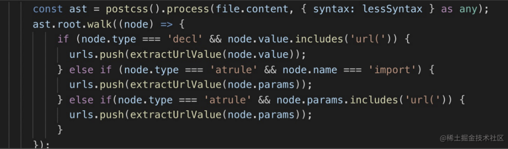

其插件形式如下：

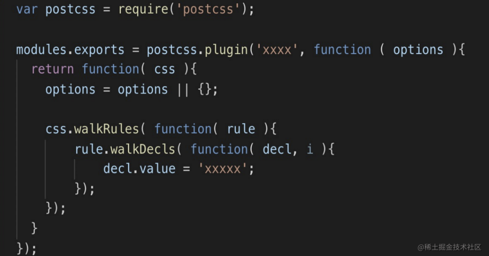

插件同样是对 AST 的增删改，区别在于并非如 eslint、babel 插件一样的 visitor 模式，而需要自己去遍历 AST，找出目标 AST 再进行转换。（typescript compiler 的 api 也是如此，例如其 `ts.forEachChild`）

可以总结，转译器操作 AST 的方式就分为两种，visitor 模式和手动查找模式：

- visitor 模式的实现包括： babel、eslint
- 手动查找方式的实现包括： typscript compiler、postcss、posthtml

### posthtml

从名字就可看出是对 html 进行转译的，支持插件。例如：

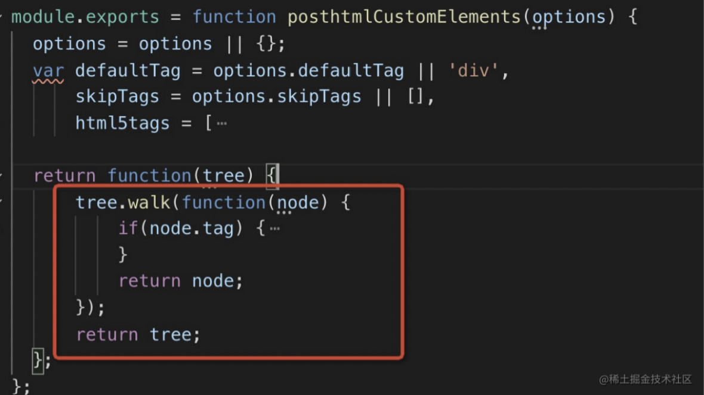

其遍历方式与 postcss 类似，手动查找

### prettier

prettier 是用于格式化代码的转译器，与其他转译器的差异主要体现在 transform 阶段，其主要逻辑是在 generate 阶段支持更友好的格式，例如支持代码太长时自动换行

其与 eslint、stylelint 有一些重合部分，一般会把 lint 工具格式化相关的 rule 禁掉，只保留一些错误检查，这也是诸如 eslint-prettier、stylint-prettier 插件的原理

prettier 更多是用命令行的方式，但工具链开发时也会用到 api

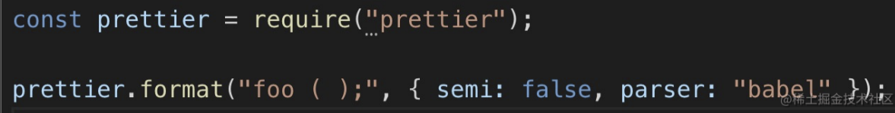

它能格式化的不只是 js、css，还有很多其他代码

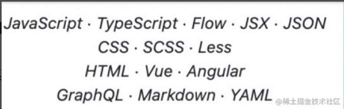

## 转译器在项目中的使用

上面介绍的一系列转译器各自为完成不同功能，其在项目中具体通过以下方式应用：

- ide 的插件，在写代码时对代码实时进行 lint、类型检查、格式化等，如常用的 eslint vscode 插件、typescript vscode 插件（vscode 内置）

- git hooks，通过 husky 的 git commit hook 来触发执行。如 prettier，只需要在代码提交时格式化一下即可

- 通过打包工具来调用，转译器针对的是单个文件，打包工具针对的是多个文件，在打包过程中处理到的每一个文件都会调用相应的转译器来处理，比如 webpack 的 loader

## 任务管理器和打包工具

在打包工具流行前，主要是用各种任务管理器，如 gulp、fis。它们通过匹配文件路径的方式来对不同文件应用不同的转译器

例如 gulp：

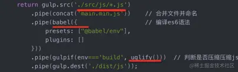

以及 fis：

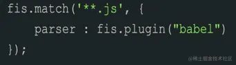

当时的模块化方案大多类似 amd、cmd 需加载一个运行时库（require.js 和 sea.js）来支持，无需打包，只需对文件做转译

后来 commonjs 和 esm 模块化方案开始流行，后者不再以运行时库的方式来支持，而是通过打包工具将文件转成浏览器支持的函数形式

这些打包工具中最流行的是 webpack，其并不通过正则来匹配文件路径并做转译，而是从入口模块开始分析模块间的依赖关系，遇到不同后缀名的文件应用配置的不同 loader；还可通过 plugin 在输出文件前对所有内容做一次处理

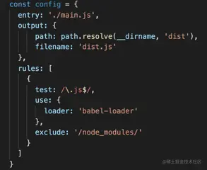

与任务管理器匹配文件路径的方式相比，这种方式更细致，能够做更多优化，所以渐渐流行开来，而 gulp、fis 等方案逐渐走向没落

## 模块化规范

模块打包都基于模块规范，首先来梳理下历史上的模块化规范

最早 js 并无模块化规范，都是通过 window 上的 namespace 来避免命名冲突的，例如 jquery 提供了 `$.conflict` 方法，ts 也有 namespace 的语法

后来有了 amd、cmd 的方案：

```js
// CMD
define(function (require, exports, module) {
	var a = require("./a");
	a.doSomething();
});
```

```js
// AMD
define(["./a"], function (a) {
	a.doSomething();
});
```

以上两种分别由 sea.js 和 require.js 实现，需要在运行时先加载这两个库

再后来 nodejs 的模块化规范 commonjs 流行开来，开发时使用 commonjs 规范再通过打包工具转成浏览器支持的模块化方案

```js
const a = require("a");
a.doSomething();
```

es2015 后，js 语言级别支持了模块化，即 es module

```js
import a from "a";
a.doSomething();
```

当然 esm 尚有兼容问题，生产环境下同样需要打包工具转成其他模块实现

## webpack

webpack 通过模块间依赖关系的分析来构建依赖图，通过不同后缀对应的 loader 来对不同内容做转换，所以支持 css、js、png 等各种模块

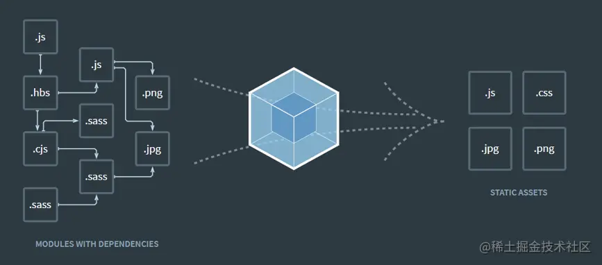

### webpack 的打包流程

webpack 并非把模块处理完就直接输出，而是做了一次分组（chunk），按一定规则将一些模块合并到同一个 chunk 中，之后再输出成文件

浏览器对一个域名并行加载的资源数也就是 5 个左右，所以合并成 chunk 有利于网页加载速度的优化

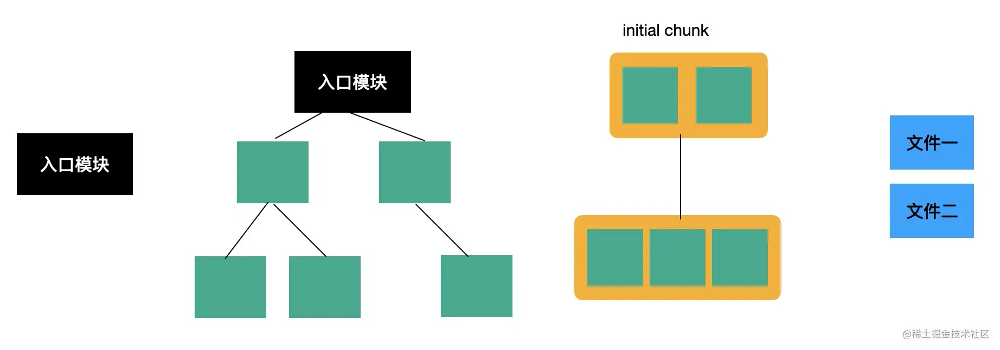

模块是一个图（一个模块可被多个模块依赖），分组之后仍会有依赖关系，从 module graph 到 chunk graph 的转换是 webpack 逻辑最复杂的地方之一

与模块一样，chunk 也有入口 chunk，叫做 initial chunk，其中保存了 webpack 用于支持模块加载的一些运行时 api，当然这部分 runtime 代码也可以抽离出来

```js
module.exports = {
	optimization: {
		runtimeChunk: true,
	},
};
```

webpack 设计的模块分组机制（chunk 机制）有两个好处：

- 减少请求数量，将模块合并到若干个 chunk 能够并行加载
- 将公共模块划分到同个 chunk 能更好利用缓存

webpack 整体编译流程为：从入口模块开始构建模块依赖图，再转换为 chunk 依赖图，然后使用不同的 chunk 模版打印成 assets，输出成文件

webpack 的优化大体可分为基于 runtime 和基于编译这两种

### webpack 基于 runtime 的优化

webpack 有自己的 runtime，也基于 runtime 做了很多优化：

- 无需立即加载的模块可以懒加载，通过 require.ensure、import 等 api 来延后加载。该功能成为 code splitting

  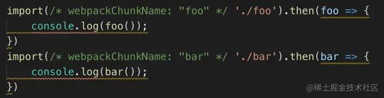

- 通过 window 共享变量的方式来复用其他模块，可把之前打包后的模块挂在 window 上，通过 window 在运行时获取该模块。这个是 dll plugin 的功能，用于减少一些不经常变动模块的编译

- 通过 window 共享变量的方式，共享其他 bundle 的模块， 这与 dll plugin 的思路一样，但 webpack5 专门设计了一套 api 用于 bundle 间共享模块，叫做模块联邦（module fedaration）

  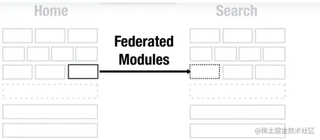

### webpack 基于编译的优化

基于编译的优化主要是 tree shaking，可在打包时把没用到的 export 给删掉，其实就是跨文件的死代码删除(dead code elimation)。其实现有两种思路：

1. 合并成一个文件，通过声明提升，变成单文件的 DCE，让 terser 来处理
2. 自己实现多文件 import 和 export 的引用计数，删掉没有被用到的 export

rollup 基于第一种，而 webpack 主要基于第二种，当然也可通过一些作用域提升的插件来触发第一种 treeshking

tree shking 基于对 es module 的静态分析，因为 import 的 source 只能是字符串，不会是动态生成的内容，所以可分析；而 commonjs 的依赖就没法分析，也就没法 treeshking

## bundleless

打包是因为旧浏览器不支持 es module，但现代浏览器已有部分能够支持了，所以出现了 bundleless 的思路，如 vite

bundleless 无需进行模块依赖图分析，只需根据请求路径使用服务端的 middleware 来处理请求的资源即可，在中间件里调用转译器对文件内容做转换

开发环境下极大提升了构建速度；但是生产环境因为兼容问题，还是需要打包

## esbuild

就像转译器有用 rust 写的 swc，打包工具也有了 go 写的 esbuild，利用 go 的协程来处理并发编译，速度上相比 webpack 有极大提升

## js 引擎

转译打包后的代码要运行起来，就需要 JS 解释器如 V8、SpiderMonkey、hermes ...

### 解释器和转译器的区别

转译器是把源码 parse 成 AST 后，进行 AST 转换，之后再打印成目标代码，并生成 sourcemap

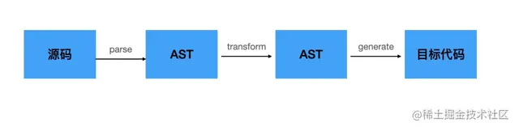

而解释器是把源码 parse 成 AST 后解释执行后者，或转成字节码之后解释执行字节码，而且还可把字节码编译成机器码直接执行，这种叫做 JIT 编译

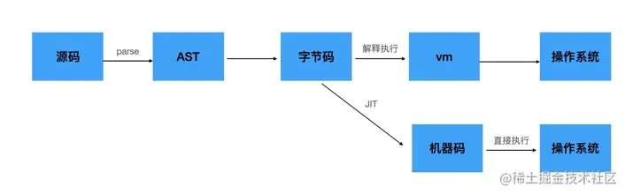

v8 就是这样的编译流程（？？？与[how-javascript-works](/how-javascript-works/overview.md)处描述不符）：

- ignation 是解释器，会把 AST 转成 bytecode 并解释执行
- turbofan 是 JIT 编译器，可以把字节码编译成机器码，直接执行

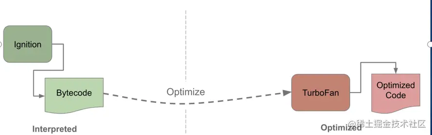

上述这些都是从源码开始 parse，再解释执行的。其实 js 也完全可做到像 java 一样，先把源码编译成字节码，然后直接执行字节码的思路。这样可提升运行速度

react native 的 js 引擎 hermes 就是这么做的：提前进行 parse 和 compile，之后就可直接从字节码开始解释或者直接从机器码执行

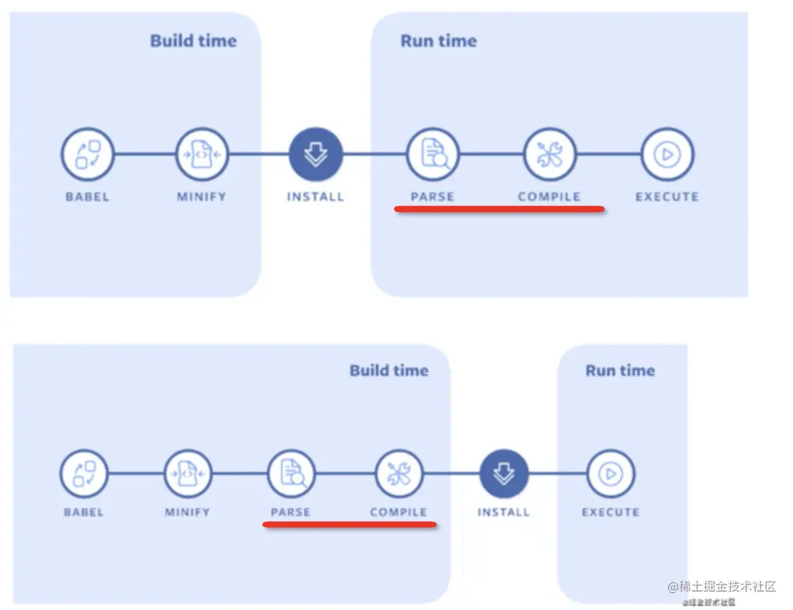

## 跨端引擎

js 引擎除可在浏览器中运行外，也会用在跨端引擎中，后者会给它注入各种 native 能力的 api，以及自己实现的 dom api

跨端引擎为了让前端代码渲染到原生，实现了一套 css 渲染引擎和 dom api，提供了前端代码运行的容器，可以对接各种前端框架

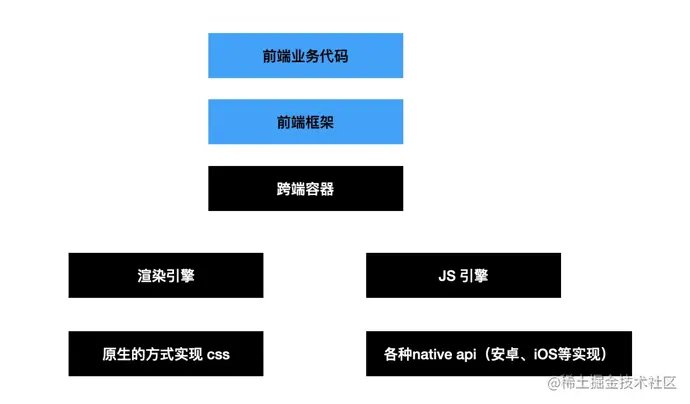

## 工程化闭环

转译器、模块化、打包工具、bundleless、js 引擎、跨端引擎等，这些串联起来就是前端领域的工具链

开发和生产环境下工具链的不同，形成了两种工程化的闭环

### 开发环境的工程化闭环

开发环境下，源码经转译打包生成目标代码（不压缩），目标代码会放到开发服务器，浏览器请求开发服务器下载代码来运行和调试，支持 sourcemap，根据运行情况进行修改代码，这是开发时的闭环

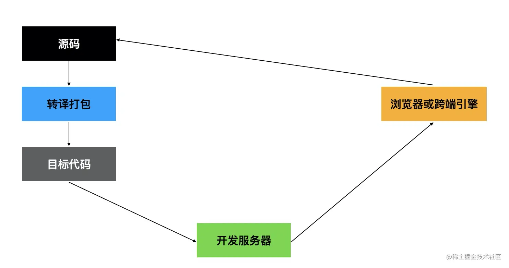

当然若是 bundleless 的话，直接在开发服务器上完成转译，无需打包：

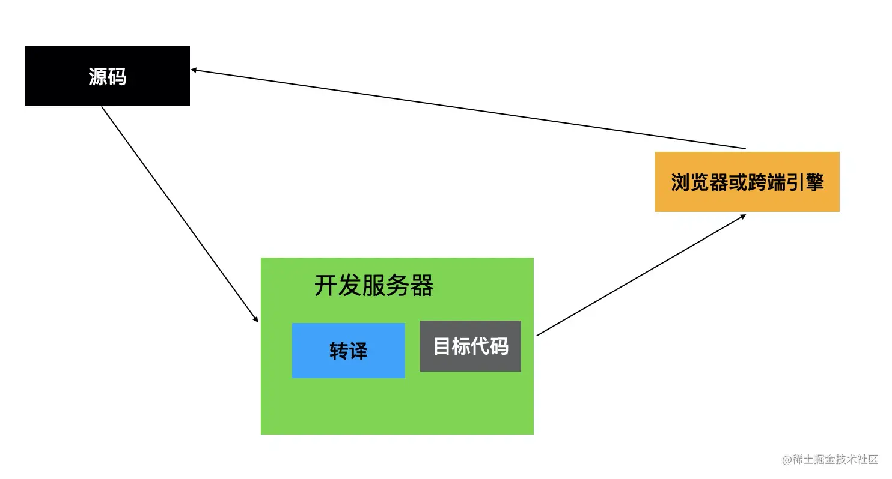

### 生产环境的工程化闭环

生产环境下，源码经转译打包生成目标代码，并通过 ci/cd 上传到 cdn 服务器，用户请求后者获取代码并运行；根据性能、报错监控及产品经理反馈来进行 bug 修改和后续迭代。这是生产时的闭环

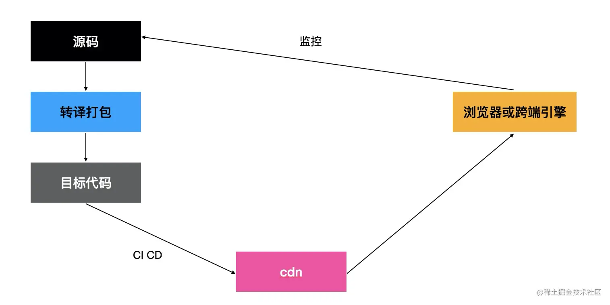
