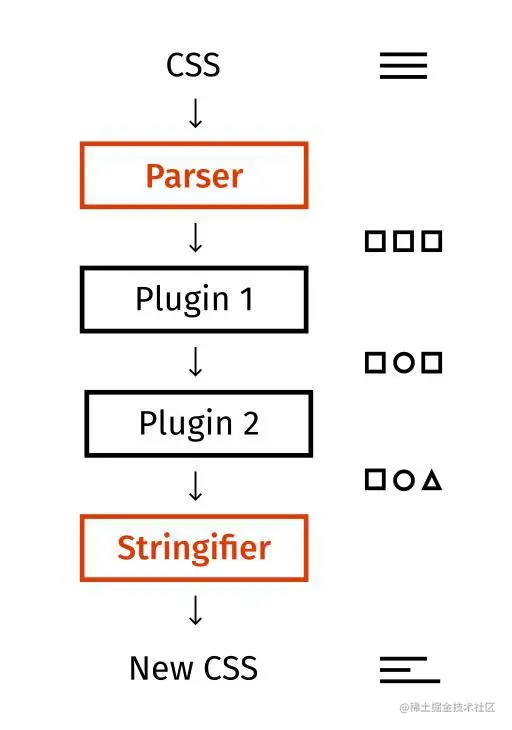
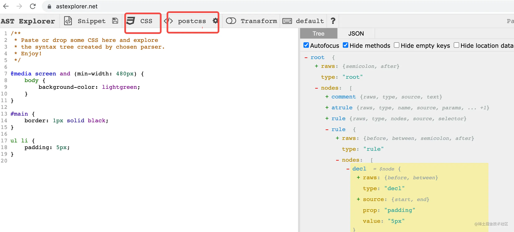
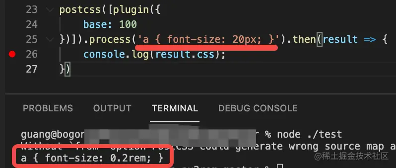

# postcss 入门

postcss 是 css 的 transpiler（转换编译器，简称转译器），它对于 css 就如 babel 之于 js：实现 css 代码的分析和转换，同时也提供插件机制来做自定义转换

这里通过一个 px 自动转 rem 的功能来入门一下 postcss 插件

## 原理

和 babel 一样，postcss 的转译分为 parse、transform、generate 3 个阶段。各种转换插件都工作在 transform 阶段，基于 AST 做分析和转换



css 的 AST 比 js 的简单多了，主要以下几种：

- **atrule**，以 @ 开头的规则，如：

  ```css
  @media screen and(min-width: 480px) {
  	body {
  		background-color: lightgreen;
  	}
  }
  ```

- **rule**：选择器开头的规则，如：

  ```css
  ul li {
  	padding: 5px;
  }
  ```

- **decl**：具体的样式，如：

  ```css
  padding: 5px;
  ```

  以上可通过 [astexplorer.net](https://astexplorer.net/) 来可视化的查看



## 插件的写法

postcss 插件工作在 transform 阶段，处理 ast 节点，形式如下：

```js
const plugin = (option = {}) => {
  return {
    postcssPlugin: "插件名"，
    Rule(node) {},
    Declaration(node) {},
    AtRule(node) {}
  }
}
```

外层函数接受 options，返回插件对象，声明处理相应节点的 listener，并在后者内写处理逻辑就行。还可这样写（好处是可存放一些公共逻辑）：

```js
module.exports = (opts = {}) => {
	return {
		postcssPlugin: "插件名",
		prepare(result) {
			// 这里可以放一些公共逻辑
			return {
				Rule(node) {},
				Declaration(node) {},
				AtRule(node) {},
			};
		},
	};
};
```

然后按如下运行插件：

```js
const postcss = require("postcss");

postcss([
	plugin({
		// options
	}),
])
	.process("a { font-size: 20px; }")
	.then((result) => {
		console.log(result.css);
	});
```

以下实现一个简易 px 自动转 rem 插件

## 实战案例

### 需求描述

px 是固定长度单位，而设备视口的尺寸是各种各样的，想通过一套样式来适配各种设备的显示，就需相对单位，常用 rem。后者本质即相对于 html 元素 font-size 的等比缩放

例如 html 的 font-size 设置为 100px，则 1rem 就等于 100px，而某元素 200px 尺寸，则可写为 2rem

这样我们只需修改 html 的 font-size 即可适配各种屏幕宽度显示，相关单位会做等比缩放

但若手动根据 html 的 font-size 值来把所有的 px 转换为 rem 则过于繁琐，知道计算方式后，完全可用 postcss 插件来自动做。下面就来实现该插件

### 代码实现

1. 搭建插件基本结构，只需声明处理 Declaration 的 listener：

```js
const plugin = (options) => {
	return {
		postcssPlugin: "postcss-simple-px2rem",
		Declaration(decl) {},
	};
};
```

2. 然后就是把 decl 样式值中的 px 转换为 rem，简单的正则替换即可：

```js
const plugin = (options) => {
	const pxReg = /(\d+)px/gi;
	return {
		postcssPlugin: "postcss-simple-px2rem",
		Declaration(decl) {
			decl.value = decl.value.replace(pxReg, (matchStr, num) => {
				return num / options.base + "rem";
			});
		},
	};
};
```

然后测试下：

```js
postcss([plugin({ base: 100 })])
	.process("a { font-size: 20px; }")
	.then((result) => {
		console.log(result.css);
	});
```

可看到，已正确做了转换：



当然，该插件只是案例，要做的完善还需更复杂的正则

## 后语

postcss 分析转换的功能还可有很多应用，例如切换主题色，从白到黑，完全可用 postcss 自动分析颜色的值，然后转换。许多业务中的应用场景都可去发掘
