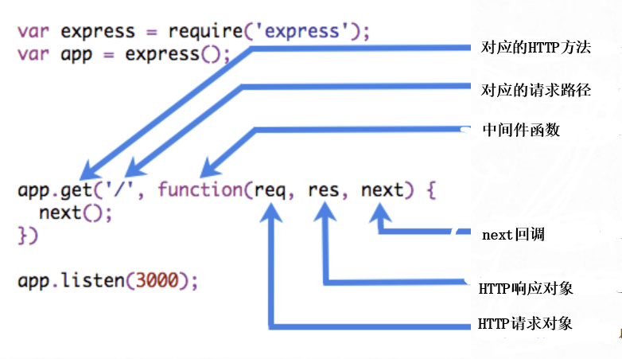

# 中间件

:::tip 提示
文章中出现的变量：

- **app**：Express 应用实例，`const app = express()`
- **router**：Express 子应用实例，`const router = express.Router()`
- **req**：Express 为中间件/handler 提供的对象入参，表示 HTTP 请求
- **res**：Express 为中间件/handler 提供的对象入参，表示 HTTP 响应
- **next**: Express 为中间件/handler 提供的回调入参，用于将控制权移交至下一中间件或 handler
- **err**：Error 对象
- **.METHOD()**：泛指 app 和 router 对象上一系列 HTTP method 相关方法

常见名词解释：

- **路由（route）**：泛指对面向特定 endpoint(URI|path)，具有特定方法的请求的处理机制。注册路由（routing）即为路由绑定处理函数（即中间件）的过程，后者也称为 handler 或 callback，一个路由可对应多个 handler

  - 实际（含本文）以**路由**专指通过**单次**`app.METHOD()`或`router.METHOD()`注册一系列 handlers 形成的“逻辑节点”，通常用于处理具体业务；

  - 而 **handler** 专指路由（实际定义）对应的处理函数，仅限`app.METHOD()`或`router.METHOD()`注册。与中间件最大的不同在于前者可通过调用`next('route')`来略过当前路由的所有后续 handlers

- **中间件**：泛指一切处理函数，包含 handlers（本文中若不特殊注明）。有时也专指通过`app.use()`注册的单一处理函数，常用于提供通用能力

后续不过多赘述

:::

Express 是基于中间件的 Web 框架，自身仅提供最小化能力。Express 应用基本可视为一系列中间件的调用

中间件依次接受 Express 提供的 req、res、next 为入参，示意如下（实际并不局限于该形式，参见下文）：



可在其中：

- 执行业务逻辑（或任意代码）
- 修改请求、响应对象
- 结束本次请求 —> 响应链
- 调用栈中的下一个中间件

若当前中间件中未能结束本次请求 —> 响应链（通过 res 上的相应方法），则务必调用`next()`，否则请求将被挂起

:::tip Express5 新特性
自 Express5 起，若中间件返回 Promise 对象，则后者在 rejected 时会自动调用`next([rejected value | error])`
:::

:::tip 可配置的中间件
可通过闭包形式生成可配置的中间件。示例如下：

```js
function myMiddleware(options) {
	return (req, res, next) => {
		// 根据 options ...
		next();
	};
}

app.use(myMiddleware({ anyOption: /* ... */ }));
```

:::

## 注册中间件

中间件基于类别具有不同的注册方式，同一类别中间件按其注册顺序执行

### 应用级中间件（Application-level middleware）

使用 `app.use([path,] callback [, callback...])` 和 `app.METHOD(path, callback [, callback ...])`注册应用级中间件，后者仅适用于相应方法的请求

- `.use()` 方法可省略 path 参数，此时路径默认为 /
- 通过 `.METHOD()` 方法注册的函数也称为 handler，可通过`next('route')`略过同一路由上的后续 handlers

### 路由级中间件（Router-level middleware）

路由级中间件绑定在子应用实例上（即`express.Router()`），后者同样拥有`.use()`和`.METHOD()`方法

若在同一路径上挂载了多个子应用，则可在**中间件**内（并非仅限 handler）通过`next('router')`直接跳转至下一子应用

其余表现与应用级中间件完全一致

### 错误处理中间件（Error-handling middleware）

错误处理中间件需要接收 4 个形参，分别对应 err、req、res、next，这也是 Express 识别其类别的方式

### 内置中间件（Built-in middleware）

自 4.x 版本起，Express 不再依赖[Connect](https://github.com/senchalabs/connect)，部分内置中间件也因此被抽离

当前 Express 仅内置如下中间件：

- [express.static](http://expressjs.com/en/4x/api.html#express.static)
- [express.json](http://expressjs.com/en/4x/api.html#express.json)：**Express 4.16.0+**
- [express.urlencoded](http://expressjs.com/en/4x/api.html#express.urlencoded)：**Express 4.16.0+**

### 三方中间件（Third-party middleware）

部分三方中间件[列表](http://expressjs.com/en/resources/middleware.html)

<!-- - 注册

通过 `app.use([middleware])` 方法注册中间件，且通常优先于路由（一旦在路由中结束本次请求-响应链，则后续中间件无法执行）。注意中间件按其注册的顺序来执行。 -->
