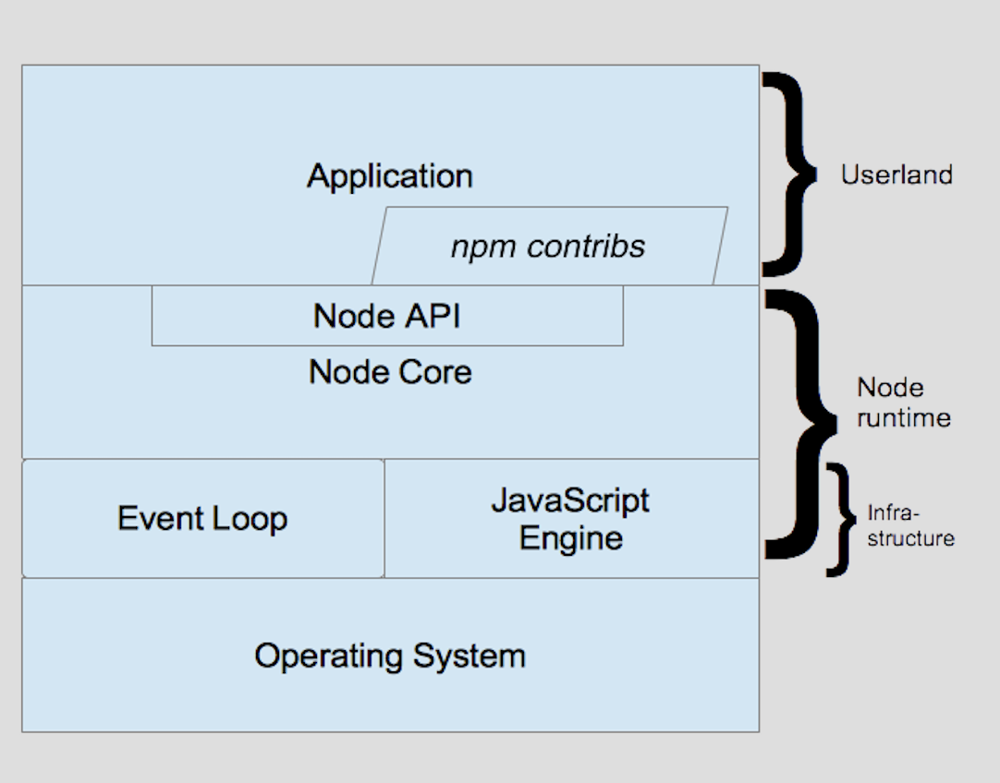

# Node 基础

## 架构和概念

Node 运行时（runtime）包含：

- **Node API**，即 File System、HTTP、Events、Stream、Crypto 等内建模块

- **Node core**，Node API 的底层支持模块

  - **V8 引擎**，单线程执行**所有**JavaScript 代码，启动 Node 即启动其单个实例

  - **事件循环**，借助 libuv 实现。主线代码执行完毕后即将控制权交给事件循环，后者分别在以下阶段调用异步回调（并交由 V8 实际执行）：

    - **Timers**，调用`setInterval()`、`setTimeout()`的到期回调

    - **Poll**，若 I/O 操作已完成，则在此阶段调用其相关回调

    - **Check**，调用`setImmediate()`的回调

  在无更多回调时退出

Node 的设计理念即 API 总应以异步方式执行，无论是否有必要
