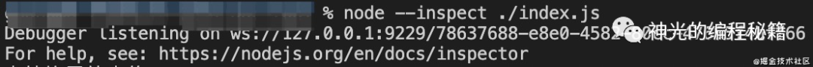
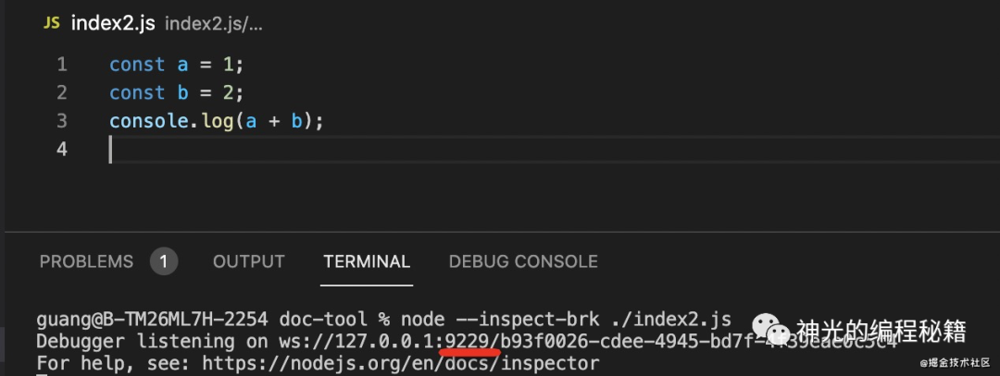

# nodejs debugger 技巧

能否使用 debugger 是区分 nodejs 水平的重要标志

## debugger 原理

运行 nodejs 时若带上 --inspect（可打断点） 或 --inspect-brk（可打断点且在首行断住） 选项，则会以 debugger 模式启动：



上图可见 node 启动了一个 websocket 服务，地址为：`ws://127.0.0.1:9229/78637688-e8e0-4582-80cc-47655f4bff66`

debugger 的含义即要在某处断点，可单步运行及查看上下文变量，而后者正是通过 websocket 服务实现。此时只需再启动一个 websocket 客户端与之连接，即可调试代码

## v8 debug protocol

debugger 服务与 debugger 客户端的通信涉及到 v8 debug protocol。类似如下：

1. 在 test.js 的 100 行 设置断点：

```json
{
	"seq": 118,
	"type": "request",
	"command": "setbreakpoint",
	"arguments": {
		"type": "script",
		"target": "test.js",
		"line": 100
	}
}
```

2. 然后查看当前作用域的变量：

```json
{
	"seq": 117,
	"type": "request",
	"command": "scope"
}
```

3. 执行一个表达式：

```json
{
	"seq": 118,
	"type": "request",
	"command": "evaluate",
	"arguments": {
		"expression": "a()"
	}
}
```

4. 之后继续运行：

```json
{
	"seq": 117,
	"type": "request",
	"command": "continue"
}
```

客户端即以此方式告知 debugger 服务如何去执行代码


## debugger 客户端

debugger 客户端一般带 UI（虽也可在命令行内用命令调试），常见的有：chrome devtools 和 vscode debugger

这里演示一个简单脚本，通过 `node --inspect-brk` 启动于 9229 端口，然后分别通过两种 client 连接



### chrome devtools

1. chrome 地址栏输入 `chrome://inspect`，点击 configure 配置目标端口：
   

2. 填入端口号 9229：
   

3. 可看到 chrome 扫描到了该 target，点击 inspect 即可连上该 debugger 服务
   
   

4. 之后就可设置断点、单步执行、执行表达式、查看作用域变量等

### vscode debugger

当然，vscode 写代码，却用 chrome devtools 调试是较麻烦的选择。实际上 vscode 自带了 debugger，可直接用于调试

1. 首先需在项目根目录的 `.vscode/launch.json` 中配置。点击右下角按钮添加配置项，这里选择 Nodejs Attach
   

2. 因为已通过 `node --inspect-brk` 启动 websocket debugger 服务，则只需启动 websocket 客户端，再 attach 上 9229 端口即可
   

3. 点击左侧按钮，即可连上 debugger 服务开始调试
   

4. 当然该方式还是有些麻烦。实际只需添加一个 launch 配置即可将这两步合并
   
   

5. launch，即先启动 debugger 服务，再启动一个 debugger 客户端连接前者。执行的脚本是根目录下的 index2.js，还可设置 stopOnEnt 首行断住。最后点击调试即可：
   

## vscode debugger 进阶

debugger 客户端中最常用的还是 vscode，这里着重讲下后者在各种场景下的配置

### sourcemap

若调试 ts 代码，还需使编译后代码能够映射回源码，这正是 sourcemap 的用处。chrome devtools 和 vscode debugger 都支持 sourcemap，支持文件末尾的 sourcemap url 解析

例如 index.js 路径末尾包含`//# sourceMappingURL=index.js.map`，则调试时就知前者由 ts 编译产出，并自动找到对应 ts

另外如调试配置里直接指定了 ts，则还需再配置 outFiles，告知 vscode 去哪找 sourcemap


<!-- 这样，在 ts 源码中打断点以及在编译后 js 打断点都能生效 -->

### 多进程调试

当程序中存在子进程时，就有了第二条控制流，需再启动一个 debugger

例如 vscode 基于 electron，包含一个主进程，一些渲染进程。主进程通过 launch 启动，而渲染进程则是后来 attach 的

主进程启动时，通过 `--remote-debugging-port` 指定子进程启动时的 debugger 服务端口：


outFiles 来指定 sourcemap 位置；runtimeExecutable 是用 vscode 的运行时替代掉了 nodejs（一般无需设置）

而渲染进程是后面启动的，通过参数配置启动端口 9222，则只需 attach 到此端口即可调试该进程


vscode 支持多 target 调试，即可在 vscode 里面同时启动多个 debugger。可切换不同 debugger 来调试不同进程


## 总结

nodejs debugger 原理为：js 引擎启动 debugger server（websocket），等待客户端连接，再通过各种 debugger client 连接来进行调试，如 chrome devtools、vscode debugger

调试 nodejs 代码更多还是使用 vscode debugger（当然有时也会使用 chrome devtools 调试，基于 chrome devtools 的 memory 来进行内存分析，定位内存泄漏问题时很有帮助）

vscode debugger 的使用主要是在 `.vscode/launch.json` 内添加调试配置，后者分为 launch 和 attach 两种：

- launch 会启动 debugger server 并用 debugger client 连接上
- attach 只是启动 debugger client 连接上已有的 debugger server，所以要指定端口

具体的配置项常用的有：

- outFiles 指定 sourcemap 的位置，用来调试 ts 源码等需要编译的代码
- stopOnEntry 在首行停住
- args 来指定一些命令行参数
- runtimeExecutable 当运行时不是 nodejs 的时候需要指定，比如 vscode 或者其他的一些运行时
  基于这些配置我们就可以调试各种场景下的 nodejs 代码，需要编译的，或者多个进程的

不夸张地说，如熟悉了 debugger 的使用，理解各种 nodejs 代码都会简单很多
