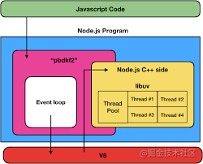

# Node.js 异步计算（多线程）

## 起步

高性能程序要充分利用 CPU 资源，不要让其空转。空转主要在于：

- 程序进行网络和磁盘 IO 时，CPU 空闲
- 多核 CPU 只利用了其中一核，则其他核空闲

操作系统提供了线程抽象，对应代码不同的执行分支，可同时上不同 CPU 跑，这是发挥好多核性能的方式

而若线程在进行 IO 时需阻塞等待读写完成，也是较低效的方式。因而操作系统实现了 DMA 机制，即设备控制器，由硬件来负责从设备到内存的搬运，完成后告知 CPU。这样当有线程在 IO 时即可将其暂停，等收到 DMA 数据运输完成通知再继续

综上，多线程、DMA 是操作系统提供的，利用好多核优势，解决 CPU 阻塞等 IO 问题的解决方案。各编程语言都对此类机制做了封装，Node.js 也是

Node.js 之所以高性能，即在于异步 IO 的设计，后者基于 libuv 实现。操作系统提供的异步系统调用一般为硬件级别的异步，如 DMA 搬运数据；而一些同步系统调用，经 libuv 封装以后也会变成异步，这是因为 libuv 通过线程池来执行这些任务，将同步 API 变成异步，线程池大小可以通过 环境变量 UV_THREADPOOL_SIZE 设置，默认为 4



代码中的许多异步 API 都通过线程来实现。如：

```js
const fsPromises = require("fs").promises;
const data = await fsPromises.readFile("./filename");
```

当然此类异步 API 只解决了 IO 问题，要真正利用多核优势还是得通过 worker_thread 模块（Node12）创建线程。要了解后者，得从 web worker 聊起

## 浏览器 web worker

浏览器同样面临上述问题，因而 html5 引入了 web worker，可在另一线程执行运算。例如：

```js
function runCalcWorker(...nums) {
	return new Promise((resolve, reject) => {
		const calcWorker = new Worker("./webWorker.js");
		calcWorker.postMessage(nums);
		calcWorker.onmessage = function (msg) {
			resolve(msg.data);
		};
		calcWorker.onerror = reject;
	});
}

(async function () {
	const res = await runCalcWorker(2, 3, 3, 3);
	console.log(res);
})();
```

```js
// webWorker.js
onmessage = function (msg) {
	if (Array.isArray(msg.data)) {
		const res = msg.data.reduce((total, cur) => {
			return (total += cur);
		}, 0);
		postMessage(res);
	}
};
```

创建 Worker 对象并指定 js 脚本，通过 postMessage 传递消息，通过 onMessage 接收消息。整个过程都是异步的，可进一步封装成 Promise

## Node.js worker thread

Node.js 的 worker thread 与 web worker 类似。若将上一段逻辑在 Node.js 内实现，则为：

```js
const { Worker } = require("worker_threads");

function runCalcWorker(...nums) {
	return new Promise((resolve, reject) => {
		const calcWorker = new Worker("./nodeWorker.js");
		calcWorker.postMessage(nums);
		calcWorker.on("message", resolve);
		calcWorker.on("error", reject);
	});
}

(async function () {
	const res = await runCalcWorker(2, 3, 3, 3);
	console.log(res);
})();
```

```js
// nodeWorker.js
const { parentPort } = require("worker_threads");

parentPort.on("message", (data) => {
	const res = data.reduce((total, cur) => {
		return (total += cur);
	}, 0);
	parentPort.postMessage(res);
});
```

由于消息传递机制，需做正反序列化，因而函数无法被传输（无法序列化）
