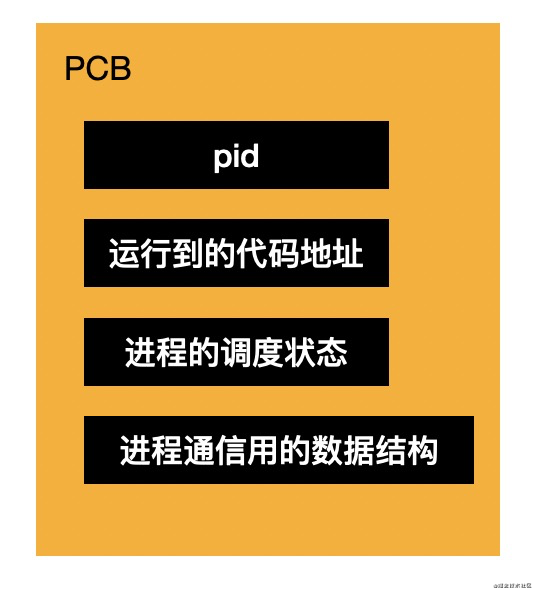

# 关于 node 多进程以及进程通信

操作系统为更好利用硬件资源，支持了多个程序的并发以及硬件资源的分配，分配的单位就是进程。进程即程序的执行过程，如记录程序执行到哪一步，申请的硬件资源、占用的端口等

进程包括要执行的代码、代码操作的数据，以及进程控制块 PCB（Processing Control Block），因为程序就是代码在数据集上的执行过程，而执行过程的状态和申请的资源需要记录在一个数据结构（PCB）里。所以进程由代码、数据、PCB 组成


pcb 中记录着 pid、执行到的代码地址、进程的状态（阻塞、运行、就绪等）以及用于通信的信号量、管道、消息队列等数据结构



进程从创建到代码不断的执行，到申请硬件资源（内存、硬盘文件、网络等），中间还可能会阻塞，最终执行完会销毁进程。这是一个进程的生命周期

进程对申请来的资源是独占式的，每个进程都只能访问自己的资源，那进程间怎么通信呢？

## 进程通信

不同进程间因为可用的内存不同，所以要通过一个中间介质通信

### 信号量

信号量通过一个数字表示，放在 PCB 的一个属性里，用于简单标记。如锁的实现就可通过信号量。另外这种信号量的思想在前端也常被使用，如实现节流时，也需加一个标记变量

### 管道

信号量的问题在于不能传递具体数据。另一种方式是通过读写文件方式来通信，即管道：内存中的文件叫匿名管道，无文件名；硬盘中的文件叫命名管道，有文件名

文件需要先打开，再读和写，最后关闭，这也是管道的特点。后者基于文件的思想封装，之所以叫管道在于只能一个进程读，一个进程写，是单向的（半双工），且还需要目标进程同步消费数据，不然就会阻塞

这种同步管道实现简单（就是一个文件读写）但是只能用于两个进程间通信，且只能同步通信。当然管道同步通信也挺常见，如 stream 的 pipe 方法

### 消息队列

管道实现简单，但是同步通信比较受限。若加个队列做缓冲（buffer）改为异步通信，就成了消息队列

消息队列也是两个进程间的通信，但并非基于文件思路，虽然也是单向的，但是有了异步性，可以放很多消息，之后一次性消费

### 共享内存

管道、消息队列都是两个进程间的，而若在多个进程间，可通过申请一段多进程都可操作的内存（共享内存），用这种方式通信。各进程都可以向该内存读写数据，效率较高

共享内存虽然效率高，也能用于多进程通信，但问题在于多进程读写容易混乱，要自己控制顺序。比如通过进程的信号量（标记变量）来控制

共享内存适用于多个进程间通信，无需通过中间介质，效率更高，使用起来也更复杂

## ipc、rpc、lpc

以上这些都是本地进程通信方式了

进程通信即 ipc（Inter-Process Communication），两个进程可能来自同一计算机，也可能为网络上不同计算机的进程，所以进程通信方式分为两种：

- 本地过程调用 LPC（local procedure call）
- 远程过程调用 RPC（remote procedure call）

本地过程调用即上述信号量、管道、消息队列、共享内存的通信方式。但若在网络上，那就要通过网络协议来通信，如 http、websocket

## electron 进程通信

electron 会先启动主进程，然后通过 BrowserWindow 创建渲染进程，加载 html 页面实现渲染。这两进程间的通信是通过 electron 提供的 ipc 的 api

### ipcMain、ipcRenderer

主进程里通过 ipcMain 的 on 方法监听事件：

```js
import { ipcMain } from "electron";

ipcMain.on('异步事件'， (event, arg) => {
  event.sender.send('异步事件返回'， 'yyy')
})
```

渲染进程里通过 ipcRenderer 的 on 方法监听事件，通过 send 发送消息:

```js
import { ipcRenderer } from "electron";

ipcRenderer.on("异步事件返回", (event, arg) => {
	const message = `异步消息：${arg}`;
});

ipcRenderer.send('异步事件'， 'xxx')
```

api 使用较简单，基于消息队列方式实现。经过 c++ 层的封装，再暴露给 js ，并以事件形式

### remote

除事件形式 api 外，electron 还提供了远程方法调用 rmi （remote method invoke）形式的 api

其本质就是对消息的进一步封装，即根据传递的消息，调用不同的方法。形式上与调用本进程方法一样，但其实是发消息到另一个进程来做的，与 ipcMain、ipcRenderer 本质上一致

如在渲染进程里，通过 remote 直接调用主进程才有的 BrowserWindow 的 api：

```js
const { BrowserWindow } = require("electron").remote;

let win = new BrowserWindow({ width: 800, height: 600 });
win.loadURL("https://github.com");
```

小结，electron 父子进程通信方式是基于消息队列封装的，形式有两种：一种以事件方式，通过 ipcMain、ipcRenderer 的 api 使用；另一种则是进一步封装成了不同方法的调用（rmi），底层也是基于消息，执行远程方法但形式上与执行本地方法一致

## nodejs

nodejs 提供了创建进程的 api，位于两个模块：child_process 和 cluster。一个用于父子进程的创建和通信，一个是用于多进程

### child_process

child_process 提供了 spawn、exec、execFile、fork 的 api，分别用于不同的进程的创建

#### spawn、exec

若想通过 shell 执行命令，则用 spawn 或 exec。因为一般执行命令是需要返回值的，这两 api 在返回值的方式上有所不同：

- spawn 返回的是 stream，通过 data 事件取值

  ```js
  const { spawn } = require("child_process");

  const app = spawn("node", "main.js", { env: {} });
  app.stderr.on("data", (data) => {
  	console.log("Error:", data);
  });
  app.stdout.on("data", (data) => {
  	console.log(data);
  });
  ```

- exec 基于 spwan 封装，返回 buffer，适用于简单场景，但有时要设置下 maxBuffer（可能超出）

  ```js
  const { exec } = require("child_process");

  exec("find . -type f", { maxBuffer: 1024 * 1024 }, (err, stdout, stderr) => {
  	if (err) {
  		console.error(`exec error: ${err}`);
  		return;
  	}
  	console.log(stdout);
  });
  ```

#### execFile

execFile api 用于执行可执行文件：

```js
const { execFile } = require("child_process");

const child = execFile("node", ["--version"], (error, stdout, stderr) => {
	if (error) {
		throw error;
	}
	console.log(stdout);
});
```

#### fork

若要执行 js，则用 fork：

```js
const { fork } = require("child_process");

const xxxProcess = fork("./xxx.js");
xxxProcess.send("111111");
xxxProcess.on("message", (sum) => {
	res.end("222222");
});
```

### child_process 进程通信

接着来看 child_process 创建的子进程如何与父进程通信，即怎么做 ipc

#### pipe

pipe 很明显是通过管道机制封装出来的，能同步（？？？存疑）传输流数据

```js
const { spawn } = require("child_process");

const find = spawn("cat", ["./aaa.js"]);
const wc = spawn("wc", ["-l"]);
find.stdout.pipe(wc.stdin);
```

上面通过管道把一个进程的输出流接入到了另一个进程的输入流，与下面 shell 命令效果一致：

```sh
cat ./aaa.js | wc -l
```

#### message

spawn 支持 stdio 参数，可设置与父进程 stdin、stdout、stderr 的关系，如指定 pipe 或者 null。还有第四个参数，可设置 ipc，这时就通过事件方式传递消息了，很明显基于消息队列实现

```js
const { spawn } = require("child_process");

const child = spawn("node", ["./child.js"], {
	stdio: ["pipe", "pipe", "pipe", "ipc"],
});
child.on("message", (m) => {
	console.log(m);
});
child.send("xxxx");
```

另外 fork api 创建的子进程自带 ipc 传递消息机制，参见前面部分

### cluster

cluster 不再是父子进程了，而是更多进程，也提供了 fork api。如 http server 会根据 cpu 数启动多个进程来处理请求

```js
import cluster from "cluster";
import http from "http";
import { cpus } from "os";
import process from "process";

const numCPUs = cpus().length;

if (cluster.isPrimary) {
	for (let i = 0; i < numCPUs; i++) {
		cluster.fork();
	}
} else {
	const server = http.createServer((req, res) => {
		res.writeHead(200);
		res.end("hello world\n");
	});

	server.listen(8000);

	process.on("message", (msg) => {
		if (msg === "shutdown") {
			server.close();
		}
	});
}
```

它同样支持了事件形式的 api，用于多个进程之间的消息传递，因为多个进程其实也只是多个父子进程的通信，子进程间不能直接通信，所以还是基于消息队列实现的

### 共享内存

子进程间通信还得通过父进程中转一次，要多次读写消息队列，效率较低。而直接共享内存的方法 nodejs 尚未提供支持，可通过第三方的包 shm-typed-array 实现，感兴趣可[参见](https://www.npmjs.com/package/shm-typed-array)

## 总结(RAW)

<!-- 进程包括代码、数据和 PCB，是程序的一次执行的过程，PCB 记录着各种执行过程中的信息，比如分配的资源、执行到的地址、用于通信的数据结构等。

进程之间需要通信，可以通过信号量、管道、消息队列、共享内存的方式。

信号量就是一个简单的数字的标记，不能传递具体数据。

管道是基于文件的思想，一个进程写另一个进程读，是同步的，适用于两个进程。

消息队列有一定的 buffer，可以异步处理消息，适用于两个进程。

共享内存是多个进程直接操作同一段内存，适用于多个进程，但是需要控制访问顺序。

这四种是本地进程的通信方式，而网络进程则基于网络协议的方式也可以做进程通信。

进程通信叫做 ipc，本地的叫做 lpc，远程的叫 rpc。

其中，如果把消息再封装一层成具体的方法调用，叫做 rmi，效果就像在本进程执行执行另一个进程的方法一样。

electron 和 nodejs 都是基于上面的操作系统机制的封装：

elctron 支持 ipcMain 和 ipcRenderer 的消息传递的方式，还支持了 remote 的 rmi 的方式。

nodejs 有 child_process 和 cluster 两个模块和进程有关，child_process 是父子进程之间，cluster 是多个进程：

child_process 提供了用于执行 shell 命令的 spawn、exec，用于执行可执行文件的 execFile，用于执行 js 的 fork。提供了 pipe 和 message 两种 ipc 方式。

cluster 也提供了 fork，提供了 message 的方式的通信。

当然，不管封装形式是什么，都离不开操作系统提供的信号量、管道、消息队列、共享内存这四种机制。

ipc 是开发中频繁遇到的需求，希望这篇文章能够帮大家梳理清楚从操作系统层到不同语言和运行时的封装层次的脉络。 -->
