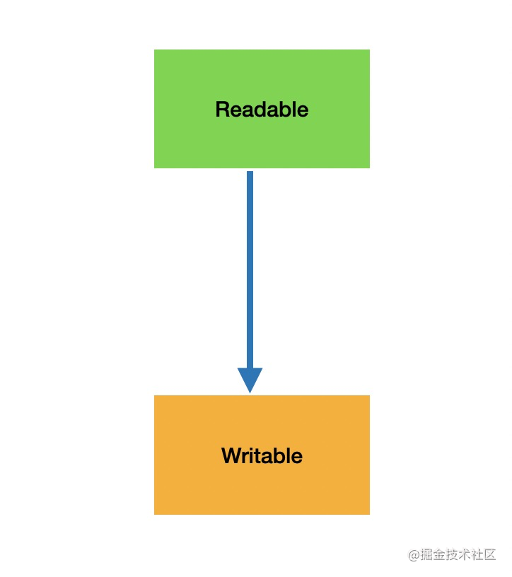
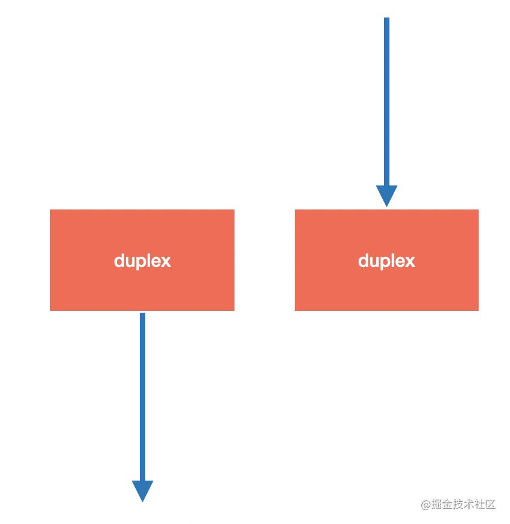
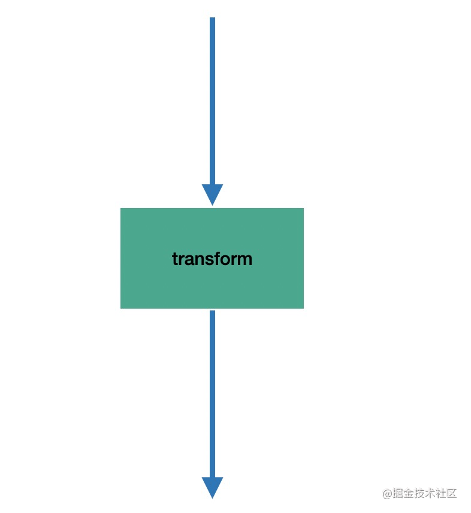
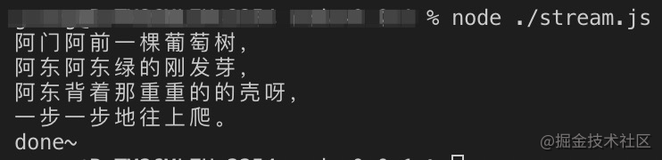
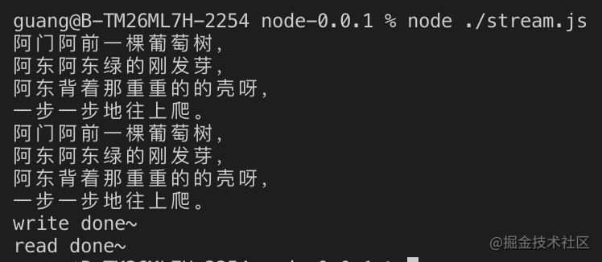
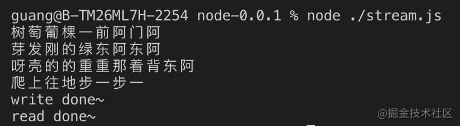
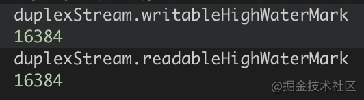

# 关于 nodejs 流

关于 IO，包括网络 IO、文件 IO，若数据量少，则直接传送全部内容即可；但若内容特别多，一次性加载到内存会崩溃，而且速度也慢，这时候就可一部分一部分处理，这就是流的思想

各种语言基本都实现了 stream 的 api，Node.js 也是。本文主要涉及：

- Node.js 的 4 种 stream
- 生成器如何与 Readable Stream 结合
- stream 的暂停和流动
- 什么是背压问题，如何解决

## Node.js 的 4 种 stream

从一个地方流到另一个地方，显然有流出一方和流入一方。流出一方就是可读流(readable)，而流入一方就是可写流(writable)



也有的流既可流入又可流出，叫做双工流（duplex）



还有的流可对流入内容做下转换再流出，叫做转换流（transform）



duplex 流的流入和流出内容无需相关，而 transform 流的流入和流出是相关的，这是两者的区别

## 流的 api

Node.js 提供的 stream 就是上面介绍的那 4 种：

```js
const stream = require("stream");

// 可读流
const Readable = stream.Readable;
// 可写流
const Writable = stream.Writable;
// 双工流
const Duplex = stream.Duplex;
// 转换流
const Transform = stream.Transform;
```

它们都有要实现的方法：

- Readable 需要实现 `_read` 方法来返回内容
- Writable 需要实现 `_write` 方法来接受内容
- Duplex 需要实现 `_read` 和 `_write` 方法来接受和返回内容
- Transform 需要实现 `_transform` 方法来把接受的内容转换之后返回

具体来看：

### Readable

Readable 要实现 `_read` 方法，通过 push 返回具体数据。且由对象自身负责结束流（当 push 一个 null 时）

```js
const Stream = require("stream");

const readableStream = stream.Readable();
readableStream._read = function () {
	this.push("阿门阿前一棵葡萄树，");
	this.push("阿东阿东绿的刚发芽，");
	this.push("阿东背着那重重的的壳呀，");
	this.push("一步一步地往上爬。");
	this.push(null);
};

readableStream.on("data", (data) => {
	console.log(data.toString());
});

readableStream.on("end", () => {
	console.log("done");
});
```

执行效果如下：



当然也可通过继承的方式：

```js
const Stream = require("stream");

class ReadableDong extends Stream.Readable {
	constructor() {
		super();
	}

	_read() {
		this.push("阿门阿前一棵葡萄树，");
		this.push("阿东阿东绿的刚发芽，");
		this.push("阿东背着那重重的的壳呀，");
		this.push("一步一步地往上爬。");
		this.push(null);
	}
}

const readableStream = new ReadableDong();

readableStream.on("data", (data) => {
	console.log(data.toString());
});

readableStream.on("end", () => {
	console.log("done~");
});
```

也很自然可以与生成器结合：

```js
const Stream = require("stream");

class ReadableDong extends Stream.Readable {
	constructor(iterator) {
		super();
		this.iterator = iterator;
	}

	_read() {
		const next = this.iterator.next();
		if (next.done) {
			return this.push(null);
		} else {
			this.push(next.value);
		}
	}
}

function* songGenerator() {
	yield "阿门阿前一棵葡萄树，";
	yield "阿东阿东绿的刚发芽，";
	yield "阿东背着那重重的的壳呀，";
	yield "一步一步地往上爬。";
}

const songIterator = songGenerator();

const readableStream = new ReadableDong(songIterator);

readableStream.on("data", (data) => {
	console.log(data.toString());
});

readableStream.on("end", () => {
	console.log("done~");
});
```

## Writable

Writable 要实现 `_write` 方法，接收写入的内容，需要由调用方来结束流

```js
const Stream = require("stream");

const writableStream = Stream.Writable();

writableStream._write = function (data, enc, next) {
	console.log(data.toString());

	setTimeout(() => {
		next();
	}, 1000);
};

writableStream.on("finish", () => console.log("done"));

writableStream.write("阿门阿前一棵葡萄树，");
writableStream.write("阿东阿东绿的刚发芽，");
writableStream.write("阿东背着那重重的的壳呀，");
writableStream.write("一步一步地往上爬。");
writableStream.end();
```

接收写入的内容，打印出来，并调用 next 来处理下一个写入的内容，这里调用 next 是异步的，可以控制频率。结果如下：


## Duplex

Duplex 可读可写，同时实现 `_read` 和 `_write` 即可

```js
const Stream = require("stream");

const duplexStream = Stream.Duplex();
duplexStream._read = function () {
	this.push("阿门阿前一棵葡萄树，");
	this.push("阿东阿东绿的刚发芽，");
	this.push("阿东背着那重重的的壳呀，");
	this.push("一步一步地往上爬。");
	this.push(null);
};
duplexStream._write = function (data, enc, next) {
	console.log(data.toString());
	next();
};

duplexStream.on("data", (data) => console.log(data.toString()));
duplexStream.on("end", (data) => console.log("read done"));

duplexStream.on("finish", (data) => console.log("write done~"));
duplexStream.write("阿门阿前一棵葡萄树，");
duplexStream.write("阿东阿东绿的刚发芽，");
duplexStream.write("阿东背着那重重的的壳呀，");
duplexStream.write("一步一步地往上爬。");
duplexStream.end();
```

整合了 Readable 流和 Writable 流的功能，这就是双工流 Duplex


## Transform

Duplex 流虽然可读可写，但是两者间无必然关联，而有时需要对流入的内容做转换之后流出，这时就需要转换流 Transform。后者要实现 `_transform` api， 这里演示下对内容做反转的转换流：

```js
const Stream = require("stream");

class TransformReverse extends Stream.Transform {
	constructor() {
		super();
	}

	_transform(buf, enc, next) {
		const res = buf.toString().split("").reverse().join("");
		this.push(res);
		next();
	}
}

const transformStream = new TransformReverse();

transformStream.on("data", (data) => console.log(data.toString()));
transformStream.on("end", (data) => console.lg("read done"));

transformStream.on("finish", (data) => console.log("write done"));
transformStream.write("阿门阿前一棵葡萄树");
transformStream.write("阿东阿东绿的刚发芽");
transformStream.write("阿东背着那重重的的壳呀");
transformStream.write("一步一步地往上爬");
transformStream.end();
```

效果如下：



## 流的暂停和流动

从 Readable 流中获取内容，然后流入 Writable 流，两边分别做 `_read` 和 `_write` 的实现，就实现了流动

### 背压

但 read 和 write 都是异步的，若两者速率不一致呢？

- 若 Readable 读入数据速率大于 Writable 写入速率，则会积累一些数据在缓冲区，若缓冲的数据过多，就会爆掉，丢失数据

- 而若 Readable 读入数据的速率小于 Writable 写入速度的速率呢？那没关系，最多就是中间有段空闲时期

这种读入速率大于写入速率的现象叫背压或负压。很好理解，写入段压力比较大写不进去了，会爆缓冲区，导致数据丢失。缓冲区大小可以通过 readableHighWaterMark 和 writableHightWaterMark 来查看，是 16k



### 解决背压

如何解决这种读写速率不一致的问题呢？

当没写完的时候，暂停读即可。这样就不会读入的数据越来越多，驻留在缓冲区。readable stream 有个 readableFlowing 属性，代表是否自动读入数据，默认为 true，即自动读入数据，然后监听 data 事件即可拿到数据；而当设为 false 就不会自动读了，需要手动通过 read 来读入

```js
readableStream.readableFlowing = false;

let data;
while ((data = readableStream.read()) != null) {
	console.log(data.toString());
}
```

但自己手动 read 较麻烦，所以依然可用自动流入的方式，调用 pause 和 resume 来暂停和恢复既可。当调用 writable stream 的 write 方法时会返回一个 boolean 值代表是写入了目标还是放在了缓冲区：

- true: 数据已经写入目标
- false：目标不可写入，暂时放在缓冲区

可判断返回值，为 false 时候就 pause，等缓冲区清空了再 resume

```js
const rs = fs.createReadStream(src);
const ws = fs.createWriteStream(dst);

rs.on("data", (chunk) => {
	if (!ws.write(chunk)) {
		rs.pause();
	}
});

rs.on("end", () => {
	ws.end();
});

rs.on("drain", () => {
	rs.resume();
});
```

这样就可达到根据写入速率暂停以及恢复读入速率的功能，解决了背压问题

## pipe 有背压问题么？

平时常会用 pipe 来直接把 Readable 流对接到 Writable 流，但是好像也没遇到过背压问题，其实是 pipe 内部已经做了读入速率的动态调节了

## 总结

<!-- 流是传输数据时常见的思想，就是一部分一部分的传输内容，是文件读写、网络通信的基础概念。

Node.js 也提供了 stream 的 api，包括 Readable 可读流、Writable 可写流、Duplex 双工流、Transform 转换流。它们分别实现 _read、_write、_read + _write、_transform 方法，来做数据的返回和处理。

创建 Readable 对象既可以直接调用 Readable api 创建，然后重写 _read 方法，也可以继承 Readable 实现一个子类，之后实例化。其他流同理。（Readable 可以很容易的和 generator 结合）

当读入的速率大于写入速率的时候就会出现“背压”现象，会爆缓冲区导致数据丢失，解决的方式是根据 write 的速率来动态 pause 和 resume 可读流的速率。pipe 就没有这个问题，因为内部做了处理。

流是掌握 IO 绕不过去的一个概念，而背压问题也是流很常见的问题，遇到了数据丢失可以考虑是否发生了背压。希望这篇文章能够帮大家理清思路，真正掌握 stream！ -->
