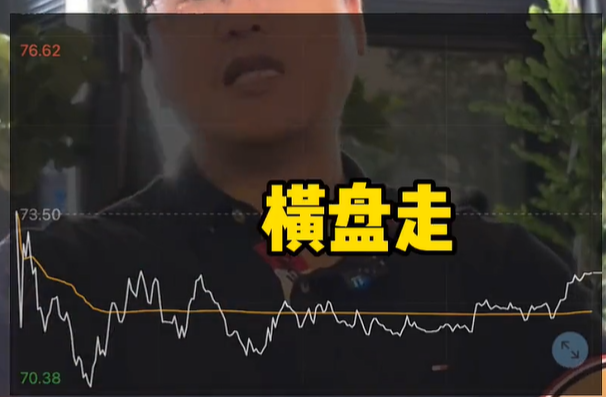

# 技术分析细节收纳

## 寻底

- 日 K 最低价为 N 日最低且当日收（准）光头阳线，纳入观察。参见：

  - 300770，22/04/27

- 昨日 K 最低价为 N 日最低且收阴，但今日收（准）光头阳线造成明显探底回升形态（参见）

- 加分项：左侧存在“骗线”，如 W 底，但被跌破后继续下跌，参见：

  - 600775，22/04/27，注意该点和 21/11/03 为起点的图形形成对称结构

## 采撷

- 拉升过程中上影线阳线常用于锁筹

- 散户心态：低位不敢追，高位来追涨

- 两种典型高位出货形态：

  - 高位放量大阳线
  - 高位缩量快速上板后，先下砸（无法立马出完）再在顶部形成震荡区间

- 低位利空（如减持）通常是为制造恐慌盘，方便主力吃货

- 二高点大概率（90%）会被用于调整（无论主力出于何种目的，优先减仓）

  - 上升途中位置不太高的二高点很可能被用于洗盘。出现以下线形时即要注意 ：

    - 流星线：上影线长，实体小，加速趋势中，表现出冲高回落并伴随放大量（前面量能的 2-3 倍）
    - 吊颈线：下影线长，实体小，加速趋势中，放大量
    - 高浪线：上、下影线长，实体小，放大量
    - 高位十字星：放大量
      

  - 大高位的二高点常用于出货，即可能为最后的顶点

- 主力拉尾盘的意图，可分为以下情况：

  - 突破压力位时，是为直接拉突破（花小钱办大事）
  - 股价很高时，一般是为拉空间出货
  - 横盘震荡时，是为保护筹码，不至于股价走得特别不好
  - 中、大盘票拉尾盘风险较小，说明机构在抢筹（后市看涨）；而小盘票风险则相对较大

- 震荡市中利好都是用来兑现的（即出货），见利好就跑

### 尾盘票

尾盘票通常是做超短，即先手资金做套利，安全性相对较高（做个大概率），若大盘向好则更佳。第二天若：

- 高开则赚几个点就走

- 缩量下跌则主力肯定没走，后面还会拉

- 放量下砸则就危险了（也可能是[洗盘](.#洗盘)）

选股原则：

- （首要条件）在主线板块中

- 个股多头排列，上涨趋势

- 日线级温和放量

- 盘口尾盘出现堆量放量，类似推土机一点点推上去

- 盘口不超 5 个点，否则就属于**攻击类盘口**

### 散户心态

- 卖出价一定要比买入价高（不敢砍仓，只能死扛）

- 买入价一定要比（之前）卖出价低（被洗出后不敢再买回）

### 洗盘

#### 恶性洗盘

主力常在启动前做最后一次洗盘（洗出不坚定者，而新买入者心理价位较高/较为坚定）。形成有效突破后，突破位向上 30% 内的首阴通常可考虑为洗盘而非出货

应对方式为判断主力出货空间。横盘时间越长，则其仓位越重，向上拉升空间也越大。如若
6 亿的小盘票，主力吃点货可能拉 10%就走了；反之则可能 30% 也不够其出货空间

### 阴线买点（散户谨慎参与）

阴线买点可分为：

- 空头衰竭（下跌无力）：一连串下跌后，突然放量并形成光脚倒垂阴线且不破前面阴线低点。（但若是破位了，则其后可能依旧下砸，要注意）
  

- 恐慌盘（**前提为大趋势向上**，切勿在向下空头趋势时）：个股（从高位）刚开始跌时实体/量较大（获利盘多），跌着跌着没劲了，形成一个个小 K 线，然后突然来个大阴线（很可能为刻意打压），此时可尝试抄底

---

- 个股拉升前的特征，盘中观察：

  - 超过 6 个点（意味着大阳线，突破时意味着起涨），温和放量

  - 是否位于主线板块

  - 从当前往回推，判断其是否有蓄势形态（若是则意味着要突破，可以买入），还是直接从底部拉上来的加速形态

- 蓄势形态，即在压力位附近缩量的横盘盘整（让散户在此进行筹码交换），具体形态为：在压力区附近形成缩量的小阳小阴，或连续密集出现上影线（如刺猬一般，属于反复试盘）

- （追涨就追主升浪）主升浪：主力要赚钱了，不拉到某个位置不出货，此时追涨哪买哪对。辨识主升浪的方法：5、10、30、60 日均线粘连到一块，且缩量，之后再突然放量上涨，此时便是主升浪

- 主升浪个股只少有一年以上的横盘时间（拉升空间大，反之筑底时间越短，仓位越轻，拉升空间越小），底部启动位置往前看无高点，此时突破颈线位置就一般是主升浪

- 小散稳妥的进场时机：一低点大阳线风险相对较高，因为是反抽结构，有可能出现回落（因为是短线资金进场）；二低点（确定主力已筑底成功），放量，阳包阴。注意大前提：主线板块、上涨趋势中的二低点；而非下跌过程中的二低点

- 小散打板要跟着大游资的思维去做，短线超跌的板不能打（也尽量不要去搏短线超跌）。游资分两种：

  - 小游资：找完全超跌的（已经趴地上 N 年的），突然拉个涨停，第二天就走，虽然是大阳线但成交量（极）低。大游资绝对不会这么干

  - 大游资会审时度势、会看技术、会看主力、会看市场风口、会看技术图形（小游资根本不看这些）

- 板块快要结束的特征：

  - 板块、题材扩散

  - 高低位切换：高位涨不动、滞涨，而同板块低位个股开始补涨时，是出货的时候。低位补涨是出货的时候（围魏救赵）。

  游资、短线主力的共识：先把板块内的某只个股（盘子很小）拉出市场人气，形成标杆后拉龙 2、龙 3（低位个股补涨是做板块氛围，方便主力出货，此时若高位个股回落，就有散户愿意去抄底，即所谓“龙回头”。若回调时是温和回调，就有小散觉得是良性调整而愿意接货，接完后若低位个股也往下跌，则整个板块玩完）... 当后者也拉到高位时就涉及到出货了

- **稳健交易者应选择右侧买入**：市场最大的风险即不确定性，右侧信号是确定性要上涨了，也代表已看到主力资金进场，此时风险相对较小。十字星、字母线、阳包阴等都是右侧信号。左侧十字星情况下市场多半是观望状态，只是在支撑位上出现尝试性止跌，这种就是赌，有一个大的不确定因素，即容易受大盘影响，大盘一旦下跌，里面的多头会变为空头，从而继续下杀，形成破位

- 行业利好消息在熊市时往往是出货/减仓/高抛低吸的时候

- 关于市场机会，要从需求的角度理解。需求分两种：

  - 社会性需求：影响因素较多，对价格波动敏感

  - 政策性需求：确定性，对价格不敏感，不受其他因素影响，且有资金保证。如之前的风光装机

- 揉搓线：代表主力洗盘的一个技术盘口，即前一线形冲高回落，第二个线性探底回升 —— 上升趋势中回调会出现的一种 K 线特征。冲高回落代表上方有抛压，第二天主力顺势往下一打，再进一步释放抛压，释放完后再一刹，盘中再拉起来，即形成带下影线的 K 线。支撑位上有支撑，其实更多的是主力在那做了一个空头释放，然后再做一个护筹的动作，将其拉起。对于 K 线，更多的是要了解其背后的逻辑

- 遇到突发性利空，主力最好的策略是逆势拉升来稳定筹码（有时也只能硬着头皮网上拉）以避免增长恐慌/引起跌停板/形成破位结构/破坏操盘节奏。有的个股会一根线直接网上拉，用很少的单子拉出空间，此过程中会有很多散户往里追（帮助接盘），之后在高位再减一减仓（延缓股价下跌）。更主要一点是拉升起来后，部分持股想抛的看到个股没受大盘影响反而拉升，就会觉得心安理得（甚至还想着涨停了），此时就不愿意扔了，筹码反而稳定了

- 主力陷阱 —— 日内洗盘：一般来讲个股在底部形成特别规整的代表主力已经高控盘了。很多散户觉得跳空放量是一个出货，但对于大盘量个股而言无法靠一根线形去出货；另外假设出货的情况下，应该冲起来就下跌最后收大阴线才对，然而为什么能守住这个缺口未被回补呢？说明今天无论大盘怎么跌，该股相当于横着走了，承接了所有浮动筹码，相当于一天的洗盘（在抛压明显的情况下做了一个很好的承接，且在技术结构上形成了突破，这种一般是要上涨的）
  

- 对于趋势好的个股，早盘急跌时别着急卖（可能是洗盘），首先要去观察分时黄线均线：

  - 若早盘下杀后分时均线是往上抬着走的，说明今天大单较多，是网上打的，即吃货
    

  - 若分时均线横盘走，但股价在上下上下波动，则属于洗盘，或叫承接
    

  - 若急杀下来后分时均线往下走，一路重心下移，且股价在分时图上会打一根又拉起来，打一根又拉起来，则肯定是出货
    

- 判断是否该离场：斜率超 60 度以上个股放量破 5 日均均线直接走就行（最“傻瓜的方法”）；若不放量则属于良性调整，筹码是稳定的（没人出货）；抄底时就看 10 日均线的一个支撑（极限底部）。注意震荡结构看均线没用。聪明的人是通过盘口判断是否离场，因为从高位破 5 日均线时可能已损失 10 多个点。

- 个股一口气拉 5 个点拐头就扔（很多高手都是日内做 T），日 T 要看大盘，看大盘和个股的分时走势（与个股弹性有关）。日 T 挣 3 个点的波动已经很厉害了。盘感好的时候看大盘，大盘要跌的时候 5 分钟 2 低点一企稳买进去（即正向做 T，高抛低吸，保持仓位不变）

- 企稳：并排至少 3 根线形不创新低就是企稳，加仓点出来了。企稳线形是组合线形，而非一根线：

  - 首先 K 线是由大逐渐变小，变成小 K 线，即空头衰竭，此时就极容易出现企稳
    

  - 接着若是企稳，则从当天盘口上看，当时的虚拟量能肯定高于昨天（甚至说半天的量能已经接近全天的量能）

  此时被套可以考虑加仓，也可以考虑进入（右侧信号已出）

- 分析主力仓位大小，判断个股后势空间：横有多长，竖有多高。横盘期越长，突破后拉升空间越大。明知其洗盘，明后就拉，则大仓位进去又何妨。分析方式：观察横盘吃货区间时间长短
  

  - 看盘子大小，超过 150 亿以上的盘子就属于中盘票，若其仅仅横盘了几天则说明主力仓位轻，控盘能力差，往后空间小
    

  - 若同样中盘票，主力仓位重（如下），则一般从突破位开始算，30% - 50%的涨幅区间内出现任何阴线都是洗盘（通常主力第一拉升目标就是从突破位置起 30% - 50%之间去做一次洗盘）
    

- 缩量倒垂线别轻易看空：一般是作为主力试盘（试抛压、洗盘是否彻底）的表现，即个股拉到一定高度出现良性回调，则企稳时主力会做一个试盘：即在盘中时（通常靠近开盘）用小单子往上打一打，上拉一把，遇到抛压了就放手不拉了，让其走个震荡回落，这样在日线级别就形成了一个倒垂线
  
  

  - 若倒垂线阴线实体较大，说明抛压较大，则会接着去洗盘
    

  - 实体特别小，没有把前面那根线的位置跌破（或没跌很深），则说明空头衰竭，后市看涨。尤其时倒垂线比前一根线稍微低那么一点点，一般是左侧信号（若对 K 线掌握较好，则可看作进场信号）
    

- 忌讳下午打板（尤其两点以后）。主力通常是有准备的，即封板通常是有预谋的，如昨晚开完会了，则早盘集合竞价时一表态一震荡后直接就可以封板了（如在 10 点时）；另一种是下午封板，一般在 13:00~13:30（如中午一聊，便决定下午封板，下午一开盘就干），总之 13:30 之前的都是强势股；还有一种是临时起意（14:00 后才封的），一般是游资干的，觉得下午盘面可以，封个板。要不就是遇到利好消息，要不就是想出货了（通常第二天走得不好）

- 许多早盘的快速拉升是带有诱多成分的（主力诱多）。主力心理和市场心里是反着来的，如当外围市场出现风险，此时大盘大幅低开，市场都是恐慌的，此时部分主力会利用这种恐慌去捡一些筹码（低 吸）或直接去拉升个股（用小仓位快速拉起），以打消散户的恐慌心理（甚至往上追了），此时主力往下一扔做一些高抛，之后个股盘面马上开始回落，回落过程中市场逐渐企稳（该套的也套了）。之后主力再思考下该拉哪个盘，哪个板块，此时再拉才是主力真正的意图方向

- 大主力票，盘子足够大，主力仓位足够重，涨停板开板没放巨量问题都不大（只是资金分歧），一个涨停板破开是出不了货的（毕竟封板时还是吃了大货的，打开时也没出现大的抛单）。进场资金远大于出场资金说明大主力未离场
  

- 暴跌但未破位，有时反而是机会，关键是看：暴跌的位置、是否在市场主逻辑中

  - 市场主线、未破位、业绩好的个股短线上大幅杀跌属于错杀，等待企稳可以去抄底，后市看涨
    

  - 如此次暴跌把整个技术位破掉，但逻辑还在，则可控制仓位（砍一些仓位）。暴跌后有往下惯性，散户的筹码并不稳定，可能第二天第三天继续往下杀。所以对散户而言最好的方法即先砍仓，待企稳再补回去
    

  - 若破位，不在市场主线、春炒题材的则直接去了，无比要再坚守
    

- 为砸出恐慌底，砸出市场恐慌盘，主力必然要打压对倒，过程中其很可能是亏损的。

  1. **初仓**建完后下一步就是利用手中筹码（初仓时吃的货）去**打出市场底**，让散户交出更多筹码。一般使用对倒打压，程度较剧烈（连续几天快速杀跌，如从 11 打到 7 甚至更低），使散户恐慌而仍筹码，则主力再去接货。

  2. 接货采用的是拦截吃货，即在买 3 或买 4 位置挂一大单，或挂一系列蜂窝单（3 位数以上，并排整齐的大单）。其作用在于：吃自己的货、吃散户恐慌抛的货、（更重要的是）警示其他对手盘

  3. 砸至散户不扔了，吃不了太多货了，则说明是真正的市场底，即开始进入横盘主吃货区，即主吃货区

### 判断主力是否离场

整理时间过长代表资金已离场。常用以下方法：

- 时间平衡（法）判断个股属良性或恶性调整，即大盘票以横盘区间出货（如图），需要时间，后者超平衡时（回调时间大于平衡点）技术结构就会走弱。例如：

  - 涨 10 天调整 10 天属正常

  - 涨 10 天调整 20 天则叫阴跌，说明筹码已不稳定

  - 调整 30 天则已出货出得差不多了（后面只会一路下行）

- 观察整体结构，若调整的波段远大于拉伸的波段，则说明主力已走，整体已是空头趋势（再有逻辑也是阴跌）

### 调整

调整分良性和恶性，套牢盘较重的调整属于后者

缩量震荡盘整后市看涨

盘底

吃货有两个阶段：低位和洗完盘之后。低位吃货要谨慎进入（主力在做高抛低吸 ）
