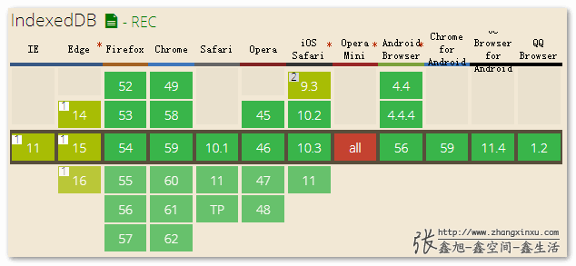
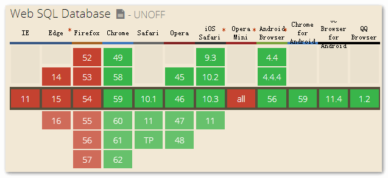

# HTML5 indexedDB 实例教程

IndexedDB 与 Web SQL Database（已于 2010.11.18 W3C 草案被宣布舍弃）都是浏览器本地数据库，前者属于非关系型数据库，而后者属于关系型数据库

目前兼容性分别如下：




:::tip
indexedDB 可在 worker 中使用
:::

## 特点

- NoSql：以键值对的形式存储数据

- 持久化存储：通过 cookie、localStorage、sessionStorage 存储的数据会在清除浏览器缓存后消失；而使用 IndexedDB 则不会，除非手动删除该数据库

- 异步操作：相比于 localStorage（同步）， 操作 IndexedDB 不会阻塞浏览器

- 支持事务（transaction）：对 IndexedDB 的一些列操作，只要有一部失败，整个事务就会被取消，数据库会回滚到事务发生前的状态

- 同源策略：每个数据库都对应创建它的域名，只能在该域下被访问

## 重要概念

- 仓库（objectStore）：IndexedDB 没有表的概念，只有仓库。当然也可将其理解为表
- 索引（index）：可在创建仓库的同时创建索引，后续查询时即可通过索引来筛选
- 游标（cursor）：可将其看作指针。例如条件查询时，要通过游标逐行返回数据，再对数据进行筛选

:::tip
IndexedDB 只能通过主键、索引、游标方式查询数据
:::

## 具体操作示例

IndexedDB 对仓库所有操作都基于事务

1. **连接和创建数据库**

```js
/**
 * @param {string} dbName 数据库名称
 * @param {string} storeName 仓库名称
 * @param {number} version 数据库版本
 * @return {object} 数据库实例
 */
function openDB(dbName, storeName, version = 1) {
	return new Promise((resolve, reject) => {
		let db;
		// 打开数据库，若无则创建
		const request = indexedDB.open(dbName, version);
		request.onsuccess = function (event) {
			db = event.target.result; // 数据库对象
			resolve(db);
		};
		request.onerror = function (event) {
			reject("数据库打开失败");
		};
		// 数据库升级或更新时触发
		request.onupgradeneeded = function (event) {
			db = event.target.result;
			const objectStore = db.createObjectStore(storeName, {
				keyPath: "id", // 定义主键
				autoIncrement: true, // 自增
			});
			// 创建索引，可根据其来查询数据
			objectStore.createIndex("id", "id", { unique: true });
			objectStore.createIndex("name", "name");
			objectStore.createIndex("begin", "begin");
			objectStore.createIndex("end", "end");
			objectStore.createIndex("person", "person");
			objectStore.createIndex("remark", "remark");
		};
	});
}
```

2. **插入语数据**

```js
/**
 * @param {object} db 数据库实例
 * @param {string} storeName 仓库名称
 * @param {object} data 待插入的数据
 */
function addData(db, storeName, data) {
	return new Promise((resolve, reject) => {
		const request = db
			// 创建事务对象，并指定仓库名称和操作模式（"只读"或"读写"）
			.transaction([storeName], "readwrite")
			.objectStore(storeName)
			.add(data);

		request.onsuccess = function (event) {
			resolve();
		};
		request.onerror = function (event) {
			reject("数据写入失败");
		};
	});
}
```

:::warning
注意：插入的数据必须包含全部的索引字段
:::

3. **通过主键读取数据**

主键即创建仓库时声明的 keyPath

```js
/**
 * @param {object} db 数据库实例
 * @param {string} storeName 仓库名称
 * @param {string} key 主键值
 */
function getDatumByKey(db, storeName, key) {
	return new Promise((resolve, reject) => {
		const request = db.transaction([storeName]).objectStore(storeName).get(key);

		request.onsuccess = function (event) {
			resolve(request.result);
		};

		request.onerror = function (event) {
			reject("数据读取失败");
		};
	});
}
```

4. 通过游标查询数据

单独使用游标只能一次查询全部数据

```js
/**
 * @param {object} db 数据库实例
 * @param {string} storeName 仓库名称
 */
function getDataByCursor(db, storeName) {
	return new Promise((resolve, reject) => {
		const data = [];

		const request = db
			.transaction(storeName, "readwrite")
			.objectStore(storeName)
			.openCursor();
		request.onsuccess = function (event) {
			const cursor = event.target.result;
			if (cursor) {
				data.push(cursor.value);
				// 该方法会重新触发一次 store.openCursor()
				// 直到 cursor 为 null，或读取失败
				cursor.continue();
			} else {
				resolve(data);
			}
		};
		request.onerror = function () {
			reject("数据读取失败");
		};
	});
}
```

5.通过索引查询数据

单独使用索引只能查询出单条数据（第一条匹配的）

```js
/**
 * @param {object} db 数据库实例
 * @param {string} storeName 仓库名称
 * @param {string} indexName 索引名称
 * @param {string} indexValue 索引值
 */
function getDatumByIndex(db, storeName, indexName, indexValue) {
	return new Promise((resolve, reject) => {
		const request = db
			.transaction(storeName, "readwrite")
			.objectStore(storeName)
			.index(indexName)
			.get(indexValue);
		request.onsuccess = function (event) {
			const result = event.target.result;
			resolve(result);
		};
		request.onerror = function () {
			reject("查询失败");
		};
	});
}
```

6. 通过游标和索引查询数据

结合游标和索引，可查询匹配索引值的全部数据

```js
/**
 * @param {object} db 数据库实例
 * @param {string} storeName 仓库名称
 * @param {string} indexName 索引名称
 * @param {string} indexValue 索引值
 */
function getDataByIndex(db, storeName, indexName, indexValue) {
	return new Promise((resolve, reject) => {
		const data = [];
		const request = db
			.transaction(storeName, "readwrite")
			.objectStore(storeName)
			.index(indexName)
			.openCursor(IDBKeyRange.only(indexValue));
		request.onsuccess = function (event) {
			const cursor = event.target.result;
			if (cursor) {
				data.push(cursor.value);
				cursor.continue();
			} else {
				resolve(data);
			}
		};
		request.onerror = function () {
			reject("查询失败");
		};
	});
}
```

9. 通过主键删除数据

```js
/**
 * @param {object} db 数据库实例
 * @param {string} storeName 仓库名称
 * @param {object} key 主键值
 */
function deleteDatumByKey(db, storeName, key) {
	return new Promise((resolve, reject) => {
		const request = db
			.transaction([storeName], "readwrite")
			.objectStore(storeName)
			.delete(key);
		request.onsuccess = function () {
			resolve();
		};
		request.onerror = function () {
			reject("删除失败");
		};
	});
}
```

<!-- 5. **删除数据**

根据 id 删除对应的数据，代码示意：

```js
const transaction = db.transaction('project'，'readwrite')
const objectStore = transaction.objectStore('project')
objectStore.delete('id')
```

6. **获取数据**

indexedDB 使用 [Cursor API](https://developer.mozilla.org/en-US/docs/Web/API/IDBCursor)（游标） 和 [Key Range API](https://developer.mozilla.org/en-US/docs/Web/API/IDBKeyRange)（范围） 获取数据

游标用于按行读取数据，使用 `objectStore.openCursor()`打开游标，在 onsuccess 回调中遍历游标对象，其中的 `cursor.value` 就是纯 js 对象形式的数据。代码示意：

```js
const transaction = db.transaction("project", "readwrite"); // ???
const objectStore = transaction.objectStore("project");
objectStore.openCursor().onsuccess = function (event) {
	const cursor = event.target.result;
	if (cursor) {
		// cursor.value 即数据对象
		// 若游标未遍历完，则继续
		cursor.continue();
	} else {
		// 若全部遍历完毕...
	}
};
```

而范围是与游标一起使用的，例如只获取 id 为 4-10 的数据：

```js
// 确定主键范围
const keyRangeValue = IDBKeyRange.bound(4, 10);
// 打开对应范围的游标
const transaction = db.transaction("project", "readwrite");
const objectStore = transaction.objectStore("project");
objectStore.openCursor(keyRangeValue).onsuccess = function (event) {
	const cursor = event.target.result;
};
```

其中 IDBKeyRange 有如下方法，分别表示：

- IDBKeyRange.bound()：范围内
- IDBKeyRange.only()：仅仅是
- IDBKeyRange.lowerBound()：小于某值
- IDBKeyRange.upperBound()：大于某值

方法的最后两个参数可传入布尔值，分别指定是否可与上下边界重合 -->

## 实例

<indexedDBForm />
