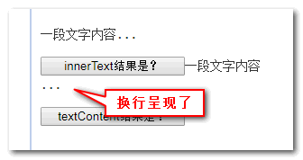

# 临时收纳处

## nodemon

nodemon 的典型配置：

```json
// nodemon.json
{
	"restartable": "rs",
	"ignore": [".git", "node_modules/", "dist/", "coverage/"],
	"watch": ["src/"],
	"execMap": {
		"ts": "node -r ts-node/register"
	},
	"env": {
		"NODE_ENV": "development"
	},
	"ext": "js,json,ts"
}
```

- restartable:用于手动重启程序的命令（按回车键执行）

- ignore: 须忽略的文件 pattern

- watch：须监听改动的文件所在**目录**

- execMap：文件扩展名与启动指令间的映射

- env：要包含的变量

- ext：监听的文件扩展名

## node.js inspect 模式

- `node --inspect <source>`：立即以审查模式启动 node 进程，调试器（debugger）可随时连接

- `node --inspect-brk <source>`：先暂停等待调试器连接后才启动

## node.js 调试相关

node.js 调试可分为 launch 模式和 attach 模式

launch 模式是本地开发的首选 ...

attach 模式适用于线上调试

## Vscode task 功能

部分任务会被自动检测，如 npm scripts、tsc 相关命令等。在命名面板中输入`run tasks`后便会罗列

否则便需在`.vscode/task.json#tasks`数组中添加自定义任务配置，其每一项均对应一项任务

大部 JS/TS 项目下的任务都会以 npm scripts 的形式存在，需要完全自定义的场景很少

自定义任务常用任务配置项：

- label：显示在用户界面的任务名称

- type：任务类型。对自定义任务而言，可选值唯有`shell`或`process`

- command：实际执行的指令

- group：定义任务组，可选值`test`、`build`、`none`。前二者对应任务通过命令面板中输入`run <group> tasks`找到

## 关于 ts-node

（局部）安装 ts-node 后，可通过以下方式执行 ts 文件：

- 通过 ts-node CLI，此时所有 flags 都将作为前者配置项，而 node flags 需要通过环境变量透传，例如：`NODE_OPTIONS='--trace-deprecation --abort-on-uncaught-exception' ts-node ./index.ts`

- 通过 node CLI，如：`node -r ts-node/register <ts-file>`或`NODE_OPTIONS="-r ts-node/register" node <ts-file>`。此时 ts-node 配置须在项目根目录的`tsconfig.json#ts-node`中被指定，后者支持大多数常用选项

另：ts-node CLI 的 flags 必须在入口脚本之前被指定

常用配置项：

- transpileOnly：默认 false

- typeCheck：与 transpileOnly 相反，默认 true

- compiler：指定 Typescript 编译器，默认为 typescript

- transpiler：指定三方转译器，用于执行无类型检测的转译

- files：默认 false。于启动时读取 tsconfig.json 中的 files、include、exclude 项，可用于避免部分类型检查错误。[参见](https://typestrong.org/ts-node/docs/troubleshooting#missing-types)

### vscode debug 配置

```json
// .vscode/launch.json
{
	"configurations": [
		{
			"type": "node",
			"request": "launch",
			"name": "Launch Program",
			"runtimeArgs": ["-r", "ts-node/register"],
			"args": ["${workspaceFolder}/<path-to-entrypoint>"] // 关键
		}
	]
}
```

## 在 vscode 中调试 node 项目

vscode 支持两种调试类型：attach 和 launch

调试相关配置位于项目根目录`.vscode/launch.json#configurations`数组中，每项均对应一套独立配置

通过以下方式执行调试：

- 在命令面板中输入`select and start debugging`后选择相应的调试配置

- 按 F5 使用最近配置开始调试

以下配置项适用于全部调试类型：

- outFiles、resolveSourceMapLocations：[参见](https://code.visualstudio.com/docs/nodejs/nodejs-debugging#_source-maps)

- timeout

- stopOnEntry

- smartStep：那些生成而来的，未被 sourcemap 覆盖的 js 代码将被 debugger 跳过

- skipFiles：用 glob patterns 指定调试过程中需被跳过的文件。例如：

  - `"<node_internals>/**"`：跳过所有 node.js 标准库

  - `${workspaceRoot}/node_modules/**`：跳过所有三方库

以下配置适用于 launch 模式：

- program：待调试的 node.js 源文件路径。注意不要在使用 npm、ts-node 等 code runner 时设置

## Vscode Remote Linux 的问题

不要在 Vscode Remote 的 Linux（含 WSL）`~/.bashrc`中设置`set -u`，否则启动内嵌终端时将报错（如下），且部分功能受限：

```sh
bash: VSCODE_ENV_REPLACE: unbound variable
bash: VSCODE_ENV_PREPEND: unbound variable
bash: VSCODE_ENV_APPEND: unbound variable
bash: HISTCONTROL: unbound variable
bash: __vsc_history_verify: unbound variable
bash: PROMPT_COMMAND: unbound variable
bash: __vsc_original_prompt_command: unbound variable
```

## Vscode 内嵌 terminal 相关问题

`` Ctrl + ` ``或`` Ctrl + Shift + ` ``打开内嵌 terminal 时的工作目录即位于项目根目录，前提时不要在诸如`~/.bash_profile`中添加类似`cd <path>`的指令

## Node.js ESM 模式下导入 JSON

当项目`package.json#type`为`module`时，导入 JSON 须增加导入断言。形如：

- ```js
  import content from 'file.json assert {type: "json"}
  ```

- ```js
  /* 或使用或动态导入 */
  const content = await import("./file.json", {
  	assert: { type: "json" },
  });
  ```

注意：

- 必须为默认导入，而非具名导入

- 将直接得到解析后的 JS 对象

## 常见希腊字母

- delta（δ）：变化量、屈光度、一元二次方程中的判别式
- upsilon（υ）：位移
- iota（ι ℩）：微小、一点
- sigma（σ ς）：总和、表面密度、跨导、正应力
- theta（θ）：角度、温度
- alpha（α）：角度、系数、角加速度
- beta（β）：角度、磁通系数、系数
- gamma（γ）：角度、电导系数、比热容比
- epsilon（ε）：对数之基数、介电常数
- zeta（ζ）：系数、方位角、阻抗、相对粘度
- lambda（λ）：体积、波长、导热系数
- phi（φ）：角、磁通、透镜焦度、热流量
- psi（ψ）：角速、介质电通量
- omega（ω）：角速度、欧姆、交流电的电角度

## 直接在对象原型上添加方法可能产生副作用

例如在 `Array.prototype` 上（会影响 for...in 循环结果）。更推荐下方式：

```js
Object.defineProperty(Array.prototype, "fnName", {
	enumerable: false,
	value: function () {
		// ...do something
	},
});
```

:::warning 注意
不可用该方式重复添加同一属性
:::

## arguments 变量

可在函数中（除箭头函数）访问类数组对象（可迭代） arguments，其以形参在参数列表中的索引为键，存储所有实参。常出现于一些老代码中。例如：

```js
function showName() {
	console.log(arguments.length);
	console.log(arguments[0]);
	console.log(arguments[1]);
}

// 依次 log 2，Julius，Caesar
showName("Julius", "Caesar");
```

- 可通过`arguments.length`获知当前函数被传入了多少实参
- 可通过 `[函数名].length` 获知该函数（包括箭头函数）定义的形参个数

## str.slice(start [, end]) 方法

- 按前闭后开截取
- 若无 end 参数，则会截取到字符串末尾；
- 若 start/end 为负值，则意为起/始位置从字符串结尾开始计算

## str.replace(str|regexp,str|func)

字符串通用操作方法。首参可为字符串或正则，为前者时只替换第一个匹配项。例如：

```js
"12-34-56".replace("-", ":"); // 12:34-56
// 若要替换所有连字符，应使用带 g 修饰符的正则表达式 /-/g
"12-34-56".replace(/-/g, ":"); // 12:34:56
```

次参可为替换字符串或函数，为前者时可用如下符号：

| 符号      | 替换字符串中的行为               |
| --------- | -------------------------------- |
| $&        | 插入整个匹配项                   |
| $`        | 插入匹配项前的字符串             |
| $'        | 插入匹配项后的字符串             |
| $n        | 插入第 n 个捕获组的内容          |
| $\<name\> | 插入名为 name 的命名捕获组的内容 |
| $$        | 插入字符 $                       |

例如：

```js
"John Smith".replace(/(john smith)/i, "$2, $1"); // Smith, John
```

当次参数为函数时，会在每次匹配时被调用，并传入以下实参，返回值将作为替换字符

1. match —— 匹配项
2. p1, p2, ..., pn —— 捕获组的内容（如有）
3. offset —— 匹配项的位置
4. input —— 源字符串
5. groups —— 具有命名的捕获组的对象（如有）

例如：

```js
"html and css".replace(/html|css/gi, (str) => str.toUpperCase()); // HTML and CSS

// 将每个匹配项替换为其在字符串中的位置
"Ho-Ho-ho".replace(/ho/gi, (match, offset) => offset); // 0-3-6

"John Smith".replace(/(\w+) (\w+)/, (match, name. surname) => `${surname}, ${name}`) // Smith, John

// 当存在命名捕获组时
"John Smith".replace(/(?<name>\w+) (?<surname>\w+)/, (...match) => {
	const groups = match.pop()
	return `${groups.surname}, ${groups.name}`
}) // Smith, John
```

### 原型相关判断

- `obj.constructor` 通常指向对象的构造函数，但不保证一定正确

- `obj instanceOf Class` 的逻辑为检查 `Class.prototype` 是否位于 obj 的原型链中，等价于：

  ```
  obj.__proto__ === Class.prototype
  obj.__proto__.__proto__ === Class.prototype
  obj.__proto__.__proto__.__proto__ === Class.prototype
  ...
  // 一个个比较，若任意一个为 true，则返回 true
  ```

- `objA.isPrototypeOf(objB)`，若 objA 位于 objB 的原型链中，则返回 true

<!-- ### Array() 构造器

可用 `new Array([...elementN | arrayLength])` 的方式创建数组（可不加 new）：

- **...elementN**：根据给定元素创建数组，但不适用于仅有一个数字类型参数的情况

- **arrayLength**：若传入的唯一参数为 0-2^32 - 1（包括）间的整数，则将返回一个 length 为前者的空槽数组（并不包含任何元素且 for...in 循环在其上找不到任何属性）

```js
const arr1 = new Array(3); // [空槽 × 3]
// 遍历时会跳过空槽，因此
arr1.forEach((_, index) => console.log(index)); // 什么都不会发生
arr1.map((_, index) => index); // [空槽 × 3]

// new Array(3) 等价于
const arr2 = [];
arr2.length = 3;

// JS 实际是将元素作为标准对象属性来存储，数组索引作为属性名
// length 属性较为特殊，其值总等于最后一个元素的索引 + 1
arr2[30] = ["cat"];
arr2.length; // 31

// 可以为 length 属性赋值
// 赋一个小于元素数量的值将截断数组
const cats = ["Dusty", "Misty", "Twiggy"];
cats.length = 2;
cats; // ['Dusty', 'Misty']

// 赋 0 会彻底清空数组
cats.length = 0;
cats; // []
``` -->

## 事件冒泡中经过的元素

为获取事件冒泡中经过的所有元素：

- Chrome 和 Opera 中可通过 `event.path`
- Firefox 和 Safari 中可通过 `event.composedPath()`

```js
const path = event.path || (event.composedPath && event.composedPath());
```

## 关于 for...in 循环

for..in 循环会迭代包含继承属性在内的所有**可枚举、非 Symbol 属性**（通常如 Object.prototype、Array.prototype 的属性都带不可枚举标志），因而不适合遍历数组

若只考虑自身属性，可在循环体内通过 `obj.hasOwnProperty(key)` 来过滤

而其他几乎所有获取键/值方法，如 `Object.keys`、`Object.values`、`Object.entries`，都会忽略继承的属性

## 判断 JS 对象是否为 DOM

```js
// 最低兼容至 IE8，支持 HTML 与 SVG
// 跨窗口解决方案：win = window.open(); win.document.body instanceof win.ELement
// 参见：https://stackoverflow.com/questions/384286/how-do-you-check-if-a-javascript-object-is-a-dom-object
function isElement(element) {
	return element instanceof Element || element instanceof HTMLDocument;
}
```

## JS 创建 SVG DOM

使用 `document.createElementNS` 方法，如：

```js
const svg = document.createElementNS("http://www.w3.org/2000/svg", "svg");
const path = document.createElementNS("http://www.w3.org/2000/svg", "path");
```

## innerText 与 textContent 的区别

PC 端获取元素文本内容通常：`var text = dom.innerText || dom.textContent`（兼容性考虑）；而通过二者设置内容均无法解析 script 标签（防 XSS，但 innerHTML 可以，所以要小心）

二者区别在于：

1. innerText IE6 开始支持，而 textContent 要到 IE9

2. innerText 只有 HTML 元素才可调用，而 textContent 任意 Node 节点都可以

3. innerText 会保留可能存在的换行符，而 textContent 不会。例如`<p id="p">内容<span style="position:absolute;">...</span></p>`（注意`<span>`虽为内联元素，但`position:absolute`会使其 display 计算值变为 block）[详情参见](https://www.zhangxinxu.com/study/201909/innerText-textContent-demo.php)：

- 若 white-space 不为 pre 或 pre-wrap 则：

  

- 若 white-space 为 pre 则：

  

4. innerText 会识别样式，而 textContent 不会。如前者无法获取`display:none`元素内容，而后者可以。[详情参见](https://www.zhangxinxu.com/study/201909/innerText-textContent-demo.php)

5. innerText 会忽略元素中的 style、script 标签，而 textContent 不会

6. 读取 innerText 将**触发回流**（因为要识别标签和样式）；而 textContent**单纯读取文本内容**，性能更高

7. IE 下 innerText 表现与 textContent 一致（不随规范），即上面 3、4 在 IE 下不会有差异；另外 IE 中更改 innerText 将会移除其子节点，并永久销毁所有子文本节点，无法再将节点插入任何其他元素或同一元素中

结论：获取或改变文本内容更推荐 textContent（除兼容性考虑）

## 重排与重绘

在 devtools -> performance 录制结果分析中的 Event Log 页签可通过 layout 或 paint 关键字筛选出重排/重绘的触发频次

- 重排（Layout）：元素的几何属性被改变，浏览器需重新计算且其他元素的几何属性或位置也可能受影响。触发因素：

  - 增/删可见 DOM 元素、
  - 改变元素位置
  - 改变元素尺寸（外边距、内边距、边框、高度等）、内容（文本改变、图片被替换为另一不同尺寸的）
  - 浏览器窗口尺寸改变
  - 通过`display: none`隐藏 DOM 节点
  - ...

- 重绘（Paint）：几何属性不受影响。触发因素：
  - 重排必触发重绘
  - 通过`visibility: hidden`隐藏 DOM 节点
  - 修改元素背景色、字体颜色
  - ...

解决方案：启用 GPU 加速，并通过 CSS 属性`will-change`将可变元素提升至单独图层（可在 devtools -> Customize and control devtools -> layers 中查看）

## 替换元素与内联元素块

- **替换元素（replaced element）**包括：``、`<button>`、`<video>`、`<input>`、`<object>`等

- **内联元素块**包括：替换元素、`inline-block`/`inline-table`元素

## CSS direction 和 writing-mode 属性

- writing-mode 属性主要用于控制文本布局，通过依次指定内联元素在块级容器中的流动方向和块流动方向来实现。关键字值：`horizontal-tb`（默认）、`vertical-rl`（古典中文）、`vertical-lr`。由于其可能将默认的水平流改为垂直流，因而可能产生诸如：水平方向 margin 合并、`margin:auto`实现块级元素垂直居中等效果

- direction 属性用于改变内联元素块（包括表格列）在容器内的水平排列顺序，如`rtl`对应右对齐、从右往左排列（部分场景下可替代`float:right`）。注：

  - 设为`rtl`时文字默认右对齐（受`text-align`默认值`start`影响），但呈现顺序不变（除非以`<span>`包裹并设置`display:inline-block;`）

  - 若要文字顺序也相应改变，须额外设置`unicode-bidi:bidi-override;`（默认为`normal`）

  <!-- - 若浏览器不支持 CSS3`text-align:start/end`（IE），则`direction`值将影响`text-align`的初始值：`ltr`对应`left`，`rtl`对应`right` -->

  - 可通过`<html>`的`dir`特性全局设置：

    - 从左往右的语言（其他大多数）应设为`ltr`（默认值）

    - 从右往左的语言（希伯来语或阿拉伯语）应设为`rtl`

注：writing-mode 与 direction 效果上并无交集，后者仅在前者指定的内联元素横/纵流动方向上改变其排列顺序而已
