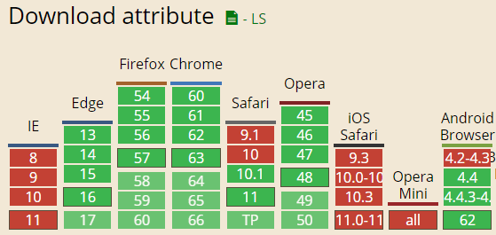

# HTML5 download 属性

若想实现点击下载图片功能，诸如以下使用 a 标签链接图片的方式并不能满足，后者只能直接浏览，而非下载：

```html
<a href="large.jpe">下载</a>
```

要么通过设置请求头的形式：

```
Content-type: image/jpeg
Content-Disposition: attachment; filename='download.jpg'
```

要么使用 `download` 属性，如下：

```html
<a href="large.jpg" download>下载</a>
```

此外还可指定下载图片的文件：

```html
<a href="index_logo.gif" download="_5332_.gif">下载</a>
<!-- 若后缀名不变，则可缺省 -->
<a href="index_logo.gif" download="_5332_">下载</a>
```

## 兼容性和跨域策略

兼容性如下：



要监测当前浏览器是否支持，只需以下 JS 代码：

```js
const isSupportDownload = "download" in document.createElement("a");
```

跨域策略的处理上，同域的资源在 Chrome 和 FireFox 上均可直接下载；但若是跨域的（包括跨子域），则仍旧是浏览而非下载的形式
