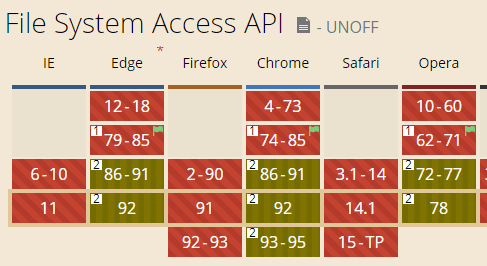

# File System Access API 触发文件上传

传统 Web 文件上传使用 file 类型的 input：`<input type="file">`：

- 通过 accept 属性指定文件类型
- directory 属性指定是否可选择文件夹
- capture 属性指定前置或后置摄像头

具体可参见 [“HTML input type=file 文件选择二三事”](https://www.zhangxinxu.com/wordpress/2015/11/html-input-type-file/) 一文

缺点在于：UI 无法定制；虽可用`<label>`模拟按钮，其 for 属性指向 file input 实现，也较为啰嗦

而通过全新的 File System Access API，触发文件选择可变得非常简单

## 介绍

File System Access API 主要包含以下方法：

- showOpenFilePicker([options])：选择文件，返回 [FileSystemFileHandle](https://developer.mozilla.org/en-US/docs/Web/API/FileSystemFileHandle)
- showDirectoryPicker([options]): 选择文件夹，返回 [FileSystemDirectoryHandle](https://developer.mozilla.org/en-US/docs/Web/API/FileSystemDirectoryHandle),

二者返回值均基于[FileSystemHandle](https://developer.mozilla.org/en-US/docs/Web/API/FileSystemHandle), 较为类似的还有[HTML Drag and Drop API](https://developer.mozilla.org/en-US/docs/Web/API/HTML_Drag_and_Drop_API) 中的 [DataTransferItem.getAsFileSystemHandle()](https://developer.mozilla.org/en-US/docs/Web/API/DataTransferItem/getAsFileSystemHandle)方法

这里简要介绍前者，`showOpenFilePicker(options)` 中的可选参数 options 包含以下属性：

- multiple: 是否支持多选，默认 false
- types: 数组，表示可选择的文件类型；每项包含：
  - description: 字符串，表示文件或文件夹的描述，可选
  - accept：对象，表示接受的文件类型，其中键为文件的 MIME 类型；值为数组，表示支持的文件后缀

示例代码：

@[code{6-27} js](./FileSystemAccessApi.vue)

实例：

<FileSystemAccessApi />

## 使用限制

- 需要 https（本地 localhost 除外）
- 不能在 iframe 内使用，这样被认为不安全

## 兼容性

由于是新 API，兼容性方面并不尽如人意

实际项目中需要支持降级，不兼容的浏览器仍使用传统 `<input type="file">`，参见 [browser-fs-access](https://github.com/GoogleChromeLabs/browser-fs-access)

而文件保存或下载，可尝试 `showSaveFilePicker()`，当然实际开发建议使用 [FileSaver.js](https://github.com/eligrey/FileSaver.js/)
