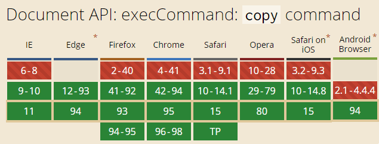
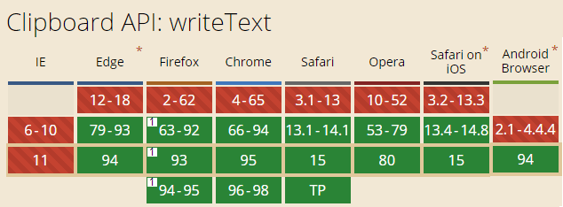

# JS 复制文字到剪切板的实现及扩展

## execCommand 方法

复制一段文字内容的老牌方法是 document.execCommand，示意：

```js
document.execCommand("copy", true);
```

兼容性很好，如下：



### 缺点

1. **执行有限制**

文字内容必须先选中才有效。而要让文字选中，通常是创建一个隐藏的 `<input>` 或 `<textarea>` ，赋值，再选中。代码示意：

```js
// 创建输入框
const textarea = document.createElement("textarea");
document.body.appendChild(textarea);
// 隐藏此输入框
textarea.style.position = "fixed";
textarea.style.clip = "rect(0,0,0,0)";
textarea.style.top = "10px";
// 赋值
textarea.value = "复制的文本内容...";
// 选中
textarea.select();
// 复制
document.execCommand("copy", true);
```

注意：若输入框不在页面可视区域内，则当 textarea.select() 触发默认控件跳转行为时，页面会滚动重定位。因此这里用了 fixed 定位

2. **性能隐患**

execCommand 是一个同步方法，在需复制非常大段的内容时，可能引起卡顿

3. 无法修改复制的内容

使用 execCommand 复制的文字内容无法进行修改与替换，这并不友好：对复制或拖拽的本文内容进行处理还是较常见的

---

基于以上限制，execCommand 已不再推荐，业界更倾向使用全新的 Clipboard API（当然由于兼容性好， execCommand 目前仍暂是主流）

## Clipboard API

Clipboard API 实现复制效果非常简单：

```js
if (navigator.clipboard) {
	navigator.clipboard.writeText(text);
}
```

其中 text 就是需复制的文本内容

无需浏览器权限申请，内容直接进入剪切板。代码简单，使用方便，异步无需担心阻塞；然而兼容性这块仍有不足



## 代码整合与封装

所以要复制一段文字到剪切板，可试试下面代码：

@[code{4-22} js](./ClipDemo.vue)

兼容 IE 在内的全部浏览器，实例：

<ClipDemo />

## 开源项目 clipboard.js

若不在意项目代码体积，也不关心具体实现细节，可以此著名的剪切板项目 [clipboard.js](https://github.com/zenorocha/clipboard.js/)

不仅有复制，还实现了剪切
