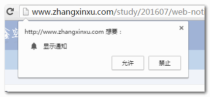
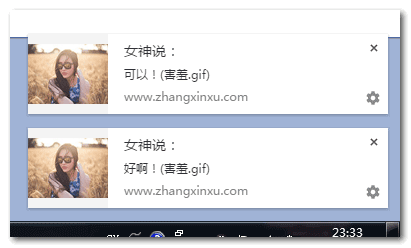

# HTML5 Web Notification

之前，通知主要是通过闪烁页面标题来实现的，原理很简单：定时器不断修改 document.title，例如：

```js
const titleInit = document.title;
let isShine = true;
setInterval(function () {
	const title = document.title;
	if (!isShine) {
		document.title = titleInit;
		return;
	}
	if (!/新/.test(title)) {
		document.title = "【你有新消息】";
	} else {
		document.title = "【　　　　　】";
	}
}, 500);

window.onfocus = function () {
	isShine = false;
};
window.onblur = function () {
	isShine = true;
};

// for IE
document.onfocusin = function () {
	isShine = false;
};
document.onfocusout = function () {
	isShine = true;
};
```

窗体失焦时，标题就会闪动。而缺陷在于浏览器要一直打开，一旦被最小化，标题就不可见，自然就无法 get 到通知

而 Web Notification 就能解决以上痛点

:::tip
小知识点: 浏览器窗体聚焦/失焦，在 Chrome、FireFox 中分别对应 focus、blur 事件；而在 IE 中则对应 focusin、focusout
:::

## Web Notification 特点

HTML5 Web Notification 属于桌面性质的通知，类似于屏幕右下角弹出的 QQ 弹框、杀毒提示，与浏览器是脱离的

例如 Facebook 的通知使用了 FCM，即 Firebase 云信息传递 —— 一种跨平台消息传递解决方案：

1. 使用 Service Worker 注册对象，调用其 pushManager.subscribe 方法让浏览器弹框询问用户是否允许接受消息通知
2. 若点击允许，浏览器会向 FCM 请求生成一个 subscription（订阅）的标志信息，并将后者发给服务端存储，用以 Push 给当前用户
3. 服务端使用该 subscription 信息调 web push 提供的 API 向 FCM 发送消息，FCM 再下发给对应的浏览器
4. 浏览器触发 Service Worker 的 push 事件，让后者调用 showNotification 使操作系统显示 push 内容

由于 Firebase 国内被墙，默认无法推送消息，若想此功能启用，需要一个境外服务器中转，或自己搭建梯子

## 兼容性

Edge 14 及 其他桌面浏览器均支持 Web Notification；而移动端中 Android 部分支持，iOS Safari 全军覆没(至 9.3 版本)：


## Web Notification 语法

Web Notification 语法基本围绕 `window.Notification` 构造函数展开

1. **Notification.requestPermission()**

静态方法，让浏览器提示是否允许通知，window 下 Chrome 的 UI 效果如下：



```js
// 基于 promise
Notification.requestPermission().then((permission) => { ... });
// 基于回调
Notification.requestPermission(permission) => { ... });
```

上述 permission 的值可为：

- granted：表示允许通知
- denied：表示拒绝通知
- default: 表示未选择

2. **Notification.permission**

静态属性，与上一条中的 permission 完全一致

3. **new Notification(title, options)**

显示通知。其中 title 表示通知的标题，必传；options 对象可选，支持的配置以释义见下：

- dir: 默认 auto, 可为 ltr 、rtl。类似 direction 属性，表示提示内容的水平书写顺序
- body：提示内容，字符串，会在标题下方显示
- tag：字符串，表示当前通知的标签
- icon：字符串，通知面板左侧图标地址
- data：任意类型与通知相关联的数据
- vibrate：通知显示时的设备振动模式 —— 一个描述交替时间的数组，分别表示振动和不振动的毫秒数。例如[200, 100, 200] 表示设备振动 200 ms，然后停止 100 ms，再振动 200 ms
- renotify：布尔值，同一 tag 的新通知是否替换旧的，设为 true 表示替换。换而言之，该参数要起作用，必须设置 tag 属性，然后通知就会类似如下覆盖：  
    
  而非默认的叠加：  
  
- silent：布尔值。通知出现时是否有提示声。默认 false
- sound：字符串。表示通知提示声的音频地址
- noscreen：是否不在屏幕上显示通知信息，默认 false

4. **Notification.close()**

该方法用于关闭通知。事实上即使放任不管，一段时间后（约 5 秒）通知也会自动隐藏

5. **事件句柄**

- Notification.onclick：点击通知后触发
- Notification.onerror：通知显示异常，例如在 `Notification.permission` 为 default 时仍调用 `new Notification(...)`...

## Web Notification 实例演示

点击以下按钮（注意需要为 https）：

<NotifyButton />
